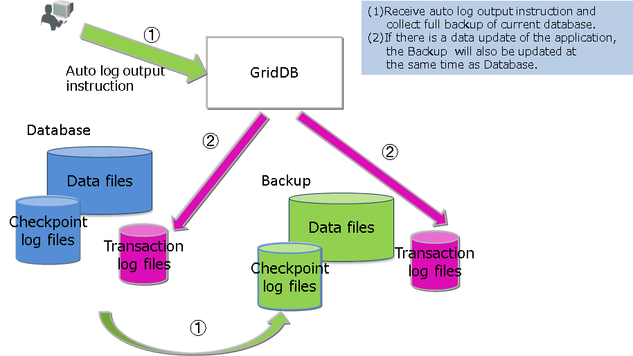
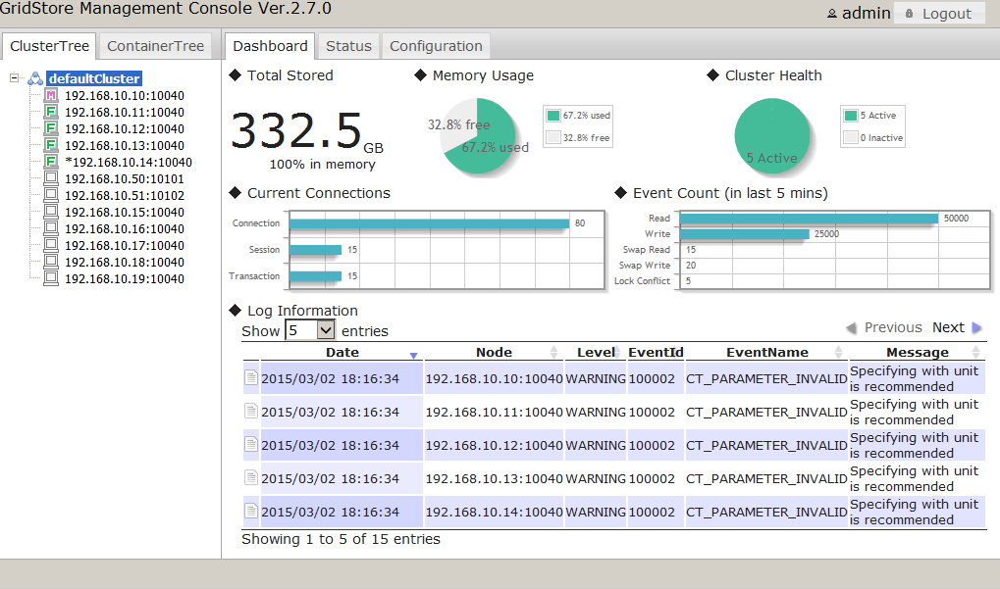

# Operating function

## Service

GridDB service is automatically performed during OS start-up to start a node or cluster.

The GridDB service is enabled immediately after installing the packages. Since the service is enabled, the GridDB server is started at the same time the OS starts up, and the server is stopped when the OS is stopped.

When you use an interface that integrates middleware and application operation including OS monitoring and database software operation, consideration of dependency with other middleware such as whether to use service or operating commands for GridDB operation is necessary.

GridDB service is automatically performed during OS start-up to start a GridDB node (hereinafter, node) or GridDB cluster (hereinafter cluster). The node or cluster is stopped when the OS is shut down.

The following can be carried out by the service.
-   Starting, stopping, and rebooting a node
-   Checking the process state of a node

The service operation procedures to the cluster of three nodes are as follows.

- Starting the cluster using services

  Suppose that three nodes are stopped.

  | User's operation | State of node A | State of node B | State of node C |
  |--------------------------------|--------------|--------------|--------------|
  | － | Stopped node | Stopped node | Stopped node    |
  | (1) Start services for nodes A/B/C | Starting a node<br />Having Joined the cluster | Starting a node<br />Having Joined the cluster | Starting a node<br />Having Joined the cluster |

  - The services are automatically executed at OS startup.
  - To start a cluster by starting the services, the number of nodes constituting a cluster and the cluster name must be defined in the configuration files of the services.
  - When the number of nodes joining the cluster is equals to the defined number of nodes constituting the cluster, the cluster is started automatically.


- Stopping a node using a service

  Suppose that the cluster is in operation.

  | User's operation | State of node A | State of node B | State of node C |
  |--------------|--------------|--------------|--------------|
  | － | Having Joined the cluster | Having Joined the cluster | Having Joined the cluster |
  | (1) Stopping the service of the node B. | Having Joined the cluster | Being detached from the cluster.<br />Node being stopped | Having Joined the cluster |


- Starting the cluster using services

  Suppose that the cluster is in operation.

  | User's operation | State of node A | State of node B | State of node C    |
  |-------------------------------|----------------|-----------------|-----------------|
  | － | Having Joined the cluster | Having Joined the cluster | Having Joined the cluster   |
  | Stop the cluster (\* caution).       | Being detached from the cluster. | Being detached from the cluster. | Being detached from the cluster. |
  | (2) Stop the service of nodes A/B/C. | Stopped node                     | Stopped node                     | Stopped node      |


[Note]
- **When stopping the cluster, execute the gs_stopcluster command and leave/stop each node by a service stop.**
  If you do not stop the cluster with the gs_stopcluster command, autonomous data arrangement may occur due to node leaving.
  If data relocation happens frequently, network or disk I/O may become a load.
  If you leave the node after stopping the cluster, data arrangement will not occur. To prevent unnecessary data rearrangement, be sure to stop the cluster in advance.
  To stop a cluster, execute the operating command gs_stopcluster, use the integrated operation control gs_admin, or use gs_sh.


If you do not use service control, disable service at all the runlevels in the way as follows.

```
# /sbin/chkconfig gridstore off
```

## User management function

There are 2 types of GridDB user, an OS user which is created during installation and a GridDB user to perform operations/development in GridDB (hereinafter referred to a GridDB user).

### OS user

An OS user has the right to execute operating functions in GridDB and a gsadm user is created during GridDB installation. This OS user is hereinafter referred to gsadm.

All GridDB resources will become the property of gsadm. In addition, all operating commands in GridDB are executed by a gsadm.

Authentication is performed to check whether the user has the right to connect to the GridDB server and execute the operating commands. This authentication is performed by a GridDB user.

### GridDB user  

-   Administrator user and general user

    There are 2 types of GridDB user, an administrator user and a general user, which differ in terms of which functions can be used. Immediately after the installation of GridDB, 2 users, a system and an admin user, are registered as default administrator users.

    An administrator user is a user created to perform GridDB operations while general users are users used by the application system.

    For security reasons, administrator users and general users need to be used differently according to the usage purpose.

-   Creating a user

    An administrator user can register or delete a gsadm, and the information is saved in the password file of the definition file directory as a GridDB resource. As an administrator user is saved/managed in a local file of the OS, it has to be placed so that the settings are the same in all the nodes constituting the cluster. In addition, administrator users need to be set up prior to starting the GridDB server. After the GridDB server is started, administrative users are not valid even if they are registered.

    An administrator user can create a general user after starting cluster operations in GridDB. A general user cannot be registered before the start of cluster services. A general user can only be registered using an operating command against a cluster as it is created after a cluster is composed in GridDB and maintained as management information in the GridDB database.

    Since information is not communicated automatically among clusters, an administrator user needs to make the same settings in all the nodes and perform operational management such as determining the master management node of the definition file and distributing information from the master management node to all the nodes that constitute the cluster.


-   Rules when creating a user

    There are naming rules to be adopted when creating a user name.
    -   Administrator user: Specify a user starting with "gs\#". After "gs\#", the name should be composed of only alphanumeric characters and the underscore mark. Since the name is not case-sensitive, gs\#manager and gs\#MANAGER cannot be registered at the same time.

    -   General user: Specify using alphanumeric characters and the underscore mark. The container name should not start with a number. In addition, since the name is not case-sensitive, user and USER cannot be registered at the same time. System and admin users cannot be created as default administrator users.

    -   Password: No restrictions on the characters that can be specified.

    A string of up to 64 characters can be specified for the user name and password.

### Usable function

The operations available for an administrator and a general user are as follows. Among the operations, commands which can be executed by a gsadm without using a GridDB user are marked with "??".

| When the operating target is a single node | Operating details                              | Operating tools used     | gsadm | Administrator user | General user            |
|------------------------|-------------------------------------|--------------------------------------------|-------|------------|-----------------------|
| Node operations                            | start node                                     | gs_startnode/gs_sh     |       | ✓                  | ✗                     |
|                        | stop node                                      | gs_stopnode/gs_sh      |       | ✓                  | ✗                     |
| Cluster operations                         | Building a cluster                             | gs_joincluster/gs_sh   |       | ✓                  | ✗                     |
|                        | Adding a node to a cluster                     | gs_appendcluster/gs_sh[EE] |       | ✓                  | ✗                     |
|                        | Detaching a node from a cluster                | gs_leavecluster/gs_sh  |       | ✓                  | ✗                     |
|                        | Stopping a cluster                             | gs_stopcluster/gs_sh   |       | ✓                  | ✗                     |
| User management                            | Registering an administrator user              | gs_adduser              | ✓✓    | ✗                  | ✗                     |
|                        | Deletion of administrator user                 | gs_deluser              | ✓✓    | ✗                  | ✗                     |
|                        | Changing the password of an administrator user | gs_passwd               | ✓✓    | ✗                  | ✗                     |
|                        | Creating a general user                        | gs_sh[EE]                   |       | ✓                  | ✗                     |
|                        | Deleting a general user                        | gs_sh[EE]                   |       | ✓                  | ✗                     |
|                        | Changing the password of a general user        | gs_sh[EE]                   |       | ✓                  | ✓: Individual only           |
| Database management                        | Creating/deleting a database                   | gs_sh[EE]                   |       | ✓                  | ✗                     |
|                        | Assigning/cancelling a user in the database    | gs_sh[EE]                   |       | ✓                  | ✗                     |
| Data operation                             | Creating/deleting a container or table         | gs_sh                   |       | ✓                  | O : Only when update operation is possible in the user's DB     |
|                        | Registering data in a container or table       | gs_sh                   |       | ✓                  | O : Only when update operation is possible in the user's DB     |
|                        | Searching for a container or table             | gs_sh                   |       | ✓                  | ✓: Only in the DB of the individual     |
|                        | Creating index to a container or table         | gs_sh                   |       | ✓                  | O : Only when update operation is possible in the user's DB     |
| Backup management                          | Creating a backup                              | gs_backup[EE]               |       | ✓                  | ✗                     |
| Backup management                          | Restoring a backup                             | gs_restore[EE]              | ✓✓    | ✗                  | ✗                     |
|                        | Displaying a backup list                       | gs_backuplist[EE]           |       | ✓                  | ✗                     |
| System status management                   | Acquiring system information                   | gs_stat                 |       | ✓                  | ✗                     |
|                        | Changing system parameter                      | gs_paramconf[EE]            |       | ✓                  | ✗                     |
| Data import/export                         | Importing data                                 | gs_import               |       | ✓                  | ✓: Only in accessible object |
| Export                                     | Exporting data                                 | gs_export               |       | ✓                  | ✓: Only in accessible object |


### Database and users

Access to a cluster database in GridDB can be separated on a user basis. The separation unit is known as a **database**.  The following is a cluster database in the initial state.

-   public
    -   The database can be accessed by all administrator user and general users.
    -   This database is used when connected without specifying the database at the connection point.

Multiple databases can be created in a cluster database. Creation of databases and assignment to users are carried out by an administrator user.

The rules for creating a database are as shown below.

-   The maximum no. of users and the maximum no. of databases that can be created in a cluster database is 128.
-   A string consisting of alphanumeric characters, the underscore mark, the hyphen mark, the dot mark, the slash mark and the equal mark can be specified for the database. The container name should not start with a number.
-   A string consisting of 64 characters can be specified for the database name.
-   Although the case sensitivity of the database name is maintained, a database which has the same name when it is not case-sensitive cannot be created. For example, both database and DATABASE cannot be registered.
-   Public and "information_schema" cannot be specified for default DB.

When assigning general users to a database, specify permissions as follows :
-   ALL
    -   All operations to a container are allowed such as creating a container, adding a row, searching, and creating an index.
-   READ
    -   Only search operations are allowed.

Only assigned general users and administrator users can access the database. Administrator user can access all databases.  The following rules apply when assign a general user to a database.
-   Multiple general users can be assigned to one database.
-   When assigning general users to a database, only one type of permission can be granted.
-   When assigning multiple general users to one database, different permission can be granted for each user.
-   Multiple databases can be assigned to 1 user


### Authentication method

GridDB offers the following two authentication methods:
-   internal authentication
-   LDAP authentication

The following explains each method.

#### Internal authentication

GridDB manages the user name, password, and privilege of administrative and general GridDB users. If the authentication method is not specified, internal authentication is used by default.

The administrative user is managed using the operation commands gs_adduser, ,gs_deluser, and gs_passwd.

General users are managed using the SQL statements CREATE USER, DROP USER, and SET PASSWORD, whereas their access rights are managed using the SQL statements GRANT and REVOKE.

**User cache settings**

To set cache for general user information, edit the following node definition file (gs_node.json):

[Note]
-   To reflect the changes made, restart the server.


| Parameter                  | Default | Value                 |
|---------------------------------|------------|------------------------|
| /security/userCacheSize | 1000  | Specify the number of entries for general and LDAP users to be cached. |
| /security/userCacheUpdateInterval | 60  | Specify the refresh interval for cache in seconds.|

#### LDAP authentication<a href="https://www.global.toshiba/ww/products-solutions/ai-iot/griddb/product/griddb-ee.html?utm_source=griddb.net&utm_medium=referral&utm_campaign=commercial_badge"><badge text="Commercial version" type="warning"/></a>

GridDB manages general GridDB users by LDAP. It also manages LDAP users' access rights by allowing the user create a role having the same name as user names and group names within LDAP and manipulate LDAP users' access rights. Moreover, it provides the caching capability of user information managed by LDAP for faster authentication operation.

[Note]
-   Install openldap2.4 on the server where the GridDB node runs. For detail, see the manual for openLDAP.
-   LDAP cannot manage the administrative user, who is always managed using internal authentication.


**settings common to internal and LDAP authentication**

To use LDAP authentication, edit the cluster definition file (gs_cluster.json) as described below.

| Parameter                  | Default | Value                 |
|---------------------------------|------------|------------------------|
| /security/authentication | INTERNAL  | Specify either INTERNAL (internal authentication) or LDAP (LDAP authentication) as an authentication method to be used. |
| /security/ldapRoleManagement | USER  | Specify either USER (mapping using the LDAP user name) or GROUP (mapping using the LDAP group name) as to which one the GridDB role is mapped to.          |
| /security/ldapUrl   |  | Specify the LDAP server using the format: ldap[s]://host[:port] |


[Note]
-   Only one LDAP server can be specified for /security/ldapUrl.
-   The following LDAP server is supported:
    -   OpenLDAP 2.4 or later.
    -   Active Directory Schema Version 87 (Windows Server 2016 or later).
-   To reflect the changes made, restart the server.


**Role management**

Roles are managed by the SQL statements CREATE ROLE and DROP ROLE. If "USER" is specified for /security/ldapRoleManagement, the role is created using the LDAP user name, whereas if "GROUP" is specified, the role is created using the LDAP group name. The access authority granted to the role created is managed using the SQL statements GRANT and REVOKE.

**Settings for LDAP authentication mode**

Specify simple mode (directly binding with a user account) or search mode (searching and authenticate users after binding with an LDAP administrative user), Then edit the cluster definition file (gs_cluster.json) as described below:

[Note]
-   Simple mode and search mode are incompatible.
-   To reflect the changes made, restart the server.

■Simple mode


| Parameter                  | Default | Value                 |
|---------------------------------|------------|------------------------|
| /security/ldapUserDNPrefix |   | To generate the user's DN (identifier), specify the string to be concatenated in front of the user name. |
| /security/ldapUserDNSuffix |  | To generate the user's DN (identifier), specify the string to be concatenated after the user name.|


■Search mode


| Parameter                  | Default | Value                 |
|---------------------------------|------------|------------------------|
| /security/ldapBindDn |   | Specify the LDAP administrative user's DN. |
| /security/ldapBindPassword |  | Specify the password for the LDAP administrative user.|
| /security/ldapBaseDn |  | Specify the root DN from which to start searching.|
| /security/ldapSearchAttribute | uid  | Specify the attributes to search for.|
| /security/ldapMemberOfAttribute | memberof | Specify the attributes where the group DN to which the user belongs is set (valid if ldapRoleManagement=GROUP).|

**User cache settings**

To set cache for LDAP user information, edit the following node definition file (gs_node.json):

[Note]
-   To reflect the changes made, restart the server.


| Parameter                  | Default | Value                 |
|---------------------------------|------------|------------------------|
| /security/userCacheSize | 1000  | Specify the number of entries for general and LDAP users to be cached. |
| /security/userCacheUpdateInterval | 60  | Specify the refresh interval for cache in seconds.|

**Setup examples**

The following example shows sample settings for the conditions below:

-   Active Directory(host=192.168.1.100 port=636)
-   user DN (cn=TEST, ou=d1 ou=dev dc=example, dc=com)
-   The user is only allowed to search the sample DB.
-   Map the GridDB role using the user name.
-   Authenticate in simple mode.

■Sample role settings (SQL statements)
```
 CREATE ROLE TEST
 GRANT SELECT ON sampleDB to TEST
```

■Sample server settings (excerpt from gs_cluster.json)
```
            :
"security":{
    "authentication":"LDAP",
    "ldapRoleManagement":"USER",
    "ldapUrl":"ldaps://192.168.1.100:636",
    "ldapUserDnPrefix":"CN=",
    "ldapUserDnSuffix":",ou=d1,ou=dev,dc=example,dc=com",
    "ldapSearchAttribute":"",
    "ldapMemberOfAttribute": ""
},
            :
```


## Security features<a href="https://www.global.toshiba/ww/products-solutions/ai-iot/griddb/product/griddb-ee.html?utm_source=griddb.net&utm_medium=referral&utm_campaign=commercial_badge"><badge text="Commercial version" type="warning"/></a>

### Communication encryption

GridDB supports SSL connection between the GridDB cluster and the client.

[Note]
-   Install openssl 1.1.1 on the server where the GridDB node and client are run.
-   Make sure the openSSL version is 1.1.1 using the following command:
```
$ python -c "import ssl; print(ssl.OPENSSL_VERSION)"
```

**Settings**

To enable SSL connection, edit the cluster definition file (gs_cluster.json) and the node definition file (gs_node.json), as illustrated below:
Then place the server certificate and the private key file in the appropriate directory.

[Note]
- To reflect the changes made, restart the server.
- SSL connection between nodes constituting a GridDB cluster is not supported. It is recommended to place the GridDB cluster in in a secure network not directly accessible externally.
- An option is available to enable server corticated verification, but host name verification is not supported. To prevent man-in-the-middle attack it is recommended to use a certificate created by your own Certificate Authority (CA).
- Confirmation of certificate revocation using the  certificate revocation list (CRL) is not supported.

\*cluster definition file (gs_cluster.json)

| Parameter | Default | Value |
|---------------------------------|------------|------------------------|
| /system/serverSslMode | DISABLED  | For SSL connection settings, specify DISABLED (SSL invalid), PREFERRED (SSL valid, but non-SSL connection is allowed as well), or REQUIRED (SSL valid; non-SSL connection is not allowed ).  |
| /system/sslProtocolMaxVersion | TLSv1.2 | As a TLS protocol version, specify either TLSv1.2 or TLSv1.3.  |

\*Node definition file (gs_node.json)

| Parameter | Default | Value |
|---------------------------------|------------|------------------------|
| /system/securityPath | security  | Specify the full path or relative path to the directory where the server certificate and the private key are placed.  |
| /system/serviceSslPort | 10045 | SSL listen port for operation commands |

\*Server certificate and private key

To enable SSL, place the server certificate and the private key in the directory where `/system/securityPath` is set with the following file names:

- gs_node.crt: certificate file
- gs_node.key: private key file


**Client settings**

SSL connection and server certificate verification can be specified on the client side. For details, see each tool and the API reference.

## Failure process function<a href="https://www.global.toshiba/ww/products-solutions/ai-iot/griddb/product/griddb-ee.html?utm_source=griddb.net&utm_medium=referral&utm_campaign=commercial_badge"><badge text="Commercial version" type="warning"/></a>

In GridDB, recovery for a single point failure is not necessary as replicas of the data are maintained in each node constituting the cluster.  The following action is carried out when a failure occurs in GridDB.


1.  When a failure occurs, the failure node is automatically isolated from the cluster.
2.  Failover is carried out in the backup node in place of the isolated failure node.
3.  Partitions are rearranged autonomously as the number of nodes decreases as a result of the failure (replicas are also arranged).

A node that has been recovered from a failure can be incorporated online into a cluster operation. A node can be incorporated into a cluster which has become unstable due to a failure using the gs_joincluster command. As a result of the node incorporation, the partitions will be rearranged autonomously and the node data and load balance will be adjusted.

In this way, although advance recovery preparations are not necessary in a single failure, recovery operations are necessary when operating in a single configuration or when there are multiple overlapping failures in the cluster configuration.

When operating in a cloud environment, even when physical disk failure or processor failure is not intended, there may be multiple failures such as a failure in multiple nodes constituting a cluster, or a database failure in multiple nodes.

### Type and treatment of failures

An overview of the failures which occur and the treatment method is shown in the table below.

A node failure refers to a situation in which a node has stopped due to a processor failure or an error in a GridDB server process, while a database failure refers to a situation in which an error has occurred in accessing a database placed in a disk.

| Configuration of GridDB | Type of failure           | Action and treatment                                                           |
|--------------|----------------------|----------------------------------------------------------------------|
| Single configuration    | Node failure              | Although access from the application is no longer possible, data in a transaction which has completed processing can be recovered simply by restarting the transaction, except when caused by a node failure. Recovery by another node is considered when the node failure is prolonged.                                                          |
| Single configuration    | Database failure          | The database file is recovered from the backup data in order to detect an error in the application. Data at the backup point is recovered.    |
| Cluster configuration   | Single node failure       | The error is covered up in the application, and the process can continue in nodes with replicas. Recovery operation is not necessary in a node where a failure has occurred.        |
| Cluster configuration   | Multiple node failure     | If both owner/backup partitions of a replica exist in a failure target node, the cluster will operate normally even though the subject partitions cannot be accessed. Except when caused by a node failure, data in a transaction which has completed processing can be recovered simply by restarting the transaction. Recovery by another node is considered when the node failure is prolonged.                     |
| Cluster configuration   | Single database failure   | Since data access will continue through another node constituting the cluster when there is a database failure in a single node, the data can be recovered simply by changing the database deployment location to a different disk, and then starting the node again.                    |
| Cluster configuration   | Multiple database failure | A partition that cannot be recovered in a replica needs to be recovered at the point backup data is sampled from the latest backup data.                  |


### Client failover

If a node failure occurs when operating in a cluster configuration, the partitions (containers) placed in the failure node cannot be accessed. At this point, a client failover function to automatically connect to the backup node again and continue the process is activated in the client API. To automatically perform a failover countermeasure in the client API, the application developer does not need to be aware of the error process in the node.

However, due to a network failure or simultaneous failure of multiple nodes, an error may also occur and access to the target application operations may not be possible.

Depending on the data to be accessed, the following points need to be considered in the recovery process after an error occurs.

- For a collection in which the timeseries container or row key is defined, the data can be recovered by executing the failed operation or transaction again.

- For a collection in which the row key is not defined, the failed operation or transaction needs to be executed again after checking the contents of the DB.

[Note]
- In order to simplify the error process in an application, it is recommended that the row key be defined when using a collection.  If the data cannot be uniquely identified by a single column value but can be uniquely identified by multiple column values, a column having a value that links the values of the multiple columns is recommended to be set as the row key so that the data can be uniquely identified.

### Automatic restarting function

If the GridDB node abnormally terminates or the node process is forcibly terminated, it will automatically restart the node and join to the cluster.  Operation manager does not need to be aware of restoring the cluster status to normal operation.


[Note]

Automatic restart is not performed in the following cases:
-   In case when the user explicitly turns it off.
-   In case of an unrecoverable failure (Node status: ABNORMAL).
-   In case of trying automatic restart more than 5 times.
-   In case of the node is not joined to the cluster before the failure.

**Settings**

The parameters of automatic recovery function is as follows.

| Parameter                  | Default | Value                 |
|---------------------------------|------------|------------------------|
| SVC_ENABLE_AUTO_RESTART | true    | true(Enabled)/false(Disabled) |
| GS_USER                   | admin   | Set as appropriate                   |
| GS_PASSWORD               | admin   | Set as appropriate                   |

When changing the parameters, edit the start configuration file: `/etc/sysconfig/gridstore/gridstore.conf` .

- SVC_ENABLE_AUTO_RESTART
  - Set whether to enable or disable this function. This parameter can be changed by restarting the node.
  - If you want to control GridDB's fault recovery with another monitoring system, set false.

- GS_USER/GS_PASSWORD
  - Set the GridDB administrator user name and password.
  - These parameters are used in the following cases:
    - In case of starting, stopping, restarting by services
    - In case of the -u option is not specified with the gs_startnode

[Note]
-   If the specified GS_USER / GS_PASSWORD is invalid, or if these are not specified, the GridDB node will fail to start up.


## Export/import function

In the GridDB export/import tools, to recover a database from local damages or the database migration process, save/recovery functions are provided in the database and container unit.

In a GridDB cluster, container data is automatically arranged in a node within a cluster. The user does not need to know how the data is arranged in the node (data position transmission).
There is also no need to be aware of the arrangement position in data extraction and registration during export/import as well. The export/import configuration is as follows.


[Export]

(1) Save the container and row data of a GridDB cluster in the file below. A specific container can also be exported by specifying its name.
-   **Container data file**
    -   Save GridDB container data and row data.
    -   There are 2 types of format available, one for saving data in a container unit and the other for consolidating and saving data in multiple containers.
-   **Export execution data file**
    -   Save the data during export execution. This is required to directly recover exported data in a GridDB cluster.

  \* See "[GridDB Operation Tools Reference](../5.md_reference_operation_tool/md_reference_operation_tool.md)" for details.

[Import]

(2) Import the container and export execution data files, and recover the container and row data in GridDB. A specific container data can also be imported as well.

(3) Import container data files created by the user, and register the container and row data.

[Note]
-   An exported container data file has the same format as the container data file created by a user.
-   If the container during export is manipulated, the manipulated data may be referenced.


## Backup/restoration function<a href="https://www.global.toshiba/ww/products-solutions/ai-iot/griddb/product/griddb-ee.html?utm_source=griddb.net&utm_medium=referral&utm_campaign=commercial_badge"><badge text="Commercial version" type="warning"/></a>

Regular data backup needs to be performed in case of data corruption caused by database failures and malfunctions of the application. The backup operation method should be selected according to the service level requirements and system resources. The backup operation method should be selected according to the service level requirements and system resources.

This section explains the types of backup and following features.

- Backup operations
  - This section explains the different types of backup available and how to use them.
- Recovery from a failure
 - This section explains failure detection and how to recover from one.

### Backup method

Regular data backup needs to be performed in case of data corruption caused by database failures and malfunctions of the application.  The type and interval of the backup operation needs to be determined based on the available disk capacity, duration of backup, and the recovery requirements in case of failure (e.g. point of recovery). The resolution method needs to be selected according to the system resources and the request from the service level of the recovery warranty.  Backup methods of GridDB are shown below.

| Backup method                                                         | Recovery point                 | Features                                                                                                                                                                                                                                             |
|-----------------------------------------------------------------------|--------------------------|--------------------------------------------------------------------------------------------------------------------------------------------------------------------------------------------------------------------------------------------------|
| Offline backup                                                        | Stopping the cluster           | Clusters must keep stopping until copying the backup completes.  The recovery point is not different from node to node.                                                                                                                                                 |     |
| Online backup (baseline with differential/incremental)                | Completing the backup          | Use the GridDB backup command. There is a possibility that the recovery point is different from node to node depending on the timing when obtaining the backup completes.                                                                                                                      |     |
| Online backup (automatic log)                                         | Immediately before the failure | Use the GridDB backup command. There is a possibility that the start-up time gets longer because the data is recovered to the latest with transaction logs.                                                                                                                    |     |
| File system level online backup (snapshot, etc.)                      | Taking the snapshot            | The backup is obtained collaborating with the snapshot of an OS and a storage. Even if snapshots for each node are executed simultaneously, there is a possibility that there is an about 1 second difference from node to node if the log write mode is default DELAYED_SYNC 1 sec.  |     |
| File system level online backup (OS command, etc. with automatic log) | Immediately before the failure | The backup is obtained collaborating with backup solutions, etc. There is a possibility that the start-up time gets longer because the data is recovered to the latest with transaction logs.                                                                                            |     |

To know about the GridDB online backup functions, please refer to [Online backup](#online_backup_and_recovery_operations).

[Note]
-   When an online backup is performed, please stop the related updating among multiple containers. Then, it is possible to prevent creating the logically inconsistent backup for the entire cluster.
- When a node failure occurs during online backup, perform the backup again starting with the first node. Then, it is possible to prevent not backing up necessary data caused by re-arrangement of partitions (rebalancing). The re-arrangement occurs when the cluster configuration is changed.

To perform an online backup of file system level instead of using the GridDB online backup functions, please refer to [File system level backup](#file_system_level_backup_and_recovery_operations).

To perform an offline backup, stop the cluster by using gs_stopcluster command first, and stop all the nodes constituting the cluster.  Next, backup the data under the database file directory of each node (directory indicated by /dataStore/dbPath, /dataStore/transactionLogPath in gs_node.json).


**Backup definition files**

In backup operation, in addition to a regular backup of the database files, backup of the definition files is also needed.

Use an OS command to perform a backup of the node definition file (gs_node.json), cluster definition file (gs_cluster.json), user definition file (password) in the $GS_HOME/conf directory (/var/lib/gridstore/conf by default) in addition to a regular backup of the database files.

Be sure to backup the definition file if there are configuration changes or when a user is registered or changed.


<a id="online_backup_and_recovery_operations"></a>
### Online backup and recovery operations

#### Backup operations

This section explains the GridDB backup operations in the event of failure.

##### Types of backup

In GridDB, backup of node units can be carried out online. A backup of the entire cluster can be carried out online while maintaining the services by performing a backup of all the nodes constituting the GridDB cluster in sequence.  The types of online backup provided by GridDB are as follows.

| Backup type                     | Backup actions                | Recovery point                       |
|------------------------|--------------------------------|--------------------------------|
| Full backup                     | A backup of the cluster database currently in use is stored online in node units in the backup directory specified in the node definition file.  | Full backup collection point |
| Differential/incremental backup | A backup of the cluster database currently in use is stored online in node units in the backup directory specified in the node definition file. In subsequent backups, only the difference in the update block after the backup is backed up.  | Differential/incremental backup collection point |
| Automatic log backup            | In addition to backing up the cluster database currently in use which is stored online in node units in the backup directory specified in the node definition file, the transaction log is also automatically picked up at the same timing as the transaction log file writing. The write timing of the transaction log file follows the value of /dataStore/logWriteMode in the node definition file.  | Latest transaction update point |

The recovery point differs depending on the type of backup used.

The various backup operations and systems recommendation provided by GridDB are shown below.

-   Full backup

    A full backup is acquired after an overnight batch process to update data in a reference system. A full backup will take a while to complete as data in all the database files will be copied. In addition, the data capacity at the backup collection destination needs to be the same as the database file.

    The backup disk capacity needs to be multiplied by the actual database size according to how many backup generations to retain.


-   Differential/incremental backup

    In differential/incremental backup, once a full backup of the entire databases have been performed, only the differences between the current and the updated data will be backed up.  This type of backup is suitable for systems which needs to be backed up quickly, and systems which perform systematic operations such as automatic backup of batch operations during the night, monthly full backup (baseline creation), differential (since) backup once a week, incremental backup (incremental) once a day, etc.

    As an incremental backup uses only updated data, it can be carried out faster compared to a full backup or differential backup. However, recovery when a failure occurs may take a while as the update block needs to be rolled forward for the data of the full backup. A differential backup using a regular Baseline or Since command is required.


-   Automatic log backup

    After performing a full backup with an automatic log backup command (baseline creation), the updated log will be collected in the backup directory. Backup operation is not required as a transaction log will be taken automatically. This command is used when you want to simplify the operation or when you do not wish to impose a load on the system due to the backup. However, if the baseline is not updated regularly, recovery will take a while as the number of transaction log files used in recovery when a failure occurs increases. In a differential/incremental backup, data of the same block will be backed up as a single data when updated, but in an automatic log backup, a log is recorded every time there is an update, so recovery during a failure takes more time than a differential/incremental backup.



[Note]
-   To shorten the recovery time when failure occurs during a differential/incremental backup or automatic log backup, a full backup that will serve as the baseline needs to be performed regularly.

The type of backup is specified in the command option.

##### Checking backup-related parameters

Specify /dataStore/backupPath in the node definition file as the backup destination. Take into consideration physical failure of the disk, and be sure to set up the backup destination and database file (/dataStore/dbPath, /dataStore/transactionLogPath) so that the file is stored in a different physical disk.

There are 2 log persistency modes for transactions. Default is NORMAL.
-   NORMAL: unnecessary transaction log files will be deleted by a checkpoint process.
-   KEEP_ALL_LOG: All transaction log files are retained.

KEEP_ALL_LOG is specified only for special operations. e.g. when issuing instructions to delete a log file in conjunction with the backup software of other companies, etc., but normally this is not used.  

A specified example of a node definition file is shown below.

```
$ cat /var/lib/gridstore/conf/gs_node.json         # The example of checking a setting
{
    "dataStore":{
        "dbPath":"/var/lib/gridstore/data",
        "transactionLogPath":"/var/lib/gridstore/txnlog",
        "backupPath":"/mnt/gridstore/backup",      # Backup directory
        "storeMemoryLimit":"1024",
        "concurrency":2,
        "logWriteMode":1,
        "persistencyMode":"NORMAL"                 #Perpetuation mode
            :
            :
}
```

##### Backup execution

This section explains how to use a full backup, differential/incremental backup, and automatic log backup.

Specify the backup name (BACKUPNAME) when executing any type of backup. For the data created by backup, a directory with the same name as the backup name (BACKUPNAME) is created and placed under the directory specified in backupPath in the node definition file.

Up to 12 alphanumeric characters can be specified in the BACKUPNAME.

##### Full backup

When a failure occurs, the system can be recovered up to the point where the full backup was completed.  Implement a full backup of all the nodes constituting the cluster. Backup data is stored in the directory indicated by the BACKUPNAME of the command. It is recommended to specify the date in the BACKUPNAME in order to make it easier to understand and manage the backup data gathered.

Execute the following command on all the nodes inside the cluster.

```
$ gs_backup -u admin/admin 20141025
```

In this example,
1.  "20141025" is specified as a backup name (BACKUPNAME), and a directory "20141025" will be created under the backup directory.
2. In the "20141025" directory, backup information files (gs_backup_info.json and gs_backup_info_digest.json) and an LSN information file (gs_lsn_info.json) are created. In the "data" directory, data files and checkpoint log files are created, while in the "txnlog" directory, transaction log files are created.

```
/var/lib/gridstore/backup/
        20141025/                           # backup directory
                gs_backup_info.json         # backup information file
                gs_backup_info_digest.json  # backup information file
                gs_lsn_info.json            # LSN information file
                data/
                    0/                      # partition number 0
                        0_part_0.dat        # data file backup
                        0_117.cplog         # checkpoint log backup
                        0_118.cplog
                        ...
                    1/
                    2/
                    ...
                txnlog/
                    0/                      # partition number 0
                        0_120.xlog          # transaction log backup
                        0_121.xlog
                    1/
                    2/
                    ...
```

A backup command will only notify the server of the backup instructions and will not wait for the process to end.

Check the completion of the backup process by the status of the gs_stat command.

```

$ gs_backup -u admin/admin 20141025
$ gs_stat -u admin/admin --type backup
BackupStatus: Processing
```

-   The backup status (BackupStatus) will be one of the following.
    -   Processing: Under execution
    -   \-: Completed or not in operation

The status of the gs_backuplist command shows whether the backup has been performed properly.

```
$ gs_backuplist -u admin/admin

BackupName   Status   StartTime                EndTime
------------------------------------------------------------------------
 20141025NO2     P   2014-10-25T06:37:10+0900 -
 20141025        NG  2014-10-25T02:13:34+0900 -
 20140925        OK  2014-09-25T05:30:02+0900 2014-09-25T05:59:03+0900
 20140825        OK  2014-08-25T04:35:02+0900 2014-08-25T04:55:03+0900
```

The status symbol of the backup list indicates the following.
-   P: Backup execution in progress
-   NG: An error has occurred during backup execution, backup data is abnormal
-   OK: Backup has been carried out normally

##### Differential/incremental block backup

When a failure occurs, data can be recovered until the last differential/incremental backup was performed by using the full backup serving as the baseline (reference point) and the differential/incremental backup after the baseline.  Get the full backup as a baseline for the differential/incremental backup and specify differential/incremental backup thereafter.

The backup interval needs to be studied in accordance with the service targets for the data update capacity and the time taken for recovery, but use the following as a guide.

-   Full backup of baseline (baseline): monthly
-   Differential backup of updated blocks after creation of the baseline (since): weekly
-   Incremental backup (incremental) of updated blocks after a baseline or differential backup: daily

Creation of baseline for full backup is specified below. In this example, BACKUPNAME is "201504."

```
$ gs_backup  -u admin/admin --mode baseline 201504
$ gs_stat -u admin/admin --type backup
BackupStatus: Processing(Baseline)
```

Database file in the data directory is copied under the backup directory as a baseline for the backup.

Specify incremental or since as the mode of the backup command (gs_backup) when performing a regular backup of the differential/incremental block after creating a baseline (backup of data block updated after a full backup of the baseline). Specify the same BACKUPNAME as when the baseline was created. In this example, BACKUPNAME is "201504."

```
*****  For incremental backup
$ gs_backup  -u admin/admin --mode incremental 201504
$ gs_stat  -u admin/admin --type backup
BackupStatus: Processing(Incremental)

*****  For differential backup
$ gs_backup  -u admin/admin --mode since 201504
$ gs_stat  -u admin/admin --type backup
BackupStatus: Processing(Since)
```

The status of the gs_backuplist command shows whether the backup has been performed properly. As a differential/incremental backup will become a single recovery unit in a multiple backup, it will be treated as a single backup in the list of BACKUPNAME. Therefore, specify the backup name and check the details to see the detailed status.

A differential/incremental backup can be confirmed by checking that an asterisk "\*" is appended at the beginning of the BACKUPNAME. The status of a differential/incremental backup is always "--".

The status of differential/incremental backup can be checked by specifying the BACKUPNAME in the argument of the gs_backuplist command.

```
*****  Display a list of BACKUPNAME
$ gs_backuplist -u admin/admin

BackupName   Status   StartTime                EndTime
------------------------------------------------------------------------
*201504          --  2015-04-01T05:20:00+0900 2015-04-24T06:10:55+0900
*201503          --  2015-03-01T05:20:00+0900 2015-04-24T06:05:32+0900
  :
 20141025NO2     OK   2014-10-25T06:37:10+0900 2014-10-25T06:37:10+0900

*****  Specify the individual BACKUPNAME and display the detailed information
$ gs_backuplist -u admin/admin 201504

BackupName : 201504

BackupData            Status   StartTime                EndTime
--------------------------------------------------------------------------------
201504_lv0                OK  2015-04-01T05:20:00+0900 2015-04-01T06:10:55+0900
201504_lv1_000_001        OK  2015-04-02T05:20:00+0900 2015-04-01T05:20:52+0900
201504_lv1_000_002        OK  2015-04-03T05:20:00+0900 2015-04-01T05:20:25+0900
201504_lv1_000_003        OK  2015-04-04T05:20:00+0900 2015-04-01T05:20:33+0900
201504_lv1_000_004        OK  2015-04-05T05:20:00+0900 2015-04-01T05:21:15+0900
201504_lv1_000_005        OK  2015-04-06T05:20:00+0900 2015-04-01T05:21:05+0900
201504_lv1_001_000        OK  2015-04-07T05:20:00+0900 2015-04-01T05:22:11+0900
201504_lv1_001_001        OK  2015-04-07T05:20:00+0900 2015-04-01T05:20:55+0900
```

A directory will be created in the backup directory according to the following rules to store the differential/incremental backup data.

-   BACKUPNAME_lv0: Baseline backup data of the differential/incremental backup is stored. lv0 fixed.
-   BACKUPNAME_lv1_NNN_MMM: Differential (Since) and incremental (Incremental) backup data of the differential/incremental backup is stored.
    -   NNN count is increased during a differential backup.
    -   MMM count is cleared to 000 during a differential backup and increased during an incremental backup.

The status symbol of the backup list indicates the following.
-   P: Backup execution in progress
-   NG: An error has occurred during backup execution, backup data is abnormal
-   OK: Backup has been carried out normally

In a differential/incremental backup, the log output of updated blocks named _n_incremental.cplog is produced in the BackupData directory/data directory/ directory, where "n" in "n" denotes a numerical value.

Differential/incremental backup can be compared to a full backup and backup time can be reduced. However, recovery when a failure occurs may take a while as the update block is rolled forward for the data of the full backup.  Get the baseline regularly or execute a differential backup from the baseline by specifying since .

[Note]
-   Partitions are automatically arranged (rebalanced) according to the cluster configuration changes and system load. When a differential log backup is specified after the arrangement of the partitions is changed, a message error "Log backup cannot be performed due to a change in the partition status" will appear. In this case, be sure to back up all the nodes constituting the cluster (baseline). Re-arrangement of partitions (rebalancing) occurs when the cluster configuration is changed as shown below.
    -   Increase the number of nodes constituting a cluster by adding nodes
    -   Decrease the number of nodes constituting a cluster by detaching nodes

##### Automatic log backup

GridDB automatically outputs a transaction log to the backup directory. Therefore, the system can always be recovered to the latest condition.  As backup is carried out automatically, it is not possible to perform systematic backups according to the system operating state such as a "backup process scheduled in advance during low peak periods". In addition, due to the automatic log backup, a system load will be imposed more or less during normal operation as well. Therefore, use of this indication is recommended only when there are surplus system resources.

Specify as follows when using an automatic log backup. In this example, BACKUPNAME is "201411252100."

```
$ gs_backup -u admin/admin --mode auto 201411252100
$ gs_stat -u admin/admin --type backup
```

Execute the command to get the backup data in the directory indicated in BACKUPNAME.
-   During an automatic log backup, operational settings for errors which occur during backup can be set in the option mode.
    -   Auto: When a backup error occurs, the node will become ABNORMAL and stop.
    -   auto_nostop: Backup will be incomplete when a backup error occurs but the node will continue to operate.

In this example,
1.  A directory with the name "201411252100" will be created under the backup directory.
2. In the "201411252100" directory, backup information files (gs_backup_info.json and gs_backup_info_digest.json) and an LSN information file (gs_lsn_info.json) are created. In the "data" directory, data files and checkpoint log files are created, while in the "txnlog" directory, transaction log files are created.
3. 3. Under the "201411252100"/"txnlog" directory, transaction log files are created when execution of the transaction is completed.

When operating with an automatic log backup, the transaction log file in 3) is rolled forward for the full backup data in 2) during recovery when a failure occurs. Therefore, specify the --mode auto to perform a full backup regularly as the recovery time will increase when the number of log files used during recovery increases.

##### Checking backup operation

The mode of the backup currently being executed and the detailed execution status can also be checked in data that can be obtained from the gs_stat command.

```
$ gs_stat -u admin/admin

    "checkpoint": {
        "backupOperation": 3,
        "duplicateLog": 0,
        "endTime": 0,
        "mode": "INCREMENTAL_BACKUP_LEVEL_0",
        "normalCheckpointOperation": 139,
        "pendingPartition": 1,
        "requestedCheckpointOperation": 0,
        "startTime": 1429756253260
    },
        :
        :
```

The meaning of each parameter related to the backup output in gs_stat is as follows.
-   backupOperation: Number of backups performed after system start-up.
-   duplicateLog: Automatic log backup is performed to indicate whether a redundant log output has been carried out.
    -   0: automatic log backup off
    -   1: automatic log backup on
-   endtime: "0" when backup or checkpoint is being performed. The time is set when the process ends.
-   mode: Name of the backup or checkpoint process is displayed. Name of the backup process last performed or currently under execution is displayed.
    -   BACKUP: Perform a full backup with an automatic log backup or full backup
    -   INCREMENTAL_BACKUP_LEVEL_0: Create baseline of differential/incremental backup
    -   INCREMENTAL_BACKUP_LEVEL_1_CUMULATIVE: Differential backup from the baseline
    -   INCREMENTAL_BACKUP_LEVEL_1_DIFFERENTIAL: Incremental backup from the last

##### Collecting container data

When a database failure occurs, it is necessary to understand which container needs to be recovered and how to contact the user of the container. To detect a container subject to recovery, the following data needs to be collected regularly.
-   List of containers arranged in a partition
    -   As containers are automatically created and arranged in the partitions according to the specifications of the application system, a list of containers and partition arrangements need to be output regularly using the gs_sh command.

Operating efforts can be cut down by creating a gs_sh command script to output the container list in advance.

In the example below, a gs_sh sub-command is created with the file name listContainer.gsh.

```
setnode node1 198.2.2.1  10040
setnode node2 198.2.2.2  10040
setnode node3 198.2.2.3  10040
setcluster cl1 clusterSeller 239.0.0.20 31999 $node1 $node2 $node3
setuser admin admin gstore
connect $cl1
showcontainer
connect $cl1 db0
showcontainer
 :   Repeat as many as the number of dbs
quit
```

Change the node variables such as node 1, node 2, node 3 that constitute a cluster, and change the cluster variable such as cl1, user settings and database data where appropriate to suit the environment.
See "[GridDB Operation Tools Reference](../5.md_reference_operation_tool/md_reference_operation_tool.md)"  for the details about gs_sh.

Execute the gs_sh script file as shown below to collect a list of containers and partitions.

```
$ gs_sh listContainer.gsh>`date +%Y%m%d`Container.txt
```

Information is saved in 20141001Container.txt is as follows.

```
Database : public
Name                  Type         PartitionId
------------------------------------------------
container_7           TIME_SERIES            0
container_9           TIME_SERIES            7
container_2           TIME_SERIES           15
container_8           TIME_SERIES           17
container_6           TIME_SERIES           22
container_3           TIME_SERIES           25
container_0           TIME_SERIES           35
container_5           TIME_SERIES           44
container_1           TIME_SERIES           53
:
 Total Count: 20

Database : db0
Name                  Type         PartitionId
---------------------------------------------
CO_ALL1              COLLECTION           32
COL1                 COLLECTION          125
 Total Count: 2
```


#### Recovery operation

An overview of the recovery operation when a failure occurs is given below.
1.  Failure recognition and checking of recovery range
2.  Recovery operation and node startup
3.  Incorporation of node in cluster
4.  Confirmation of recovery results and operation

##### Failure recognition and checking of recovery range

When a failure occurs in GridDB, in addition to the cause of the failure being output to the event log file of the node in which the error occurred, if it is deemed that node operation cannot continue, the node status will become ABNORMAL and the node will be detached from the cluster service.

Cluster service will not stop even if the node status becomes ABNORMAL as operations are carried out with multiple replicas in a cluster configuration. Data recovery is necessary when all partitions including the replicas were to fail.

Use gs_stat to check the status of the master node to see whether data recovery is necessary or not. Recovery is necessary if the value of /cluster/partitionStatus is "OWNER_LOSS".

```
$ gs_stat -u admin/admin -p 10041
{
    "checkpoint": {
        :
    },
    "cluster": {
        "activeCount": 2,
        "clusterName": "clusterSeller",
        "clusterStatus": "MASTER",
        "designatedCount": 3,
        "loadBalancer": "ACTIVE",
        "master": {
            "address": "192.168.0.1",
            "port": 10011
        },
        "nodeList": [
            {
                "address": "192.168.0.2",
                "port": 10011
            },
            {
                "address": "192.168.0.3",
                "port": 10010
            }
        ],
        "nodeStatus": "ACTIVE",
        "partitionStatus": "OWNER_LOSS",     ★
        "startupTime": "2014-10-07T15:22:59+0900",
        "syncCount": 4
          :
```

Use the gs_partition command to check for data to be recovered. Partitions with problems can be checked by specifying the --loss option and executing the command.

In the example below, an error has occurred in Partition 68 due to a problem with node 192.168.0.3.


```
$ gs_partition -u admin/admin -p 10041 --loss

[
 {
        "all": [
            {
                "address": "192.168.0.1",
                "lsn": 0,
                "port": 10011,
                "status": "ACTIVE"
            },
            :
            :
            ,
            {
                "address": "192.168.0.3",
                "lsn": 2004,
                "port": 10012,
                "status": "INACTIVE"   <---  The status of this node is not ACTIVE.
            }
        ],
        "backup": [],
        "catchup": [],
        "maxLsn": 2004,
        "owner": null,           //Partition owner is not present in the cluster.
        "pId": "68",             //ID of partition which needs to be recovered     
        "status": "OFF"
   },
   {
     :

   }
  ]
```

##### Recovery operation and node startup

###### Recovery from backup data

When a problem occurs in a database due to a problem in the system e.g. a disk failure, etc., the data will be recovered from the backup. The following needs to be noted during recovery.

[Note]
-   Take note of the number of partitions and the parameter value of the processing parallelism in the cluster definition file.  Set the configuration value of the node to restore to be the same as the configuration value of the backup node. The node cannot start correctly if it is not the same.
-   If data files are set to be split, pay attention to the parameter value for the number of splits in the node definition file. Make sure that the backup nodes and the nodes to be restored should have the same number of splitting. If they are not the same, restoration will fail.
-   When you want to recover a cluster database to a specific point, the backup and restoration processes need to be carried out for the entire cluster.
-   When some of the nodes are restored in a cluster operation, the replicas maintained in other nodes will become valid (this occurs when LSN data is new) and it may not be possible to return to the status of the restored backup database.
-   In particular, if the cluster configuration has changed from the time the backup was created, there will be no restoration effect. As the data will be autonomously re-arranged if the node is forced to join a cluster, there is a high probability that the data will become invalid even when restored.
-   If data is missing in the backup data file, or if the contents have been revised, a GridDB node will not be able to start services.

Restore backup data to a GridDB node.

Follow the procedure below to restore a node from backup data.

1.  Check that no node has been started.
    -   Check that the cluster definition file is the same as the other nodes in the cluster that the node is joining.

2.  Check the backup name used in the recovery. This operation is executed on a node.
    -   Check the backup status and select one that has been backed up correctly.

3. Check that past data files, checkpoint log files, and transaction log files are not left behind in the database file directories (/var/lib/gridstore/data and /var/lib/gridstore/txnlog by default) of the node.
    -   Delete if unnecessary and move to another directory if required.

4.  Execute the restore command on the machine starting the node.
5.  Start node.

Use the command below to check the backup data.

-   gs_backuplist -u user name/password

A specific example to display a list of the backup names is shown below.  A list of the backup names can be displayed regardless of the startup status of the nodes. The status appears as "P" (abbreviation for Processing) if the backup process is in progress with the nodes started.

A list of the backup is displayed in sequence starting from the latest one. In the example below, the one with the 201912 BACKUPNAME is the latest backup.

```
$ gs_backuplist -u admin/admin
 BackupName   Status  StartTime                 EndTime
-------------------------------------------------------------------------
*201912           --  2019-12-01T05:20:00+09:00 2019-12-01T06:10:55+09:00
*201911           --  2019-11-01T05:20:00+09:00 2019-11-01T06:10:55+09:00
  :
 20191025NO2      OK  2019-10-25T06:37:10+09:00 2019-10-25T06:38:20+09:00
 20191025         NG  2019-10-25T02:13:34+09:00 -
 20191018         OK  2019-10-18T02:10:00+09:00 2019-10-18T02:12:15+09:00

$ gs_backuplist -u admin/admin 201912

BackupName : 201912

BackupData            Status StartTime                 EndTime
--------------------------------------------------------------------------------
201912_lv0                OK 2019-12-01T05:20:00+09:00 2019-12-01T06:10:55+09:00
201912_lv1_000_001        OK 2019-12-02T05:20:00+09:00 2019-12-02T05:20:52+09:00
201912_lv1_000_002        OK 2019-12-03T05:20:00+09:00 2019-12-03T05:20:25+09:00
201912_lv1_000_003        OK 2019-12-04T05:20:00+09:00 2019-12-04T05:20:33+09:00
201912_lv1_000_004        OK 2019-12-05T05:20:00+09:00 2019-12-05T05:21:25+09:00
201912_lv1_000_005        OK 2019-12-06T05:20:00+09:00 2019-12-06T05:21:05+09:00
201912_lv1_001_000        OK 2019-12-07T05:20:00+09:00 2019-12-07T05:22:11+09:00
201912_lv1_001_001        OK 2019-12-08T05:20:00+09:00 2019-12-08T05:20:55+09:00

```

[Note]
-   If the status displayed is NG, the backup file may be damaged and so restoration is not possible.

Check the data among the 201912 backup data used in the recovery. Differential/incremental backup data used for recovery can be checked in the --test option of gs_restore. In the --test option, only data used for recovery is displayed and restoration of data will not be carried out. Use this in the preliminary checks.

The example above shows the use of the baseline data in the 201912_lv0 directory, differential data (Since) in the 201912_lv1_001_000 directory, and incremental data in the 201912_lv1_001_001 directory for recovery purposes in a recovery with the 201912 BACKUPNAME output.

```

-bash-4.2$ gs_restore --test 201912

BackupName : 201912
BackupFolder : /var/lib/gridstore/backup

RestoreData           Status StartTime                 EndTime
--------------------------------------------------------------------------------
201912_lv0                OK 2019-09-06T11:39:28+09:00 2019-09-06T11:39:28+09:00
201912_lv1_001_000        OK 2019-09-06T20:01:00+09:00 2019-09-06T20:01:00+09:00
201912_lv1_001_001        OK 2019-09-06T20:04:42+09:00 2019-09-06T20:04:43+09:00

```

When a specific partition fails, there is a need to check where the latest data of the partition is being maintained.

Use the gs_backuplist command on all the nodes constituting the cluster, and specify the ID of the partition for which you wish to check the --partitionId option for execution. Use the node backup that contains the largest LSN number for recovery. Use the node backup that contains the largest LSN number for recovery.

```
Perform for each node constituting the cluster.

$ gs_backuplist -u admin/admin --partitionId=68
 BackupName    ID   LSN
----------------------------------------------------------
 20191018      68   1534
*201911        68   2349
*201912        68   11512
```

"\*" is assigned to BACKUPNAME for a differential/incremental backup.

An execution example to restore backup data is shown below. Restoration is executed with the nodes stopped.

```
$ mv ${GS_HOME}/data/* ${GS_HOME}/temp/data         # Move data files and checkpoint log files.
$ mv ${GS_HOME}/txnlog/* ${GS_HOME}/temp/txnlog     # Move transaction log files.
$ gs_restore 201912                                 # restoration
```

The process below is performed by executing a gs_restore command.

-   Copy backup files from the 201912_lv0 and 201912_lv1_001_001 directories under the backup directory (/dataStore/backupPath in the node definition file) to the database directory (/dataStore/dbPath and /dataStore/transactionLogPath in the node definition file).

Start the node after restoration. See *Operations after node startup* for the processing after startup.

```
$ gs_startnode -u admin/admin -w
```

###### Recovery from a node failure

When the status of node becomes ABNORMAL due to a node failure, or a node is terminated due to an error, the cause of the error needs to be identified in the event log file.

If there is no failure in the database file, the data in the database file can be recovered simply by removing the cause of the node failure and starting the node.

When the node status becomes ABNORMAL, force the node to terminate once and then investigate the cause of the error first before restarting the node.

Stop a node by force.

```
$ gs_stopnode -f -u admin/admin -w
```

Identify the cause of the error and start the node if it is deemed to be not a database failure. By starting the node, a roll forward of the transaction log will be carried out and the data will be recovered to the latest status.

```
$ gs_startnode -u admin/admin -w
```

See *Operations after node startup* for the processing after startup.


<a id="operations_after_node_startup"></a>
##### Operations after node startup

Perform the following operation after starting a node.

1.  Join node into the cluster
2.  Data consistency check and failover operations

###### Join node into the cluster

After starting the node, execute a gs_joincluster command with waiting option (-w) to join the recovered node into the cluster.

```
$ gs_joincluster -u admin/admin -c clusterSeller -n 5 -w
```


###### Data consistency check and failover operations

After incorporating a node into a cluster, check the recovery status of the partition. When recovery of a database file is carried out from a backup for a cluster operating online, the LSN of the partition maintained online may not match.  The command below can be used to investigate the detailed data of the partition and find out the container included in the lost data by comparing it to data gathered when collecting container data.

Use a gs_partition command to get missing data of a partition. If partition data is missing, only the partition with the missing data will be displayed. If not, no information displayed and there is no problem with data consistency.

```
$ gs_partition  -u admin/admin --loss
 [
      {
        "all": [
            {
                "address": "192.168.0.1",
                "lsn": 0,
                "port": 10040,
                "status": "ACTIVE"
            },
            {
                "address": "192.168.0.2",
                "lsn": 1207,
                "port": 10040,
                "status": "ACTIVE"
            },
            {
                "address": "192.168.0.3",
                "lsn": 0,
                "port": 10040,
                "status": "ACTIVE"
            },
        ],
        "backup": [],
        "catchup": [],
        "maxLsn": 1408,
        "owner": null,
        "pId": "1",
        "status": "OFF"
    },
:
]
```

Partition data is deemed to be missing if the LSN is different from the MAXLSN maintained by the master node.  The status of the nodes constituting the cluster is ACTIVE but the status of the partition is OFF.  Execute a gs_failovercluster command to incorporate directly into the system.

```
$ gs_failovercluster -u admin/admin --repair
```

At the end of the failover, check that the /cluster/partitionStatus is NORMAL by executing a gs_stat command to the master node, and that there is no missing data in the partition by executing a gs_partition command.

##### Operations after completion of recovery

After recovery ends, perform a full backup of all the nodes constituting the cluster.


<a id="file_system_level_backup_and_recovery_operations"></a>
### File system level backup and recovery operations

There is a way to perform an online backup for a file system as an alternative plan in which you don't use the online backup function of GridDB. It performs a backup of a data directory using the snapshot function of LVM and a storage or copying files directly.

The backup data is saved as a base line and it is possible to recover data to the latest version using the automatic log backup function of GridDB.

#### Online backup by snapshot

It is possible to back up online using the snapshot function of LVM or a storage.  It can reduce significant time for backing up, and can align the recovery point of each node on a cluster accurately.

The procedure is as follows.

1.  Disable the periodic checkpoint function.
2.  (Optional) If you use the automatic log backup simultaneously, start the automatic log backup.
    -   By using option, please omit the baseline backup process.

3.  Execute the manual checkpoint and wait to complete.
4.  Take the snapshot including a database file directory.
    -   Start this operation at the same time if you want to align the recovery point of all nodes of a cluster accurately.

5.  Copy the database file directory from the snapshot.
6.  (Optional) Remove the unnecessary snapshot.
7.  Re-enable the periodic checkpoint function.

The recovery point of the backup is almost same as the point at taking the snapshot.

[Note]
-   If you back up only by snapshot, the recovered data is crash recovery.  If a system requires high consistency, use the automatic log backup simultaneously.
-   If the log write mode is DELAYED_SYNC (default value: 1 second) and the default value is set, there is an up to 1second difference in the recovery point.
-   If you use snapshots, there is a possibility that performance decreases due to copy-on-write. Be sure to verify it before using.

[Note]
-   If you use the automatic log backup simultaneously, matching the directory name of the backup destination with a backup name gives you the easy understanding of correspondence.

#### Online backup by file copying

It is possible to perform online backup by file copying using OS commands or backup solutions.

The procedure is as follows.

1.  Disable the periodic checkpoint function.
2.  (Optional) If you use the automatic log backup simultaneously, start the automatic log backup.
    -   By using option, please omit the baseline backup process.

3.  Execute the manual checkpoint and wait to complete.
4.  Copy the transaction log files. Then, copy the data files and the checkpoint log files.
    -   Start this operation at the same time if you want to align the recovery point of all nodes of a cluster accurately.

5.  Re-enable the periodic checkpoint function.

And the concrete procedure is as follows.

Execute the checkpoint control command to disable the periodic checkpoint function temporarily.

```
$ gs_checkpoint -u admin/admin --off
```

If you use the log backup simultaneously, execute the backup command to start the automatic log backup. Specify the option "--skipBaseline" to omit a baseline backup.

```
$ gs_backup -u admin/admin --mode auto --skipBaseline 201808010300
```

Execute the manual checkpoint with the wait option (-w).

```
$ gs_checkpoint -u admin/admin --manual -w
```

Copy the transaction log files. Then, copy the data files and the checkpoint log files.

```
$ mkdir -p /mnt/backup/201808010300
$ cp -p ${GS_HOME}/txnlog/* /mnt/backup/201808010300/txnlog
$ cp -p ${GS_HOME}/data/* /mnt/backup/201808010300/data
```

After the file copying, re-enable the periodic checkpoint function.

```
$ gs_checkpoint -u admin/admin --on
```

The recovery point of the backup is almost same as the latest transaction update point.

And the recovery point of the backup with the log backup is almost same as the last updated date of the backup directory.

[Note]
-   If you back up only by file copying, the recovered data is crash recovery.  If a system requires high consistency, use the automatic log backup simultaneously.

[Note]
-   If you use the automatic log backup simultaneously, matching the directory name of the backup destination with a backup name gives you the easy understanding of correspondence.

#### Recovery operation and node startup

If you restore from the backup data by a snapshot and file copying, follow the below procedure.

1.  Check that no node has been started.
    -   Check that the cluster definition file is the same as the other nodes in the cluster that the node is joining.

2. Check that past data files, checkpoint log files, and transaction log files are not left behind in the database file directories (/var/lib/gridstore/data and /var/lib/gridstore/txnlog by default) of the node.
    -   Delete if unnecessary and move to another directory if required.

3.  Copy the back up data for restoration to the database file directory.
    -   If you recover the database to the updated point using the log backup simultaneously, restore the corresponding log backup data with the restore command specifying the updateLogs option.

4.  Start node.

And the concrete procedure from 3 is as follows.

Copy the back up data for restoration to the database file directory.

```
$ cp -p /mnt/backup/201808010300/data/* ${GS_HOME}/data
$ cp -p /mnt/backup/201808010300/txnlog* ${GS_HOME}/txnlog
```

If you recover the database to the updated point using the log backup simultaneously, restore the corresponding log backup data with the restore command specifying the updateLogs option.


The recovery point of the log backup is almost same as the last updated date of the backup directory.

```
$ ls -l /mnt/backup | grep 201808010300
drwx------ 2 gsadm gridstore 4096  Aug  4 14:06 2018 201808010300
```

After confirming whether that there are no errors, execute the gs_restore command with the --updateLogs option.

```
$ gs_restore --updateLogs 201808010300
```

Start the node after restoration. See [Operations after node startup](#operations_after_node_startup) for the processing after startup.


### Backup file

#### Installed directories and files

A directory with the name specified in BACKUPNAME of the backup command will be created under the directory indicated by /dataStore/backupPath in the node definition file to store the following files. In the case of differential/incremental backup, the BACKUPNAME_lv0 (baseline) BACKUPNAME_lv1_NNN_MMM (differential/incremental backup) directory is created under the backup directory to similarly store the following files.

1.  Backup data file (gs_backup_info.json,gs_backup_info_digest.json)
    -   Data such as the backup start time, end time and backup file size, etc., is maintained in gs_backup_info.json as backup time data while digest data is maintained in gs_backup_info_digest.json. Data is output to gs_backuplist based on this file.

2.  Sequence number (gs_lsn_info.json)
    -   LSN (Log Sequence Number) indicating the sequence number of the partition update is output. The LSN maintained by the partition at the point the backup is performed is output.

3.  Data file (_part_n.dat), where "n" in "_n." denotes a numerical value.
    -   Data files are placed under the data directory/ directory.
    -   If data files are set to be split, data files as many as the number of splits (/dataStore/dbFileSplitCount) are created.

4.  Checkpoint log file (_n.cplog), where "n" in "_n." denotes a numerical value.
    -   Checkpoint log files are placed under the data directory/ directory.

5.  Transaction log file (_n.xlog), where "n" in "_n." denotes a numerical value.
    -   Transaction log files are placed under the txnlog directory/directory.
    -   A new transaction log file is added according to the operation during a full backup or an automatic log backup.

6.  Differential/incremental block log file (gs_log_n_incremental.cplog), where "n" in "_n_" denotes a numerical value.
    -   Maintain a checkpoint log file of the update block in the differential/incremental backup.
    -   Checkpoint log files are placed under the data directory/ directory.


#### Deleting unnecessary backup files

Unnecessary backup data can be deleted from directories that are no longer required in the BACKUPNAME unit. Since all management information of the backup data is located under the BACKUPNAME directory, there is no need to delete other registry data and so on.  During a differential/incremental backup, delete all the BACKUPNAME_lv0, BACKUPNAME_lv1_NNN_MMM directory groups.


## Rolling upgrade<a href="https://www.global.toshiba/ww/products-solutions/ai-iot/griddb/product/griddb-ee.html?utm_source=griddb.net&utm_medium=referral&utm_campaign=commercial_badge"><badge text="Commercial version" type="warning"/></a>

The upgrade of nodes while the cluster is running is possible by the rolling upgrade.  By operating one by one to leave a node from the cluster, upgrading GridDB on the node and join the node to the cluster again, GridDB on all nodes are replaced to a newer version.

Follow the procedures below to perform upgrade using the rolling upgrade function.

1. Make a plan for the operations of rolling upgrade in advance
    - Estimate the time of the operations. The operations for a node are as follows.  Estimate the time of the following operations and calculate the time for all the nodes.  The estimated time is about 5 minutes for the operations other than the start-up of a node (recovery).
      -   Leave cluster
      -   Stopped node
      -   Installation of GridDB
      -   Start-up node (recovery)
      -   Join cluster
    - When there are many data updates before leaving the cluster or during the rolling upgrade, the recovery may take longer than usual.


2. Disable the automatic data arrangement setting in a cluster.
    - In rolling upgrade, since the cluster configuration is changed repeatedly, the autonomous data redistribution is disabled, while upgrading all the nodes. By avoiding redundant data redistribution, this setting reduces the load of processing or network communication.
    - By executing the gs_goalconf command with the --cluster option, the autonomous data redistribution on all the nodes of the cluster is disabled.
    - Example:
      ```
      $ gs_goalconf -u admin/admin --off --cluster
      ```

3. Confirm the cluster configuration
    - After upgrading all of the follower nodes, upgrade a master node at the end in the rolling upgrade procedure.  Therefore, confirm the cluster configuration before upgrading to decide the order of upgrading nodes.
    - Confirm a master node using the gs_config command. Nodes except for the master node are follower nodes.
    - Example:
      ```
      $ gs_config -u admin/admin
      ```

4. Upgrade all follower nodes one by one
    - Perform the following operations on each follower node. Login the node and do the operations.  From starting these operations and until finishing step 5, the operations of SQL cause an error. See "Points to note" for details.
      - a. Acquire the present data distribution setting from the master node. (gs_goalconf)
        - Example:
          ```
          $ gs_goalconf -u admin/admin -s MASTER_IP --manual > last_goal.json
          ```
      - b. Set the data distribution settings to all the nodes so as to detach the target node from a cluster. (gs_goalconf)
        - To detach the node safely, set the data distribution so that the target does not have the owner of a replica. This operation takes around the following seconds: number of partitions \* number of nodes / 10.
        - Since a backup and an owner are switched in some partitions, client fail over may occur. The processing that does not support client fail over causes an error.
        - Example:
          ```
          $ gs_goalconf -u admin/admin --manual --leaveNode NODE_IP --cluster
          ```
      - c. Wait until the partition state of a master node becomes NORMAL. (gs_stat)
        - Example:
          ```
          $ gs_stat -u admin/admin -s MASTER_IP | grep partitionStatus
          ```
      - d. Disable the autonomous data distribution function of all the nodes. (gs_loadbalance)
        - Example:
          ```
          $ gs_loadbalance -u admin/admin --off --cluster
          ```
      - e. Detach a node from a cluster. (gs_leavecluster)
        - Example:
          ```
          $ gs_leavecluster -u admin/admin --force -w
          ```
      - f. Stop the node normally (gs_stopnode)
        - Example:
          ```
          $ gs_stopnode -u admin/admin -w
          ```
      - g. Upgrade GridDB.
      - Start the node. (gs_startnode)
        - Example:
          ```
          $ gs_startnode -u admin/admin -w
          ```
      - i. Disable the autonomous data distribution function. (gs_loadbalance)
        - The --cluster option is not needed because of the operation on single node.
        - Example:
          ```
          $ gs_loadbalance -u admin/admin --off
          ```
      - j. Disable the autonomous data redistribution. (gs_goalconf)
        - The --cluster option is not needed because of the operation on single node.
        - Example:
          ```
          $ gs_goalconf -u admin/admin --off
          ```
      - k. Join the node to the cluster (gs_joincluster)
        - Example) Cluster name: mycluster, The number of nodes in the cluster: 5
          ```
          $ gs_joincluster -u admin/admin -c mycluster -n 5 -w
          ```
      - l. Wait until the partition state of a master node becomes REPLICA_LOSS. (gs_stat)
        - Example:
          ```
          $ gs_stat -u admin/admin -s MASTER_IP | grep partitionStatus
          ```
      - m. Set the data redistribution setting to the original. (gs_goalconf)
        - This operation takes around the following seconds: number of partitions \* number of nodes / 10.
        - Example:
          ```
          $ gs_goalconf -u admin/admin --manual --set last_goal.json --cluster
          ```
      - n. Enable the autonomous data distribution function of all the nodes. (gs_loadbalance))
        - Since a backup and an owner are switched in some partitions, client fail over may occur. The processing that does not support client fail over causes an error.
        - Example:
          ```
          $ gs_loadbalance -u admin/admin --on --cluster
          ```
      - o. Wait until the partition state of the master node becomes NORMAL. (gs_stat)
        - Example:
          ```
          $ gs_stat -u admin/admin -s MASTER_IP | grep partitionStatus
          ```
5. Upgrade the master node
   - Upgrade the master node checked in Procedure 3. Upgrading procedure is same as procedure 4.

6. Check that all nodes are the new version (gs_stat)

7. Enable autonomous data redistribution.
   - Example:
     ```
     $ gs_goalconf -u admin/admin --on --cluster
     ```

A sample script is available which performs the procedures from a. to o. for upgrading a node. After installing the server package, the script will be distributed to the following directory.

```
$ ls /usr/griddb/sample/ja/rolling_upgrade
Readme.txt  rolling_upgrade_sample.sh

$ ls /usr/griddb/sample/en/rolling_upgrade
Readme.txt  rolling_upgrade_sample.sh
```

[Note]
-   The rolling upgrade can be used for version 4.0 or later.
-   The rolling upgrade can not be performed when the current major version and the replaced major version of the cluster are different.

    Example) When the current version is V4.0 and the version to be replaced is V5.0, the rolling upgrade cannot be performed because the major versions are different.

-   The replaced version is required to be newer than the current version.
-   Additional functions of the new version cannot be available until the rolling upgrade for all of the nodes has completed.

[Note]
-   Try to execute the rolling upgrade in a test environment to confirm whether there is not a problem in the procedure before upgrading clusters in operation.
-   Confirm that there is enough free space for update installation of the package before executing the procedure.
-   Continuation of the SQL process during the rolling upgrade is not guaranteed.
    -   There is a possibility that search with SQL is continued due to client failover, however, it is possible that an error returns if the load of nodes is high.
-   When the master node is replaced, the cluster stops temporarily (about 1 minute).
    -   For the processing that can be failed over (NoSQL interface and SQL search), if the cluster restarts in the failover time, no error occurs on the client.
-   When there are many data updates during a rolling upgrade, the synchronization of data takes time.  There is a possibility that the system runs out of resources temporarily because the nodes other than being upgraded nodes need to process requirement.  Therefore, it is recommended that the rolling upgrade is executed on the time when the number of the client access is low.
-   If the synchronous setting of the replication is asynchronous, keeping the operation of a registration and an update during the rolling upgrade sometimes results in the situation that you can not access the part of partition when nodes are isolated temporarily. Retry if needed because there is a possibility that client failover fails at the time.
-   Do not keep operating while there are the nodes of multiple versions in the cluster.

<a id="label_event_log"></a>
## Event log function

An event log is a log to record system operating information and messages related to event information e.g. exceptions which occurred internally in a GridDB node etc.

An event log is created with the file name gridstore-%Y%m%d-n.log in the directory shown in the environmental variable GS_LOG (Example: gridstore-20150328-5.log). 22/5000 The file switches at the following timing:

-   When the log is written first after the date changes
-   When the node is restarted
-   When the size of one file exceeds 1MB

The default value of the maximum number of event log files is 30. If it exceeds 30 files, it will be deleted from the old file. The maximum number can be changed with the node definition file.

Output format of event log is as follows.

-   (Date and time) (host name) (thread no.) (log level) (category) [(error trace no.): (error trace no. and name)] (message) \< (base64 detailed information: Detailed information for problem analysis in the support service)\>

    An overview of the event can be found using the error trace number.
    A solution to the problem can be searched in "[GridDB Error Codes](../6.md_error_code/md_error_code.md)" using the error trace number. A output example of an event log is shown below.

```

2014-11-12T10:35:29.746+0900 TSOL1234 8456 ERROR TRANSACTION_SERVICE [10008:TXN_CLUSTER_NOT_SERVICING] (nd={clientId=2, address=127.0.0.1:52719}, pId=0, eventType=CONNECT, stmtId=1) <Z3JpZF9zdG9yZS9zZXJ2ZXIvdHJhbnNhY3Rpb25fc2VydmljZS5jcHAgQ29ubmVjdEhhbmRsZXI6OmhhbmRsZUVycm9yIGxpbmU9MTg2MSA6IGJ5IERlbnlFeGNlcHRpb24gZ3JpZF9zdG9yZS9zZXJ2ZXIvdHJhbnNhY3Rpb25fc2VydmljZS5jcHAgU3RhdGVtZW50SGFuZGxlcjo6Y2hlY2tFeGVjdXRhYmxlIGxpbmU9NjExIGNvZGU9MTAwMDg=>

```

The event log output level can be changed online by using the gs_logconf command. When analyzing details of trouble information, change it online. However, online changes are temporary memory changes. Therefore, in order to make it permanent such as setting valid at restart of the node, it is necessary to change the trace item of the node definition file of each node constituting the cluster.

The current setting can be displayed with the gs_logconf command. Output content varies depending on the version.

``` 
$ gs_logconf -u admin/admin
{
    "levels": {
        "CHECKPOINT_FILE": "ERROR",
        "CHECKPOINT_SERVICE": "INFO",
        "CHUNK_MANAGER": "ERROR",
        "CHUNK_MANAGER_IODETAIL": "ERROR",
        "CLUSTER_OPERATION": "INFO",
        "CLUSTER_SERVICE": "ERROR",
        "COLLECTION": "ERROR",
        "DATA_STORE": "ERROR",
        "DEFAULT": "ERROR",
        "EVENT_ENGINE": "WARNING",
        "IO_MONITOR": "WARNING",
        "LOG_MANAGER": "WARNING",
        "MAIN": "WARNING",
        "MESSAGE_LOG_TEST": "ERROR",
        "OBJECT_MANAGER": "ERROR",
        "RECOVERY_MANAGER": "INFO",
        "REPLICATION_TIMEOUT": "WARNING",
        "SESSION_TIMEOUT": "WARNING",
        "SYNC_SERVICE": "ERROR",
        "SYSTEM": "UNKNOWN",
        "SYSTEM_SERVICE": "INFO",
        "TIME_SERIES": "ERROR",
        "TRANSACTION_MANAGER": "ERROR",
        "TRANSACTION_SERVICE": "ERROR",
        "TRANSACTION_TIMEOUT": "WARNING"
    }
}
```


## Checking operation state

### Performance and statistical information

GridDB performance and statistical information can be checked in GridDB using the operating command gs_stat. gs_stat represents information common in the cluster and performance and statistical information unique to the nodes.

Among the outputs of the gs_stat command, the performance structure is an output that is related to the performance and statistical information.

An example of output is shown below. The output contents vary depending on the version.

```
-bash-4.1$ gs_stat -u admin/admin -s 192.168.0.1:10040
{
    :
    "performance": {
        "batchFree": 0,
        "dataFileSize": 65536,
        "dataFileUsageRate": 0,
        "checkpointWriteSize": 0,
        "checkpointWriteTime": 0,
        "currentTime": 1428024628904,
        "numConnection": 0,
        "numTxn": 0,
        "peakProcessMemory": 42270720,
        "processMemory": 42270720,
        "recoveryReadSize": 65536,
        "recoveryReadTime": 0,
        "sqlStoreSwapRead": 0,
        "sqlStoreSwapReadSize": 0,
        "sqlStoreSwapReadTime": 0,
        "sqlStoreSwapWrite": 0,
        "sqlStoreSwapWriteSize": 0,
        "sqlStoreSwapWriteTime": 0,
        "storeDetail": {
            "batchFreeMapData": {
                "storeMemory": 0,
                "storeUse": 0,
                "swapRead": 0,
                "swapWrite": 0
            },
            "batchFreeRowData": {
                "storeMemory": 0,
                "storeUse": 0,
                "swapRead": 0,
                "swapWrite": 0
            },
            "mapData": {
                "storeMemory": 0,
                "storeUse": 0,
                "swapRead": 0,
                "swapWrite": 0
            },
            "metaData": {
                "storeMemory": 0,
                "storeUse": 0,
                "swapRead": 0,
                "swapWrite": 0
            },
            "rowData": {
                "storeMemory": 0,
                "storeUse": 0,
                "swapRead": 0,
                "swapWrite": 0
            }
        },
        "storeMemory": 0,
        "storeMemoryLimit": 1073741824,
        "storeTotalUse": 0,
        "swapRead": 0,
        "swapReadSize": 0,
        "swapReadTime": 0,
        "swapWrite": 0,
        "swapWriteSize": 0,
        "swapWriteTime": 0,
        "syncReadSize": 0,
        "syncReadTime": 0,
        "totalLockConflictCount": 0,
        "totalReadOperation": 0,
        "totalRowRead": 0,
        "totalRowWrite": 0,
        "totalWriteOperation": 0
    },
    :
}
```

Information related to performance and statistical information is explained below. The description of the storeDetail structure is omitted as this is internal debugging information.
-   The type is shown below.
    -   CC: Current value of all cluster
    -   c: Current value of specified node
    -   CS: Cumulative value after service starts for all clusters
    -   s: Cumulative value after service starts for all nodes
    -   CP: Peak value after service starts for all clusters
    -   p: Peak value after service starts for all nodes
-   Check the event figure to be monitored, and show the items that ought to be reviewed in continuing with operations.

| Output parameters | Type | Description | Event to be monitored |
|----------------------------|------|-----------------------------------------------------|-----|
| dataFileSize               | c    | Data file size (in bytes)                                    |     |
| dataFileUsageRate          | c    | Data file usage rate                                           |     |
| checkpointWrite            | s    | Write count to the date file by checkpoint processing |     |
| checkpointWriteSize        | s    | Write size to the date file by checkpoint processing (byte)                         |     |
| checkpointWriteTime        | s    | Write time to the date file by checkpoint processing (ms)                                  |     |
| checkpointWriteCompressTime| s    | Compression time of write data to the data file by checkpointing process (ms) |     |
| dataFileAllocateSize       | c    | The total size of blocks allocated to data files (in bytes)           |     |
| currentTime                | c    | Current time                                                                |     |
| numConnection              | c    | Current no. of connections. Number of connections used in the transaction process, not including the number of connections used in the cluster process. Value is equal to the no. of clients + no. of replicas \* no. of partitions retained.  | If the no. of connections is insufficient in monitoring the log, review the connectionLimit value of the node configuration.|
| numSession                 | c    | Current no. of sessions                                                      |     |
| numTxn                     | c    | Current no. of transactions                                                |     |
| peakProcessMemory          | p    | Peak value of the memory used in the GridDB server, including the storememory value which is the maximum memory size (byte) used in the process | If the peakProcessMemory or processMemory is larger than the installed memory of the node and an OS Swap occurs, additional memory or a temporary drop in the value of the storeMemoryLimit needs to be considered. |
| processMemory              | c    | Memory space used by a process (byte)                                            |     |
| recoveryReadSize           | s    | Size read from data files in the recovery process (in bytes)            |     |
| recoveryReadTime           | s    | Time taken to read data files in the recovery process (in milliseconds)              |     |
| sqlStoreSwapRead           | s    | Read count from the file by SQL store swap processing     |     |
| sqlStoreSwapReadSize       | s    | Read size from the file by SQL store swap processing (byte) |     |
| sqlStoreSwapReadTime       | s    | Read time from the file by SQL store swap processing (ms)   |     |
| sqlStoreSwapWrite          | s    | Write count to the file by SQL store swap processing      |     |
| sqlStoreSwapWriteSize      | s    | Write size to the file by SQL store swap processing (byte)  |     |
| sqlStoreSwapWriteTime      | s    | Write time to the file by SQL store swap processing (ms)     |     |
| storeMemory                | c    | Memory space used in an in-memory database (byte)                     |     |
| storeMemoryLimit           | c    | Memory space limit used in an in-memory database (byte)                 |     |
| storeTotalUse              | c    | Full data capacity (byte) retained by the nodes, including the data capacity in the database file  |     |
| swapRead                   | s    | Read count from the file by swap processing                                                     |     |
| swapReadSize               | s    | Read size from the file by swap processing (byte)                                     |     |
| swapReadTime               | s    | Read time from the file by swap processing (ms)                                              |     |
| swapWrite                  | s    | Write count to the file by swap processing                                                     |     |
| swapWriteSize              | s    | Write size to the file by swap processing (byte)                                     |     |
| swapWriteTime              | s    | Write time to the file by swap processing (ms)                                              |     |
| swapWriteCompressTime      | s    | Compression time of write data to the file by swap process (ms)  |     |
| syncReadSize               | s    | Size of files to read from sync data files (in bytes)                                      |     |
| syncReadTime               | s    | Time taken to read files from sync data files (in milliseconds)                                               |     |
| totalLockConflictCount     | s    | Row lock competing count                                                     |     |
| totalReadOperation         | s    | Search process count                                                              |     |
| totalRowRead               | s    | Row reading count                                                           |     |
| totalRowWrite              | s    | Row writing count                                                         |     |
| totalWriteOperation        | s    | Insert and update process count                                                          |     |


### Container placement information<a href="https://www.global.toshiba/ww/products-solutions/ai-iot/griddb/product/griddb-ee.html?utm_source=griddb.net&utm_medium=referral&utm_campaign=commercial_badge"><badge text="Commercial version" type="warning"/></a>

Containers (tables) and partitioned tables in a GridDB cluster are automatically distributed to each node.  By using operation management tools or SQL, it is possible to check which container (table) is placed on each node.

This function is used to:
-   Check containers placed on a node when the database size of each node is not balanced.
-   find backup location of the node where specified container is placed on.

[Note]
-   See the [Data model](#data_model) for the description of the container and partition.
-   When the autonomous data placement is executed by a node down or a node failure, the placement of containers may be changed. The placement of containers is not persistent.

The placement information of containers (tables) is checked by the following methods.

#### Getting container (table) list of node

To get container (table) list of a node, use "Container list screen" of integrated operation control GUI (gs_admin).

1.  Login to gs_admin.

2.  After selecting the "ClusterTree" tab on the left tree view and selecting a node, click "Container" tab on the right frame.

3.  Container list placed on the node is displayed.

[Note]
-   For partitioned table, the management table is only displayed. Data partitions are not displayed.

#### Checking owner node of container (table)

To check node where specified container is placed on, use gs_sh and operation command (gs_partition).

1.  Perform gs_sh sub-command "showcontainer" to check ID of the partition which has specified container.  The partition ID is displayed as "Partition ID".

2.  Perform gs_sh sub-command "configcluster" to check master node.  M is displayed as "Role" for the master node.

3.  Specify the partition ID, which was identified in the procedure 1., as the argument-n, and execute gs_partition in the master node.  The "/owner/address" in the displayed JSON shows the owner node of the container (table).

[Example]
-   Getting a particular partition information.

```
$ gs_partition -u admin/admin -n 5
[
    {
        "backup": [],
        "catchup": [],
        "maxLsn": 300008,
        "owner": {
            "address": "192.168.11.10",    -> The IP address of the owner node is 192.168.11.10.
            "lsn": 300008,
            "port": 10010
        },
        "pId": "5",
        "status": "ON"
    }
]
```

[Note]
-   When performing the gs_partition on a node except the master node, the information of the partition may not be correct.

[Note]
-   When specifying partitioned table, the placement information of the management table is only displayed.  The placement information of the data partitions is not displayed.

#### Checking node of data partition

A partitioned container (table) divides and stores data in two or more internal containers (data partition).  The data distribution of the partitioned container (table) can be obtained by checking the nodes to which these data partitions are distributed.

Check the partition ID of the data partition in the container (table) and search the node to which the data partition is distributed. The procedure is as follows.

1.  Check the ID of the partition which has the data partition of the specified container (table).

-   To check the ID, use the meta-table "\#table_partitions", which includes information, such as the container names of all the data partitions, partition IDs, and so on.
-   Perform SQL on the metatable "\#table_partitions" using the "SQL screen" of the integrated operation control management GUI (gs_admin) or the "sql" sub-command of the interpreter (gs_sh). Specify the name of a container as the "TABLE_NAME" column condition in a where clause.
-   Check the "CLUSTER_PARTITIONINDEX" column to identify the partition ID from the search results in the specified container.

2.  Use the partition ID to search the node to which the data partition is distributed.

-   To check the node to which the data partition is distributed using the partition ID, execute a gs_partition command in a master node.
-   Perform gs_sh sub-command "configcluster" to check master node. M is displayed as "Role" for the master node.
-   Specify the partition ID, which was identified in the procedure 1., as the argument-n, and execute gs_partition in the master node.  The "/owner/address" in the displayed JSON shows the owner node of the container (table).
-   Only one partition ID can be specified for -n. If -n is not specified, information for all partitions is displayed.

[Example]
-   Displaying the addresses of the nodes where each data partition of partitioned table "hashTable" is placed on.

```
select DATABASE_NAME, TABLE_NAME, CLUSTER_PARTITION_INDEX from "#table_partitions" where TABLE_NAME='hashTable1';

DATABASE_NAME,TABLE_NAME,CLUSTER_PARTITION_INDEX
public,hashTable1,1
public,hashTable1,93
public,hashTable1,51
public,hashTable1,18
public,hashTable1,32  ->The number of data partitions of 'hashTable1'is 5 and the partition IDs stored in it are 1, 93, 51, 18, 32.
```

-   2 Check the node where the data partition with the partition ID 1 is distributed. (For other partition IDs 93, 51, 18, and 32, check in the same way)

```
$ gs_partition -u admin/admin -n 1
[
    {
        "backup": [],
        "catchup": [],
        "maxLsn": 200328,
        "owner": {
            "address": "192.168.11.15",    -> The IP address of the owner node is 192.168.11.15.
            "lsn": 200328,
            "port": 10010
        },
        "pId": "1",
        "status": "ON"
    }
]
```

[Note]
-   The schema of the metatable "\#table_partitions" may be changed in future version.

[Note]
-   See the "[GridDB SQL Reference](manuals/14.md_reference_sql/md_reference_sql.md)" for the details of the metatable schema.


## Operating tools for the system

GridDB provides the following tools for operating clusters and nodes, operating data, such as creating containers, exporting and/or importing.


| Name                                                   | Displayed information |
|------------------------------------------|--------------------------------------------------------------------|
| Service                                                | Linux service management tools to start and/or stop GridDB nodes.          |
| Integrated operation control GUI (gs_admin)           | Web-based integrated operation control GUI (gs_admin) for the operating functions of GridDB clusters.|
| Cluster operation control command interpreter (gs_sh) | CUI tool for operation management and data manipulation of GridDB clusters.|
| Operating commands                                     | Commands to perform the operating functions of GridDB clusters. . |
| Exporting/importing tool                               | Export/import data. |


<a id="operating_commands"></a>

### Operating commands

The following commands are available in GridDB. The following commands are available in GridDB. All the operating command names of GridDB start with gs_.

| Type               | Command             | Functions                |
|----------------------|--------------------|---------------------|
| Node operations    | gs_startnode       | start node         |
|                      | gs_stopnode        | stop node         |
| Cluster operations | gs_joincluster     | Join a node to a cluster. Join to cluster configuration |
|                      | gs_leavecluster    | Cause a particular node to leave a cluster. Used, when causing a particular node to leave from a cluster for maintenance. The partition distributed to the node to leave the cluster will be rearranged (rebalance). |
|                      | gs_stopcluster     | Cause all the nodes, which constite a cluster, to leave the cluster. Used for stopping all the nodes. The partitions are not rebalanced when the nodes leave the cluster. |
|                      | gs_config[EE]          | Get cluster configuration data      |
|                      | gs_stat            | Get cluster data         |
|                      | gs_appendcluster[EE]   | Add a node to the cluster in a STABLE state.      |
|                      | gs_failovercluster[EE] | Do manual failover of a cluster Used also to start a service accepting a data lost. Used also to start a service accepting a data lost.     |
|                      | gs_partition[EE]       | Get partition data        |
|                      | gs_loadbalance[EE]     | Set autonomous data redistribution        |
| User management    | gs_adduser         | Registration of administrator user         |
|                      | gs_deluser         | Deletion of administrator user        |
|                      | gs_passwd          | Change a password of an administrator user         |
| Log data           | gs_logs[EE]            | Display recent event logs     |
|                      | gs_logconf[EE]         | Display and change the event log output level           |
| Restoring a backup | gs_backup[EE]          | Collect backup data        |
|                      | gs_backuplist[EE]      | Display backup data list          |
|                      | gs_restore[EE]         | Restore a backup data           |
| Import/export      | gs_import          | Import exported containers and database on the disk       |
|                      | gs_export          | Export containers and database as CSV or ZIP format to the disk     |
| Maintenance        | gs_paramconf[EE]       | Display and change parameters    |
|                 | gs_authcache[EE]  | Listing and deleting cache for user information for faster authentication of general users and of LDAP.   |


<a id="integrated_operation_control"></a>
### Integrated operation control GUI (gs_admin)<a href="https://www.global.toshiba/ww/products-solutions/ai-iot/griddb/product/griddb-ee.html?utm_source=griddb.net&utm_medium=referral&utm_campaign=commercial_badge"><badge text="Commercial version" type="warning"/></a>

The integrated operation control GUI (hereinafter referred to gs_admin) is a Web application that integrates GridDB cluster operation functions. gs_admin is an intuitive interface that provides cluster operation information in one screen (dashboard screen). start and stop operation to individual nodes constituting the cluster, check performance information, etc.



gs_admin also supports the following functions to support development, so it can be used effectively in the development stage of the system.
-   Create and drop database, manage general user
-   Create, drop and search container
-   Create and drop indexes
-   Execute TQL/SQL statement to container
-   Execute SQL


<a id="label_gs_sh"></a>
### Cluster operation control command interpreter (gs_sh)

The cluster operation control command interpreter (hereinafter referred to gs_sh) is a command line interface tool to manage GridDB cluster operations and data operations. While operating commands provide operation on a per-node basis, gs_sh provides interfaces for processing on a per-cluster basis. In addition to user management operations, it also provides data manipulation such as creating databases, containers and tables, and searching by TQL or SQL.

There are two types of start modes in gs_sh. Interactive mode: specify sub-command interactively to execute processing, Batch mode: Execute a script file containing a series of operations with sub-commands. Use of batch script enables automation of operation verification at development and labor saving of system construction.

```
// Interactive mode
$ gs_sh
// start gs_sh and execute sub-command "version"
gs> version

// Batch mode: execute a script file specified as an argument
$gs_sh test.gsh
```

gs_sh provides, cluster operations such as starting a node, starting a cluster, and data manipulation, such as creating containers.

- Cluster operations
  - Starting and stopping a node, starting and stopping a cluster, displaying the state of a node and a cluster, etc.

- Data operation
  - Creating containers, building an index, executing TQL and SQL, etc.


See "[GridDB Operation Tools Reference](../5.md_reference_operation_tool/md_reference_operation_tool.md)" for the details about gs_sh operations.