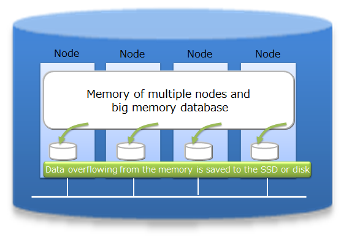
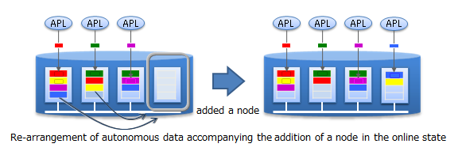
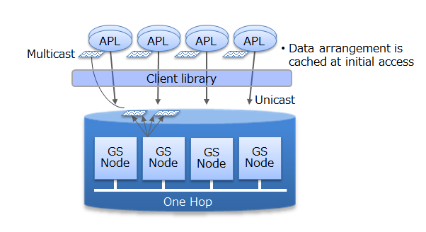

# What is GridDB

GridDB is a distributed NoSQL database to manage a group of data (known as a row) that is made up of a key and multiple values.  Besides having a composition of an in-memory database that arranges all the data in the memory, it can also adopt a hybrid composition combining the use of a disk (including SSD as well) and a memory. By employing a hybrid composition, it can also be used in small scale, small memory systems.

In addition to the 3 Vs (volume, variety, velocity) required in big data solutions, data reliability/availability is also assured in GridDB. Using the autonomous node monitoring and load balancing functions, labor-saving can also be realized in cluster applications.

## Features of GridDB

### Big data (volume)<a href="https://www.global.toshiba/ww/products-solutions/ai-iot/griddb/product/griddb-ee.html?utm_source=griddb.net&utm_medium=referral&utm_campaign=commercial_badge"><badge text="Commercial version" type="warning"/></a>

As the scale of a system expands, the data volume handled increases and thus the system needs to be expanded so as to quickly process the big data.

System expansion can be broadly divided into 2 approaches - scale-up (vertical scalability) and scale-out (horizontal scalability).

-   What is scale-up (vertical scalability)?

    This approach reinforces the system by adding memory to the operating machines, using SSD for the disks, adding processors, and so on. Generally, this approach increases individual processing time and increases the system processing speed. On the other hand, since the nodes must be stopped before the scale-up operation, as it is not a cluster application using multiple machines, once a failure occurs, failure recovery is also time-consuming.

-   What is scale-out (horizontal scalability)?

    This approach increases the number of nodes constituting a system to improve the processing capability. Since multiple nodes are generally set to operate in coordination, this approach features that there is no need to completely stop the service during maintenance or even when a failure occurs. However, the application management time and effort increases as the number of nodes increases. This architecture is suitable for performing highly parallel processing.

In GridDB, in addition to the scale-up approach to increase the number of operating nodes and reinforce the system, new nodes can be added to expand the system with a scale-out approach to incorporate nodes into an operating cluster.

As an in-memory processing database, GridDB can handle a large volume of data with its scale-out model. In GridDB, data is distributed throughout the nodes inside a cluster that is composed of multiple nodes. That is, GridDB provides a large-scale memory database by handling memories of more than one nodes as one big memory space.

Moreover, since GridDB manages data both in memories and on a disk, even when a single node is in operation, it can maintain and access the data larger than its memory size. A large capacity that is not limited by the memory size can also be realized.

System expansion can be carried out online with a scale-out approach. That is, without stopping the system in operation, the system can be expanded when the volume of data increases.

In the scale-out approach, data is relocated into the new nodes added to the system in accordance with the load of each existing node in the system. As GridDB will optimize the load balance, the application administrator does not need to worry about the data arrangement. Operation is also easy because a structure to automate such operations has been built into the system.

### Various data types (variety)

GridDB data adopts a Key-Container data model that is expanded from Key-Value. Data is stored in a device equivalent to a RDB table known as a container.  (A container can be considered a RDB table for easier understanding.)

When accessing data in GridDB, the model allows data to be short-listed with a key thanks to its Key-Value database structure, allowing processing to be carried out at the highest speed. A design that prepares a container serving as a key is required to support the entity under management.

Besides being suitable for handling a large volume of time series data (TimeSeries container) that is generated by a sensor or the like and other values paired with the time of occurrence, space data such as position information, etc. can also be registered and space specific operations (space intersection) can also be carried out in a container. A variety of data can be handled as the system supports non-standard data such as array data, BLOB and other data as well.

### High-speed processing (velocity)

A variety of architectural features is embedded in GridDB to achieve high-speed processing.

#### Processing is carried out in the memory space as much as possible

In the case of an operating system with an in-memory in which all the data is arranged, there is no real need to be concerned about the access overhead in the disk. However, in order to process a volume of data so large that it cannot be saved in the memory, there is a need to localize the data accessed by the application and to reduce access to the data arranged in the disk as much as possible.

In order to localize data access from an application, GridDB provides a function to arrange related data in the same block as far as possible. Since data in the data block can be consolidated according to the hints provided in the data, the memory hit rate is raised during data access, thereby increasing the processing speed for data access. By setting hints for memory consolidation according to the access frequency and access pattern in the application, limited memory space can be used effectively for operation (Affinity function).

#### Reduces the overhead

In order to minimize waiting time caused by locks or latches in a simultaneous access to the database, GridDB allocates exclusive memory and DB files to each CPU core and thread, so as to eliminate waiting time for exclusive and synchronization processing.

In addition, direct access between the client and node is possible in GridDB by caching the data arrangement when accessing the database for the first time on the client library end. Since direct access to the target data is possible without going through the master node to manage the operating status of the cluster and data arrangement, access to the master node can be centralized to reduce communication cost substantially.

#### Processing in parallel

GridDB provides high-speed processing using the following functions: parallel processing e.g. by dividing a request into processing units capable of parallel processing in the drive engine and executing the process using a thread in the node and between nodes, as well as dispersing a single large data into multiple nodes (partitioning) for processing to be carried out in parallel between nodes.

### Reliability/availability<a href="https://www.global.toshiba/ww/products-solutions/ai-iot/griddb/product/griddb-ee.html?utm_source=griddb.net&utm_medium=referral&utm_campaign=commercial_badge"><badge text="Commercial version" type="warning"/></a>

Data are duplicated in a cluster and the duplicated data, replicas, are located in multiple nodes. Replicas include master data, called an owner replica, and duplicated data called a backup. By using these replicas, processing can be continued in any of the nodes constituting a cluster even when a failure occurs. Special operating procedures are not necessary as the system will also automatically perform re-arrangement of the data after a node failure occurs (autonomous data arrangement). Data arranged in a failed node is restored from a replica and then the data is re-arranged so that the set number of replicas is reached automatically.

Duplex, triplex or multiplex replica can be set according to the availability requirements.

Each node performs persistence of the data update information using a disk. Even if a failure occurs in the cluster system, all the registered and updated data up to the failure can be restored without being lost.

In addition, since the client also possesses cache information on the data arrangement and management, upon detecting a node failure, it will automatically perform a failover and data access can be continued using a replica.

GridDB Editions
------------

GridDB has the following products.

-   GridDB Community Edition (CE)
-   GridDB Enterprise Edition (EE)

In addition to the features described in [Features of GridDB](#features-of-griddb) above, GridDB Enterprise Edition has the following two features:

-   NewSQL interface
    -   In addition to being SQL 92 compliant, GridDB AE supports ODBC (C language interface) and JDBC (Java interface) application interfaces.
    -   By using ODBC/JDBC, direct access to the database from BI (Business Intelligence) or ETL (Extract Transfer Load) tool becomes possible.
    -  	Containers can be considered as tables and operated.
-   Table partitioning function
    -   Partitioning function for high speed access to a huge table.
    -   Since data is divided into multiple parts and distributed to multiple nodes, it is possible to parallelize data search and extraction from the table, thus realizing faster data access.

The features of each interface are as follows.

-   NoSQL interface (NoSQL I/F)
    -   Client APIs (C, Java) of NoSQL I/F focus on batch processing of big data at high speed.
    -   It is used for data collection, high-speed access of key value data, simple aggregate calculation using TQL, etc.
-   NewSQL interface (NewSQL I/F)
    -   ODBC/JDBC of NewSQL I/F focus on cooperation with existing applications and development productivity using SQL.
    -   It is used to classify and analyze data collected using BI tools, etc.

When using GridDB, both NoSQL I/F and NewSQL I/F can be used depending on the use case.

The GridDB database and NoSQL/NewSQL interface of GridDB are compatible within the same major version (e.g., a minor version upgrade).  The version notation is as follows:

-   The version of GridDB is represented as "X.Y[.Z]", and each symbol represents the following.
    -   Major version (X): Changed for significant enhancements.
    -   Minor version (Y): Changed for expanding or adding functions.
    -   Revision (Z): Changed for such as bug fixes.

When using both NoSQL I/F and NewSQL I/F in GridDB AE, check the following specification in advance

-   Containers created by NoSQL I/F can be operated as tables by NewSQL I/F.  Containers created with NoSQL I/F can be accessed as tables in NewSQL I/F.
-   And tables created with NewSQL I/F can be accessed as containers in NoSQL I/F.  The names of tables and containers must be unique.

## Terminology

Describes the terms used in GridDB in a list.

| Term                                                | Description    |
|--------------------------------|------------------------------------------------------------------------|
| Node                                                | Refers to the individual server process to perform data management in GridDB.                   |
| Cluster                                             | Single or a set of nodes that perform data management together in an integrated manner.     |
| Master node                                         | Node to perform a cluster management process.                                         |
| Follower node                                       | All other nodes in the cluster other than the master node.                       |
| number of nodes constituting a cluster              | Refers to the number of nodes constituting a GridDB cluster. When starting GridDB for the first time, the number is used as a threshold value for the cluster to be valid. (Cluster service is started when the number of nodes constituting a cluster joins the cluster.)  |
| number of nodes already participating in a cluster  | Number of nodes currently in operation that have been incorporated into the cluster among the nodes constituting the GridDB cluster. |
| Block                                               | A block is a data unit for data persistence processing in a disk (hereinafter referred to a checkpoint) and is the smallest physical data management unit in GridDB. Multiple container data are arranged in a block. Block size is set up in a definition file (cluster definition file) before the initial startup of GridDB. |
| Partition                                           | A partition is a unit of data management for placing a container and is equivalent to a data file on the file system when persisting data to a disk. One partition corresponds to one data file. It is also the smallest unit of data placement between clusters, as well as a unit of data movement and copy for adjusting the load balance between nodes (rebalancing) and for managing data multiplexing (replicas) in the event of a failure. |
| Row                                                 | Refers to one row of data registered in a container or table. Multiple rows are registered in a container or table. A row consists of values of columns corresponding to the schema definition of the container (table).   |
| Container (Table)                                   | Container to manage a set of rows. It may be called a container when operated with NoSQL I/F, and may be called a table when operated with NewSQL I/F. What these names refer are the same object, only in different names. A container has two data types: collection and timeseries container.        |
| Collection (table)                                  | One type of container (table) to manage rows having a general key.     |
| Timeseries container (timeseries table)             | One type of container (table) to manage rows having a timeseries key. Possesses a special function to handle timeseries data. |
| Database file                                       | A database file is a group of files where the data retained by nodes configuring a cluster is written to disks or SSDs and is persisted. A database file is a collective term for data files, checkpoint log files, and transaction log files. |
| Data file                                           | A file to which partition data is written.  Updated information located on the memory is reflected at the interval  (/checkpoint/checkpointInterval) specified in the node definition file. |
| Checkpoint log file                                 | This is a file for storing block management information for a partition. Block management information is written in smaller batches at the interval (/checkpoint/checkpointInterval) specified in the node definition file. |
| Transaction log file                                | Update information of the transaction is saved sequentially as a log. |
| LSN (Log Sequence Number)                           | Shows the update log sequence number, which is assigned to each partition during the update in a transaction. The master node of a cluster configuration maintains the maximum number of LSN (MAXLSN) of all the partitions maintained by each node. |
| Replica                                             | Replication is the process of creating an exact copy of the original data. In this case, one or more replica are created and stored on multiple nodes, which results to the creation of partition across the nodes. There are 2 forms of replica, master and backup. The former one refers to the original or master data, whereas the latter one is used in case of failure as a reference.       |
| Owner node                                          | A node that can update a container in a partition. A node that records the container serving as a master among the replicated containers. |
| Backup node                                         | A node that records the container for backup data among the replicated containers.      |
| Definition file                                     | Definition file includes two types of parameter files: gs_cluster.json, hereinafter referred to as a cluster definition file, used when composing a cluster; gs_node.json, hereinafter referred to as a node definition file, used to set the operations and resources of the node in a cluster. It also includes a user definition file for GridDB administrator users.   |
| Event log file                                      | Event logs of the GridDB server are saved in this file including messages such as errors, warnings and so on. including messages such as errors, warnings and so on.                     |
| OS user (gsadm)                                     | An OS user has the right to execute operating functions in GridDB. An OS user named gsadm is created during the GridDB installation.       |
| Administrator user                                  | An administrator user is a GridDB user prepared to perform operations in GridDB.         |
| General user                                        | A user used in the application system.                     |
| user definition file                                | File in which an administrator user is registered. During initial installation, 2 administrators, system and admin, are registered.               |
| Cluster database                                    | General term for all databases that can be accessed in a GridDB cluster system.                                                                            |
| Database                                            | Theoretical data management unit created in a cluster database. A public database is created in a cluster database by default. Data separation can be realized for each user by creating a new database and giving a general user the right to use it.                 |
| Full backup                                         | A backup of the cluster database currently in use is stored online in the backup directory specified in the node definition file.      |
| Differential/incremental backup                     | A backup of the cluster database currently in use is stored online in the backup directory specified in the node definition file. In subsequent backups, only the difference in the update block after the backup is backed up.    |
| Automatic log backup                                | In addition to backing up the cluster database currently in use in the specified directory online, the transaction log is also automatically picked up at the same timing as the transaction log file writing. The write timing of the transaction log file follows the value of /dataStore/logWriteMode in the node definition file.            |
| Failover                                            | When a failure occurs in a cluster currently in operation, the structure allows the backup node to automatically take over the function and continue with the processing.       |
| Client failover                                     | When a failure occurs in a cluster currently in operation, the structure allows the backup node to be automatically re-connected to continue with the processing as a retry process when a failure occurs in the API on the client side.    |
| Table partitioning                                  | Function to access a huge table quickly by allowing concurrent execution by processors of multiple nodes, and the memory of multiple nodes to be used effectively by distributing the placement of a large amount of table data with multiple data registrations in multiple nodes.             |
| Data partition                                      | General name of data storage divided by table partitioning. Multiple data partitions are created for a table by table partitioning. Data partitions are distributed to the nodes like normal containers. The number of data partitions and the range of data stored in each data partition are depending on the type of table partitioning (hash, interval or interval-hash). |
| Data Affinity                                       | A function to raise the memory hit rate by placing highly correlated data in a container in the same block and localizing data access.      |
| Placement of container/table based on node affinity | A function to reduce the network load during data access by placing highly correlated containers in the same node.       |