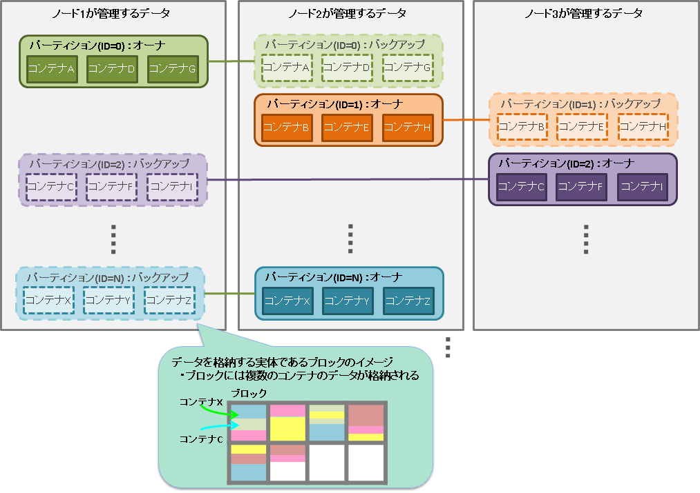

#  データモデル
<a id="data_model"></a>

GridDBは、Key-Valueに似た独自のKey-Container型データモデルです。以下の特徴があります。
-   Key-Valueをグループ化するコンテナというRDBのテーブルに似た概念を導入
-   コンテナに対してデータ型を定義するスキーマ設定が可能。カラムにインデックスを設定可能。
-   コンテナ内のロウ単位でトランザクション操作が可能。また、コンテナ単位でACIDを保証します。


GridDBのデータは、ブロック、コンテナ、テーブル、ロウ、パーティションという単位でデータ管理されています。


-   ブロック

    ブロックとは、ディスクへのデータ永続化処理（以降、チェックポイントと呼びます）のデータ単位であり、GridDBの物理的なデータ管理の最小単位です。
    ブロックには複数のコンテナのデータが配置されます。ブロックサイズは、GridDBの初期起動前に定義ファイル（クラスタ定義ファイル）で設定します。

    GridDBは、システムの初期起動とともにデータベースファイルが作成されるため、初期起動以降ブロックサイズの変更はできません。

-   コンテナ（テーブル）

    利用者とのI/Fとなるデータ構造です。 複数のブロックで構成されます。 NoSQL I/Fで操作する場合はコンテナ、NewSQL I/Fで操作する場合はテーブルと呼びます。コンテナ（テーブル）には、コレクション（テーブル）と時系列コンテナ（時系列テーブル）の２種類のデータタイプが存在します。

    アプリケーションでデータを登録する前には、必ずコンテナ（テーブル）を作成しておく必要があります。

-   ロウ

    ロウは、コンテナやテーブルに登録される1行のデータを指します。コンテナやテーブルには複数のロウが登録されますが、データは同じブロックに配置されるわけではありません。登録・更新されるタイミングに応じて、パーティション内の適切なブロックに配置されます。

    ロウは複数のデータ型のカラムから構成されます。

-   パーティション

    パーティションは、1つ以上のコンテナやテーブルを含むデータ管理の単位です。

    パーティションはクラスタ間でのデータ配置の単位であり、ノード間の負荷バランスを調整するためのデータ移動や、障害発生に備えたデータ多重化（レプリカ）管理のための単位です。データのレプリカはパーティション単位にクラスタを構成するノードに配置されます。

    パーティション内のコンテナに対して更新操作ができるノードはオーナノードと呼ばれ、１つのパーティションに対して１つのノードが割り当てられます。オーナノード以外でレプリカを保持するノードは、バックアップノードとなります。パーティションには、レプリカの数の設定値に応じてマスタデータと複数のバックアップデータがあります。

    コンテナとパーティションの関連は恒久的なもので、コンテナ作成時に、所属するパーティションが決定した後は変わりません。パーティションとノードの関連は一時的なもので、自律的データ配置によってパーティションが別のノード上に移動する場合があります。

    また、パーティションの保持するデータがOSのディスクに保存される物理的なデータベースファイルとなります。



<a id="label_container"></a>
## コンテナ

GridDBにデータを登録し、検索するには、データを格納するコンテナ(テーブル)を作成する必要があります。 NoSQL I/Fで操作する場合はコンテナ、NewSQL I/Fで操作する場合はテーブルと呼びます。

コンテナ(テーブル)もデータベースと同様の命名規則があります。
-   指定可能な文字列は、英数字およびアンダースコア\_、ハイフン-、ドット.、スラッシュ/、イコール=です。ただし、先頭文字に数字は指定できません。
-   命名時の大文字・小文字は保持されますが、大文字小文字を同一視した場合に同一名となるコンテナ(テーブル)は作成できません。


[メモ]
- 同一のデータベースの中で、[ビュー](#label_view)と同じ名前のコンテナは作成できません。


### 種別

コンテナ(テーブル)には、2つのデータタイプがあります。
時々刻々発生するデータを発生した時刻とともに管理するのに適したデータタイプである **時系列コンテナ(時系列テーブル)** とさまざまなデータを管理する **コレクション(テーブル)** です。


### データ型

コンテナ(テーブル)にはスキーマを設定できます。登録できるデータ型には、基本的なデータ型である **基本型** と **配列型** があります。

#### 基本型

登録できる基本型のデータを説明します。基本型とは、他の型の組み合わせで表現できない、基本的な型です。

| データ型    | 説明                                                                                              |
|-------------|--------------------------------------------------------------------------------------------------|
| BOOL型      | 真または偽のいずれかの値                                                                           |
| STRING型    | Unicodeコードポイントを文字とする、任意個数の文字の列より構成                                         |
| BYTE型      | -2<sup>7</sup>から2<sup>7</sup>-1 (8ビット)の整数値                                                |
| SHORT型     | -2<sup>15</sup>から2<sup>15</sup>-1 (16ビット)の整数値                                             |
| INTEGER型   | -2<sup>31</sup>から2<sup>31</sup>-1 (32ビット)の整数値                                             |
| LONG型      | -2<sup>63</sup>から2<sup>63</sup>-1 (64ビット) の整数値                                            |
| FLOAT型     | IEEE754で定められた単精度型(32ビット)浮動小数点数                                                   |
| DOUBLE型    | IEEE754で定められた倍精度型(64ビット)浮動小数点数                                                   |
| TIMESTAMP型 | 年月日ならびに時分秒からなる時刻を表す型。データベースに保持されるデータ形式はUTCで、精度はミリ秒         |
| GEOMETRY型  | 空間構造を表すためのデータ型                                                                        |
| BLOB型      | 画像や音声などのバイナリデータのためのデータ型                                                        |

STRING型､GEOMETRY型、BLOB型は管理できるデータのサイズに以下の制限があります。制限値は、GridDBの定義ファイル（gs_node.json）のデータベースの入出力単位であるブロックサイズに応じて値が異なります。

| 型         | ブロックサイズ(64KB)           | ブロックサイズ (1MB～32MB)         |
|------------|--------------------------------|---------------------------------|
| STRING型   | 最大31KB (UTF-8エンコード相当) | 最大128KB (UTF-8エンコード相当) |
| GEOMETRY型 | 最大31KB (内部格納形式相当)    | 最大128KB (内部格納形式相当)    |
| BLOB型     | 最大1GB - 1Byte                | 最大1GB - 1Byte                 |


**GEOMETRY型(空間型)**

GEOMETRY型（空間型）のデータは地図情報システムなどでよく利用されています。空間型のデータは、NoSQLインターフェースでのみ使用できます。NewSQLインターフェースでは未サポートです。

GEOMETRY型のデータは、WKT（Well-known text）を用いて記述します。WKTは、地理空間に関する情報の標準化などを推進している非営利団体OGC(Open Geospatial Consortium)にて策定されています。GridDBでは、コンテナのカラムをGEOMETRY型に設定することで、WKTで記述された空間情報をカラムに格納できます。

GEOMETRY型では以下のWKT形式をサポートします。

-   POINT
    -   2次元または3次元の座標により生成される点。
    -   記述例： POINT(0 10 10)
-   LINESTRING
    -   2つ以上の点により表現される、2次元または3次元空間上の直線の集合。
    -   記述例： LINESTRING(0 10 10, 10 10 10, 10 10 0)
-   POLYGON
    -   直線の集合により表現される、2次元または3次元空間上の閉じた領域。POLYGONの頂点は反時計回りに指定します。POLYGON内に島をつくる場合、内部の点は時計回りで指定します。
    -   記述例： POLYGON((0 0,10 0,10 10,0 10,0 0))、POLYGON ((35 10, 45 45, 15 40, 10 20, 35 10),(20 30, 35 35, 30 20, 20 30))
-   POLYHEDRALSURFACE
    -   2次元または3次元の座標により生成される点
    -   記述例： POLYHEDRALSURFACE (((0 0 0, 0 1 0, 1 1 0, 1 0 0, 0 0 0)), ((0 0 0, 0 1 0, 0 1 1, 0 0 1, 0 0 0)),((0 0 0, 1 0 0, 1 0 1, 0 0 1, 0 0 0)), ((1 1 1, 1 0 1, 0 0 1, 0 1 1, 1 1 1)),((1 1 1, 1 0 1, 1 0 0, 1 1 0, 1 1 1)),((1 1 1, 1 1 0, 0 1 0, 0 1 1, 1 1 1)) )
-   QUADRATICSURFACE
    -   定義式f(X) = &lt;AX, X&gt; + BX + cにより表現される、3次元空間上の2次曲面。

ただし、空間構造QUADRATICSURFACEはコンテナに登録することはできず、検索条件としてのみ使用できます。

GEOMETRY型を利用した演算は、APIやTQLで実行できます。

TQLでは2次元、3次元の空間を定義する空間生成関数と空間型データ間での演算の関数を提供します。TQLではコンテナ内のGEOMETRY型のカラムと指定した空間データで演算を行いその結果を以下のようにして得ることができます。

```
 SELECT * WHERE ST_MBRIntersects(geom, ST_GeomFromText('POLYGON((0 0,10 0,10 10,0 10,0 0))'))
```

TQLで提供する関数の詳細は『[GridDB TQL リファレンス](../11.md_reference_tql/md_reference_tql.md)』を参照ください。


#### 複合型

コンテナに登録できる、基本型の組み合わせで構成される型を定義します。 現バージョンでは配列型のみです。

- 配列型

  値の列を表します。基本型のデータの内、GEOMETRY型とBLOB型を除く基本型を配列型として、データを保持することができます。配列で保持できるデータ量の制限は、データベースのブロックサイズに応じて値が異なります。

  | 型     | ブロックサイズ(64KB) | ブロックサイズ (1MB～32MB) |
  |--------|---------------------|----------------------|
  | 配列数 | 4000                 | 65000                |

【メモ】

配列型カラムでは、TQLでの操作に以下の制約があります。

-   配列型カラムのi番目の値の比較はできますが、全要素に関する演算（集計演算）はできません。

  - （例）columnAが配列型で定義されたとした場合
    -   select \* where ELEMENT(0, columnA) &gt; 0 のような配列内の要素を指定した比較はできます。ただし、ELEMENTの"0"の部分に変数は指定できません。

    -   select SUM(columnA) のような集計計算はできません。


<a id="primary_key"></a>
### 主キー

コンテナ(テーブル)には、主キーを設定できます。主キーによって、コンテナ(テーブル)のロウの一意性を保証します。また主キーを設定したカラムには、NULL値を許容しません。

主キーは、コンテナではROWKEY(ロウキー)、テーブルではPRIMARY KEY(プライマリキー)と呼びます。

-   時系列コンテナ（時系列テーブル）の場合
    -   ROWKEY(PRIMARY KEY)は先頭カラムに設定できます。（GridDBではカラムを0番から数えるため、カラム番号0に設定します。）
    -   ROWKEY(PRIMARY KEY)は、TIMESTAMP型です。
    -   指定は必須です。
-   コレクション(テーブル)の場合
    -   ROWKEY(PRIMARY KEY)は先頭カラムより連続した複数のカラムに設定できます。ロウキーを複数のカラムに設定した場合は、複合ロウキーと呼びます。設定できるカラム数の上限は16個です。
        - 例) 先頭カラムより連続したカラムであるstr1, str2, str3をロウキーに設定できます。
          ```
          CREATE TABLE sample_table1
          (str1 string, str2 string, str3 string, str4 string, str5 string, int1 integer,
           PRIMARY KEY(str1, str2, str3));
          ```
        - 例) 連続していないカラムであるstr1, str3, str4をロウキーに設定することはできません。以下のSQLを実行するとエラーになります。
          ```
          CREATE TABLE sample_table2
          (str1 string, str2 string, str3 string, str4 string, str5 string, int1 integer,
           PRIMARY KEY(str1, str3, str4));
          ```
    -   ROWKEY(PRIMARY KEY)は、STRING、INTEGER、LONG、TIMESTAMPのいずれかの型のカラムです。
    -   指定は必須ではありません。

ROWKEY(PRIMARY KEY)に設定したカラムには、カラムの型に応じてあらかじめ既定された、デフォルトの索引が設定されます。

GridDBの現バージョンでは、ROWKEY(PRIMARY KEY)に指定できるSTRING、INTEGER、LONG、TIMESTAMPのすべての型のデフォルトの索引はTREE索引です。


[メモ]
- NoSQLインターフェースにて、複合ロウキーを設定する例は『[GridDB プログラミングガイド](../10.md_programming_guide/md_programming_guide.md)』の「複合ロウキーを扱う」を参照ください。

　　

<a id="label_view"></a>
## ビュー

コンテナのデータを参照するためのビューを作成できます。

ビュー作成時に、コンテナに対する参照(SELECT文)を定義します。ビューはコンテナと似たオブジェクトですが実データを持ちません。ビューを含むクエリの実行時に、ビュー作成時に定義されたSELECT文を評価して結果を返します。

ビューは参照(SELECT)のみ可能です。ビューに対して、データの追加(INSERT)/更新(UPDATE)/削除(DELETE)を行うことはできません。


[メモ]
- 同一のデータベースの中で、コンテナと同じ名前のビューは作成できません。
- ビューの命名規則は、[コンテナの命名規則](#label_container)と同様です。