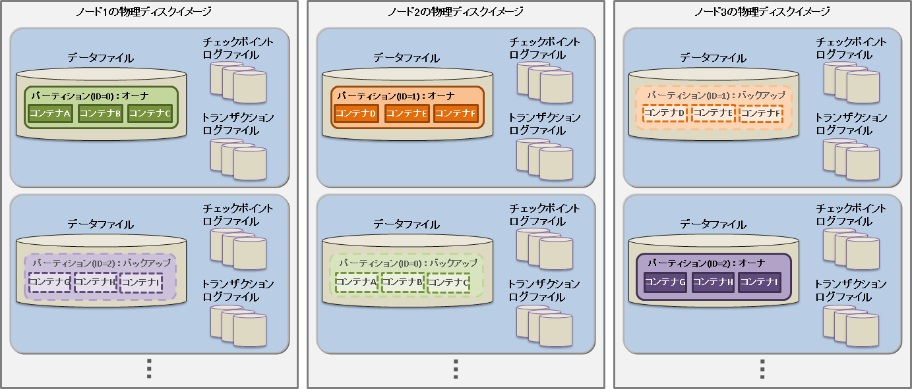
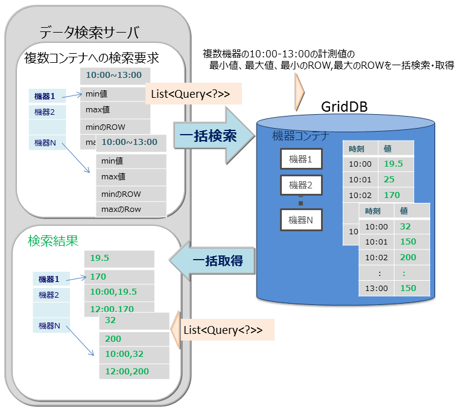
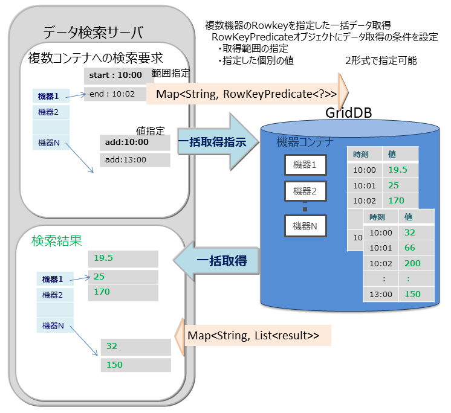
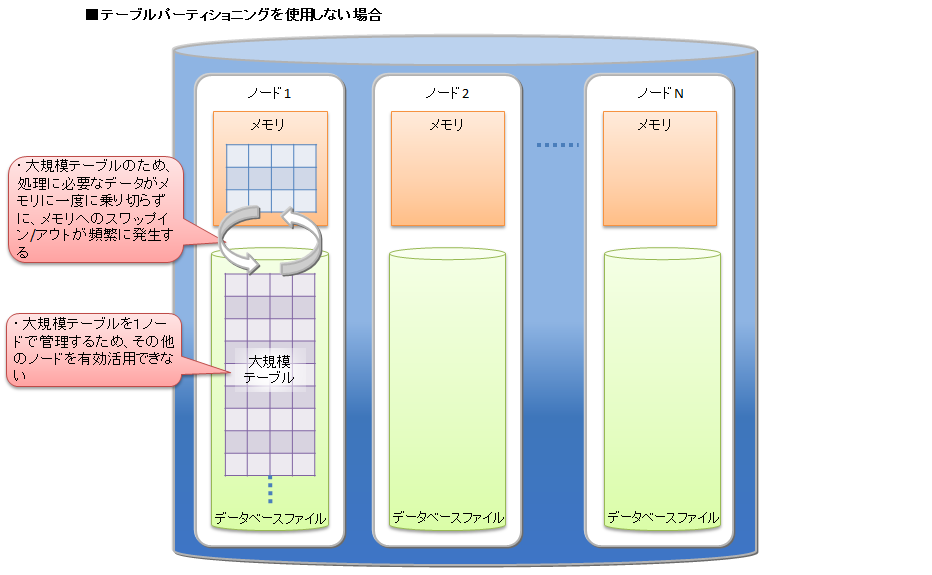
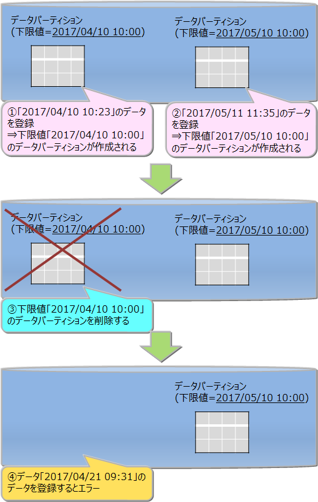
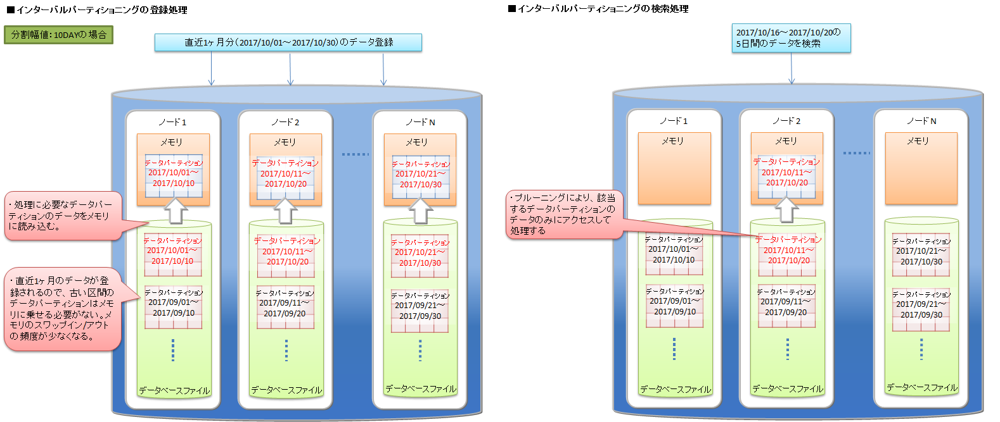
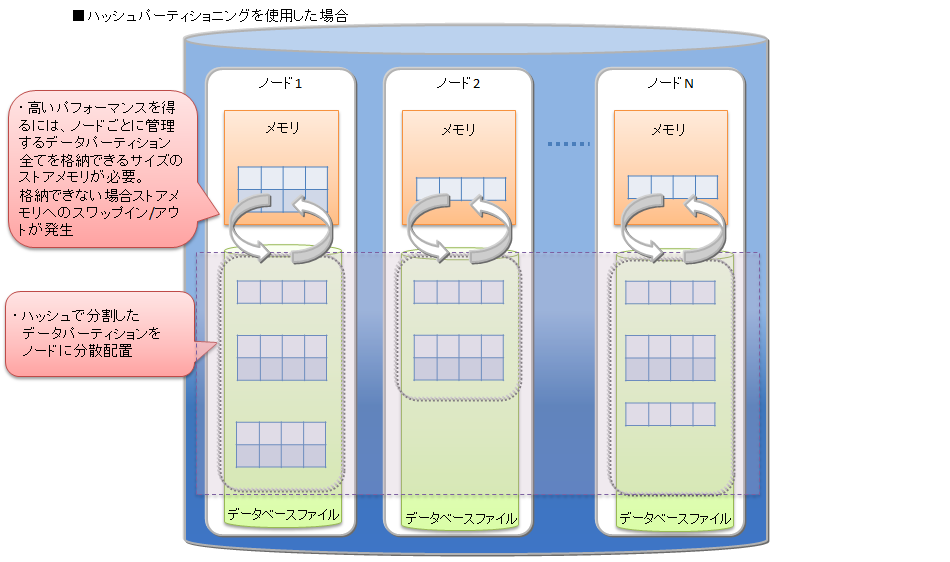

# データベース機能
<a id="label_database_feature"></a>

## リソースの管理

GridDBのクラスタを構成するリソースには、メモリ上のデータベースのほかにディスク上に永続化されるリソースがあります。 永続化リソースには、以下のものがあります。

-   データベースファイル

    クラスタを構成するノードの保有するデータをディスクやSSDに書き込み、永続化したファイル群です。データベースファイルは、定期的にメモリ上のデータベースが書き込まれるデータファイル/チェックポイントログファイルと、データ更新の都度保存されるトランザクションログファイルを総称します。



-   データファイル

    パーティションがディスクに永続化されたファイルです。ノード定義ファイルのサイクル（/checkpoint/checkpointInterval）でメモリ上の更新情報が反映されます。 ファイルのサイズはデータ容量に応じて拡張します。一度拡張したデータファイルのサイズは、コンテナやロウなどのデータを削除しても減少しません。なお、データ削除後の空き領域は再利用されます。データファイルは複数に分割することも可能です。

-   チェックポイントログファイル

    パーティションのブロック管理情報がディスクに永続化されたファイルです。ノード定義ファイルのサイクル（/checkpoint/checkpointInterval）でブロック管理情報の書き込みを分割で行います。 パーティションごとにファイルをデフォルトで最大10個作成します。ノード定義ファイルの分割数(/checkpoint/partialCheckpointInterval)で調整できます。

-   トランザクションログファイル

    トランザクションの更新情報がログとしてシーケンシャルに保存されるファイルです。ひとつのファイルには、前回のチェックポイント開始から次のチェックポイント開始までに実行されたトランザクションログを格納します。パーティションごとにファイルをデフォルトで最大3個(現在のログファイルと過去2世代分のログファイル)作成します。

-   定義ファイル

    クラスタを構成する際のパラメータファイル（gs_cluster.json：以降、クラスタ定義ファイルと呼ぶ）と、クラスタ内でのノードの動作やリソースを設定するパラメータファイル（gs_node.json：以降、ノード定義ファイルと呼ぶ）の２つがあります。また、GridDBの管理ユーザのユーザ定義ファイルもあります。

-   イベントログファイル

    GridDBサーバのイベントログが保存されます。イベントログにはエラーや警告などのメッセージが含まれます。

-   バックアップファイル

    GridDBのデータファイルのバックアップデータが保持されます。


これらのリソースは、GridDBホーム（環境変数GS_HOMEで指定されるパス)で配置を定義します。 初期インストール状態では、/var/lib/gridstoreディレクトリがGridDBホームで、このディレクトリの下に各リソースの初期データが配置されます。

初期の配置状態は以下のとおりです。

```
/var/lib/gridstore/        # GridDBホームディレクトリ
     admin/                # 統合運用管理機能ホームディレクトリ
     backup/               # バックアップディレクトリ
     conf/                 # 定義ファイルディレクトリ
          gs_cluster.json  # クラスタ定義ファイル
          gs_node.json     # ノード定義ファイル
          password         # ユーザ定義ファイル
     data/                 # データファイル,チェックポイントログディレクトリ
     txnlog/               # トランザクションログディレクトリ
     expimp/               # Export/Importツールディレクトリ
     log/                  # サーバイベントログ・運用ツールログディレクトリ
```

GridDBホームは、OSユーザgsadmの.bash_profileファイルの設定で変更できます。GridDBホームを変更する場合は、上記ディレクトリのリソースも適宜移動してください。

.bash_profileファイルには、環境変数GS_HOMEとGSLOGの２つの環境変数の設定がされています。

```
vi .bash_profile

# GridStore specific environment variables
GS_LOG=/var/lib/gridstore/log
export GS_LOG
GS_HOME=/var/lib/gridstore　　　　　　　　　　★GridDBホームの変更
export GS_HOME
```

データベースディレクトリやバックアップディレクトリ、サーバイベントログディレクトリは、ノード定義ファイルの設定値を変更することで変更できます。

クラスタ定義ファイルやノード定義ファイルで設定できる内容に関しましては[パラメータ](#label_parameters)を参照してください。


## データアクセス機能

GridDBのデータにアクセスするには、NoSQLインターフェースもしくはNewSQLインターフェースを用いてアプリケーションを開発する必要があります。データアクセスでは、コンテナやテーブルがクラスタデータベースのどこに配置されているかの位置情報を意識する必要はなく、GridDBのクラスタデータベースに接続するだけでアクセスができます。コンテナがクラスタを構成するどのノードに配置されているのかをアプリケーションシステムが意識する必要はありません。

GridDBのAPIでは、クラスタデータベースへの初期接続時に、ノード情報（パーティション）とともにコンテナの配置ヒント情報をクライアント側に保持（キャッシュ）します。

アプリケーションが利用するコンテナが切り替わる度に、配置されているノードを探す処理のためクラスタにアクセスする必要はなく、コンテナを保持するノードに直に接続して処理をするため、通信のオーバヘッドを最小限としています。

GridDBではリバランス処理により、コンテナ配置は動的に変わりますが、クライアントキャッシュは定期的に更新されるため、コンテナの位置は透過です。タイミングによってクライアントからのアクセスでノードがミスヒットした時でも、自動的に再配置情報を取得して処理を継続します。

<a id="tql_and_sql"></a>
### TQLとSQL

データベースのアクセス言語として、TQLとSQL-92準拠のSQLをサポートしています。

-   TQLとは

    簡易版SQLとして、コンテナを単位とした検索、集計演算などの機能をサポートします。TQLはNoSQLインターフェースから利用します。

    TQLは、小規模なコンテナに対して少量ヒットするような検索に適しています。データ量・ヒット件数が少ない場合には、SQLより低いレイテンシで検索できることが特徴です。ヒット件数を少量にする手段の一つとして、TQL構文のLIMIT節の指定があります。

    大量データを含むコンテナを検索する場合は、SQLの利用を推奨します。

    NewSQLインターフェースで作成したコンテナや、パーティショニングされたテーブルに対しても、TQLを利用することができます。パーティショニングされたテーブルに対するTQLについては、次の制限があります。

    -   構文では、WHERE節の条件式によるフィルタリングが利用できます。集計演算、時系列データ選択・補間演算、最大値・最小値のロウ集合選択演算、ORDER BYなどは利用できません。

    -   更新用ロックをかけることはできません。

    TQLの詳細は『[GridDB TQL リファレンス](../11.md_reference_tql/md_reference_tql.md)』を参照ください。

-   SQLとは

    ISOで言語仕様の標準化が行われており、GridDBではSQL-92に準拠したデータの操作や定義を行うためのインターフェースをサポートします。SQLはNewSQLインターフェースから利用します。

    NoSQLインターフェースで作成したコンテナに対しても、SQLを利用することができます。

    SQLの詳細は『[GridDB SQLリファレンス](../14.md_reference_sql/md_reference_sql.md)』を参照ください。

<a id="batch_functions"></a>
### 複数コンテナへの一括処理機能

GridDBが提供するNoSQL I/Fでは、時々刻々発生するイベント情報を高速に処理するためのインターフェースを用意しています。

大量に発生するイベントを発生の都度データベースサーバに送信していると、ネットワークへの負荷が高くなりシステムのスループットがあがりません。通信回線帯域が狭い場合特に顕著な影響がでます。NoSQL I/Fでは複数のコンテナに対する複数のロウの登録や、複数のコンテナへの複数の問い合わせ(TQL)を1リクエストで処理するためのマルチ処理が用意されています。頻繁にデータベースサーバにアクセスしないため、システム全体のスループットがあがります。

以下に例を挙げます。

- マルチプット(multiput)

  - 複数のセンサのイベント情報をデータベースに登録する処理として、センサ名毎にコンテナを用意します。センサ名とセンサの時系列イベントのロウ配列を作り、複数のセンサ分まとめたリスト(Map)を作成します。このリストデータを1回のAPI呼び出しでGridDBのデータベースに登録します。

  - マルチプットのAPIでは、複数クラスタからなるGridDBのノードに対して、１個以上のコンテナへの登録要求をまとめて行うことで通信処理を効率化します。また、マルチ登録処理では、トランザクション実行時のMVCCは行わず、高速に処理します。

  - マルチプットでは、トランザクションのコミットは、autocommitとなります。1件単位にデータが確定されます。


- マルチクエリ(fetchAll)

  - センサのイベント情報を集計する処理などで、コンテナへのクエリ問い合わせを複数実行するのではなく、１つの問い合わせで実行することができます。たとえば、センサから取得したデータの一日の最大値、最小値、平均値などの集計結果の取得や、最大値や最小値をもつロウ集合や特定の条件に合致するロウ集合といったロウ集合のデータ取得を最適化します。



- マルチゲット(multiget)

  - センサのイベント情報を取得する処理などで複数機器のRowkeyを指定した一括データ取得ができます。 RowKeyPredicateオブジェクトにデータ取得の条件を設定し、複数の機器のデータを一括で取得します。

  - RowKeyPredicateオブジェクトでは以下の2形式のいずれかで取得条件を設定します。
    - 取得範囲の指定
    - 指定した個別の値



<a id="index_function"></a>
## 索引機能

コンテナ(テーブル)のカラムに対し索引を作成することで、条件付き検索が高速に処理できます。

索引タイプにはツリー索引(TREE)、空間索引(SPATIAL)の2種類があります。
設定できる索引はコンテナ(テーブル)のタイプやカラムのデータ型に応じて異なります。

-   ツリー索引（TREE）
    -   等価検索、範囲（より大きい/等しい、より小さい/等しいなど）を含む参照に利用します。
    -   時系列コンテナ(時系列コレクション)のROWKEY(PRIMARY KEY)に対応するカラムを除く、任意種別のコンテナ（テーブル）における次に示す型のカラムに対して設定できます。
        -   STRING
        -   BOOL
        -   BYTE
        -   SHORT
        -   INTEGER
        -   LONG
        -   FLOAT
        -   DOUBLE
        -   TIMESTAMP
    -   ツリー索引のみ、複数のカラムを指定した索引を作成できます。これを複合索引と呼びます。1つの複合索引に指定できるカラム数の上限は16個で、同じカラムを複数回指定することはできません。
-   空間索引（SPATIAL）
    -   コレクションにおけるGEOMETRY型カラムに対してのみ設定できます。空間検索を高速に行う場合に指定します。

コンテナに作成できる索引の数に制限はありませんが、索引の作成は慎重に設計する必要があります。索引は、設定されたコンテナのロウに対して挿入、更新、または削除の各操作が実行されると更新されます。したがって、頻繁に更新されるロウのカラムに多数の索引を作成すると、挿入、更新、または削除の各操作でパフォーマンスに影響ができます。

索引は以下のようなカラムに作成します。
-   頻繁に検索されたり、ソートされたりするカラム
-   TQLのWHERE節の条件で頻繁に使用されるカラム
-   カーディナリティの高い（重複した値があまり含まれない）カラム

【メモ】
- テーブル（時系列テーブル）のカラムには、ツリー索引のみ設定できます。

<a id="ts_data_functions"></a>
## 時系列データ特有の機能

GridDBでは、高頻度で発生するセンサなどのデータ管理のために、メモリを最大限有効利用するデータ配置アルゴリズム(TDPA：Time Series Data Placement Algorithm)に従いデータ配置処理します。時系列コンテナ(時系列テーブル)では、内部データを周期性で分類しながらメモリ配置します。アフィニティ機能でヒント情報を与えるとさらに配置効率が上がります。また、データを必要に応じてディスクに追い出しながら、ほぼゼロコストで有効期限切れのデータを解放しています。

時系列コンテナ(時系列テーブル)は、TIMESTAMP型のROWKEY(PRIMARY KEY)を持ちます。

### TQLの演算機能

#### 集計演算

採取したデータの時間間隔でデータに重みをつけて計算します。つまり、時間間隔が長い場合、長時間その値が続いたことを想定した計算となります。

集計演算には以下の関数があります。

- TIME_AVG

  - 重み付きで平均を求める演算です。
  - 検索の条件に合致した各ロウについて、前後それぞれの時刻のロウとの中間時刻間の期間を特定の単位で換算したものを、重み付け値として使用します。条件で指定した時刻のロウのみが存在しない場合は、存在しないロウの代わりに条件に指定した時刻の直前、直後のロウを用いて重みづけ計算をします。
  - 計算の詳細イメージを図示します。


#### 選択・補間演算

時刻データは、収集されるデータの内容や収集タイミングにより想定した時刻より多少の時間のずれが発生することがあります。したがって時刻データをキーにして検索する際にも、指定した時刻周辺のデータが取得できる機能が必要です。

時系列コンテナ(時系列テーブル)を検索し、指定したロウを取得するための以下のような関数があります。

-   TIME_NEXT(\*, timestamp)

    指定の時刻と同一またはその直後の時刻を持つ1つのロウを選択します。

-   TIME_NEXT_ONLY(\*, timestamp)

    指定の時刻の直後の時刻を持つ1つのロウを選択します。
-   TIME_PREV(\*, timestamp)

    指定の時刻と同一またはその直前の時刻を持つ1つのロウを選択します。
-   TIME_PREV_ONLY(\*, timestamp)

    指定の時刻の直前の時刻を持つ1つのロウを選択します。

また、実体のロウのカラムの値を補間演算で計算するための以下のような関数があります。

-   TIME_INTERPOLATED(column, timestamp)

    指定の時刻に関して、一致するロウの指定のカラムの値、または、隣接する前後のロウの指定カラムの値を線形補間して得られた値を求めます。

-   TIME_SAMPLING(\*|column, timestamp_start, timestamp_end, interval, DAY|HOUR|MINUTE|SECOND|MILLISECOND)

    開始・終了時刻を指定して、特定範囲のロウ集合をサンプリングします。

    サンプリング位置の時刻は、開始時刻に対し非負整数倍のサンプリング間隔を加えた時刻のうち、終了時刻と同じかそれ以前のもののみです。

    各サンプリング位置の時刻と一致するロウが存在する場合は該当ロウの値を使用します。存在しない場合は補間された値を使用します。

### 期限解放機能

期限解放とは、設定した保持期間を超えたロウデータを、検索や削除などの操作対象から外して参照不可とした後、DBから物理的に削除する機能です。 利用されなくなった古いデータを操作の対象から外して削除することで、DBサイズを一定に保ち、データベースサイズ肥大化によるパフォーマンス低下を防ぐことができます。


保持期間はコンテナ単位に設定します。保持期間を越えたロウを「期限切れデータ」と呼びます。期限切れデータは参照不可となってAPIから操作できなくなるので、アプリケーションからはそのロウは存在しない状態になります。期限切れデータは、一定期間が経過すると、DBから物理的に削除する対象のデータになります。この削除対象となった期限切れデータを「コールドデータ」と呼びます。コールドデータは、そのまま自動的にDBから削除します。

#### 期限解放の設定

期限解放は、パーティショニングされたコンテナ(テーブル)で利用可能です。

- インターバル、インターバルハッシュでパーティショニングされた以下のテーブルに設定できます。
  - 時系列テーブル
  - パーティショニングキーがTIMESTAMP型のコレクションテーブル
- 設定項目は、保持期間、保持期間の単位です。
- 保持期間の単位として設定できるのは、日/時/分/秒/ミリ秒の単位です。年単位、月単位の指定はできません。
- ロウの保持期限は、データパーティションのロウ格納期間の最終日時に保持期間を足した日時です。同じデータパーティションに格納されているロウは、全て同じ保持期限になります。
- コールドデータになる単位は、データパーティションです。物理的データ削除はデータパーティション単位で行われます。


【メモ】

- 期限解放の設定は、テーブル作成時に行います。作成後に設定を変更することはできません。
- 保持期限超過の判定に使用される現在時刻は、GridDBの各ノードの実行環境に依存します。したがって、ネットワークの遅延や実行環境の時刻設定のずれなどにより、クライアントの時刻よりGridDBのノードの時刻が進んでいる場合、期限切れ前のロウにアクセスできなくなる場合があります。逆にクライアントの時刻のみ進んでいる場合は、期限切れロウにアクセスできる場合があります。意図しないロウの喪失を避けるために、最低限必要な期間よりも大きな値を設定することを推奨します。
- 期限切れのロウは、検索や更新といったロウ操作の対象から外れ、存在しないものとみなされます。期限切れのロウに対して行われた操作はエラーにはなりません。
  - 例) 保持期限が30日の設定の場合、現在から31日前の日時のロウを登録しても登録処理はエラーにはならず、かつ、テーブルにはそのロウは保存されません。
- 期限解放を設定する場合は、必ずクラスタの全ノードの時刻を同期してください。時刻がずれていると、ノード間で期限解放されるタイミングが異なるなどの問題が生じる場合があります。
- 期限切れデータからコールドデータになるまでの期間は、期限解放の保持期間の設定によって異なります。

  | 保持期間     | 期限切れからコールドデータになるまでの最大期間 |
  |--------------|------------------------------------------------|
  | ～3日        | 約1.2時間                                         |
  | 3日～12日    | 約5時間                                          |
  | 12日～48日   | 約19時間                                         |
  | 48日～192日  | 約3日                                          |
  | 192日～768日 | 約13日                                         |
  | 768日～      | 約38日                                         |

#### コールドデータの自動削除

1秒間に1回、定期的にDBファイルの管理情報をスキャンして、その時点でコールドデータになっているロウを物理的に削除します。DBファイルの管理情報をスキャンする量は1回の実行につき2000ブロック分です。スキャンする量は、ノード定義ファイル(gs_node.json)の/dataStore/batchScanNumで設定できます。登録量が多いシステムなどでは、自動削除の速度が登録に追いつかずに、DBサイズが増加し続ける可能性があります。その場合はスキャンする量を増やしてください。


<a id="table_partitioning"></a>
## テーブルパーティショニング機能

複数ノードで動作するGridDBのアプリケーションを高速化するには、処理するデータをできるだけメモリに配置することが重要です。 データ登録数が多い巨大なコンテナ（テーブル）では、テーブルのデータを分割してノードに分散配置することで、複数ノードのCPUやメモリリソースを効率的に活用した処理が可能です。分割したデータは、「データパーティション」という複数の内部コンテナに格納します。データをどのデータパーティションに格納するかは、テーブル作成時に指定された「パーティショニングキー」のカラムの値を基に決定します。

GridDBではテーブルパーティショニングの方法として、ハッシュパーティショニング、インターバルパーティショニング、インターバル-ハッシュパーティショニングの3種類があります。

テーブルの作成・削除はNewSQLインターフェースのみ、データの登録・更新・検索はNewSQL/NoSQLインターフェースで実行できます。(一部制限があります。詳細は[TQLとSQL](#tql_and_sql)を参照ください)

-   データ登録

    テーブルにデータを登録すると、パーティショニングキーの値とパーティショニングの方法に応じて、適切なデータパーティションにデータが自動的に登録されます。データパーティションを直接指定してデータ登録することはできません。

-   索引

    テーブルに索引を作成した場合、データパーティション単位でのローカル索引が作成されます。テーブル全体でのグローバル索引を作成することはできません。

-   データ操作

    パーティショニングキーに指定したカラムがプライマリキーである場合、パーティショニングキーに対するデータ更新操作は、エラーになります。データを削除してから再登録してください。

    パーティショニングキーに指定したカラムがプライマリキーでない場合、NoSQL I/Fでのみ更新操作が可能です。

-   期限解放機能

    インターバル、インターバルハッシュでパーティショニングされた以下のテーブルに期限解放を設定できます。
     - 時系列テーブル
     - パーティショニングキーがTIMESTAMP型のコレクションテーブル

-   注意点

    V4.3より、プライマリキーが存在する場合に、プライマリキー以外のカラムをパーティショニングキーに指定すると、デフォルトではエラーとなります。指定可能とするにはクラスタ定義ファイル（gs_cluster.json)の/sql/partitioningRowkeyConstraintにfalseを設定する必要があります。

    プライマリキー以外のカラムをパーティショニングキーに指定した場合、プライマリキーの制約は、データパーティションの単位では保証しますが、テーブル全体では保証しません。そのため、テーブル全体としては、プライマリキーに同じ値が重複して登録される場合があります。


### テーブルパーティショニングの利点

テーブルパーティショニングを利用して、大規模なデータを分割することで、メモリの効率的な利用や検索の処理対象データの絞込みによる性能向上の効果があります。

-   メモリの効率的な利用

    登録や検索などの処理では、処理に必要なデータパーティションがメモリに読み込まれます。処理対象外のデータパーティションは読み込まれないため、処理対象のデータが局所的で一部のデータパーティションに集中する場合は、メモリ上に読み込むデータ量が少なくなります。メモリへのスワップイン/スワップアウトの頻度が低減して、パフォーマンスが向上します。

-   検索の処理対象データの絞込み

    検索する際に、問合わせの絞込み条件に合致するデータパーティションのみを処理対象とします。必要ではないデータパーティショニングにはアクセスしません。この機能をプルーニングと呼びます。 処理対象となるデータ量が小さくなるため、パフォーマンスが向上します。プルーニングが有効になる問合せの絞込み条件は、パーティショニング種別ごとに異なります。

上記の点について、テーブルパーティショニングを利用しない場合と利用する場合の特徴を説明します。

テーブルパーティショニングを利用せずに大規模データをひとつのテーブルに格納する場合、処理に必要なデータをすべてメモリ上に載せることができず、メモリとデータベースファイル間でのスワップイン/スワップアウトが頻繁に発生してパフォーマンスが低下します。特に大規模テーブルのデータ量よりもGridDBノードのメモリが小さい場合に低下が顕著になります。また、テーブルに対するアクセスが1ノードに集中するため、並列度が低くなります。



テーブルパーティショニングを利用した場合、大規模データを各データパーティションに分割して、複数ノードに分散配置します。

登録や検索などの処理の際には、処理に必要なデータパーティションがメモリに読み込まれます。処理対象外のデータパーティションは読み込まれないため、テーブルパーティショニングを使わない大規模テーブルと比較すると必要なデータ量は小さくなる場合が多く、メモリへのスワップイン/スワップアウトの頻度が低減します。各データパーティションにデータを偏りなく均等に分割した方が各ノードのCPUやメモリリソースを有効に活用することができます。

また、データパーティションはノードに分散配置されるため、データへの並列アクセスが可能になります。


### ハッシュパーティショニング

ハッシュパーティショニングでは、ハッシュ値 (HASH) に基づいてテーブルパーティションに均等にデータを分割して格納します。

高い頻度でデータ登録を行うアプリケーションシステムでの利用においては、テーブルの末尾にアクセスが集中し、待ち時間が発生する場合があります。ハッシュ分割を使用すると複数のテーブルが用意されるため、アクセス分散できます。


-   データの分割

    パーティショニングキーとハッシュの分割数Mを指定されることで、パーティショニングキーの値から1～Mの整数を返すハッシュ関数を定義し、その返値に基づいてデータ分割を行います。分割数Mの最大値は1024です。

-   パーティショニングキー

    パーティショニングキーに指定できるカラムのデータ型に制限はありません。

-   データパーティションの作成

    テーブル作成時に、指定されたハッシュの分割数Mの数のデータパーティションを自動的に作成します。テーブル作成後は、データパーティションの数は変更できません。変更する場合は、テーブルの再作成が必要となります。

-   データパーティションの削除

    データパーティション単体を指定して削除することはできません。

    テーブルの削除により、そのテーブルを構成するデータパーティションをすべて削除します。

-   プルーニング

    ハッシュの場合は、パーティショニングキーの値一致検索を行う場合にプルーニングが適用され、条件に適したデータパーティションのみ処理対象とするため、処理速度の向上やメモリ使用量削減の効果があります。

### インターバルパーティショニング

インターバルパーティショニングでは、指定された一定の値間隔でデータを分割して、データパーティションに格納します。各データパーティションに格納するデータの区間(下限値から上限値)は、指定された値間隔を基に自動的に決定します。

ある一定の範囲の値を持つデータを同じデータパーティション上に格納するので、登録するデータが連続値の場合や、特定期間の範囲の検索を行う場合などに、より少ないメモリで処理できます。


-   データの分割

    値間隔の基準値(分割幅値)に基づいてデータ分割を行います。 パーティショニングキーの型によって、指定できる分割幅値の範囲が異なります。
    -   BYTE型 : 1～2<sup>7</sup>-1
    -   SHORT型 : 1～2<sup>15</sup>-1
    -   INTEGER型 : 1～2<sup>31</sup>-1
    -   LONG型 : 1000～2<sup>63</sup>-1
    -   TIMESTAMP型 : 1以上

    パーティショニングキーがTIMESTAMP型の場合は、単位に「DAY」を指定します。

-   パーティショニングキー

    パーティショニングキーに指定できるデータ型は、BYTE型, SHORT型, INTEGER型, LONG型, TIMESTAMP型です。 パーティショニングキーはひとつのカラムで、NOT NULL制約を設定する必要があります。

-   データパーティションの作成

    テーブル作成時には、データパーティションを作成しません。データ登録時、該当するデータパーティションが存在しない場合に、データパーティションを自動的に作成します。

    データパーティション数の上限値は10000個です。データパーティション数が上限値に達すると、新規のデータパーティションが必要なデータ登録はエラーになります。エラーが発生した場合は、不要なデータパーティションを削除して、データ登録を再実行してください。

    テーブル作成時には、登録するデータの分布とデータパーティション上限数10000を考慮して、分割幅値を決定してください。分割幅値に対してデータの範囲が幅広く、データパーティションが大量に作成されるようなテーブルでは、データパーティション削除のメンテナンスが頻繁に必要になります。

-   データパーティションの削除

    データパーティション単体を削除できます。一度削除したデータパーティションは、再作成できません。
    削除したデータパーティションに対する新規データ登録はすべてエラーとなります。
    データパーティションを削除する前には、メタテーブルで削除対象のデータパーティションが管理するデータの範囲を確認してください。
    メタテーブルの詳細は『[GridDB SQLリファレンス](../14.md_reference_sql/md_reference_sql.md)』をご参照ください。

    テーブルを削除すると、そのテーブルを構成するデータパーティションをすべて削除します。

    テーブル全体に対する検索を行った場合、すべてのデータパーティションが処理対象になるため、不要なデータパーティションはあらかじめ削除した方が効率的な検索ができます。

-   データパーティションのメンテナンス

    データパーティション数が10000に達する場合、または、不要なデータパーティションがある場合は、データパーティションを削除してメンテナンスする必要があります。

    -   データパーティション数の確認方法

        データパーティションの情報を管理しているメタテーブルを参照して確認します。詳細は『[GridDB SQLリファレンス](../14.md_reference_sql/md_reference_sql.md)』を参照ください。

    -   データパーティションの削除方法

        テーブルパーティションの下限値を指定して削除を行います。詳細は『[GridDB SQLリファレンス](../14.md_reference_sql/md_reference_sql.md)』を参照ください。



-   プルーニング

    where句の条件にパーティショニングキーを指定した検索を行う場合、条件に適したデータパーティションのみ処理対象とするため、処理速度の向上やメモリ使用量削減の効果があります。

### インターバル-ハッシュパーティショニング

インターバル-ハッシュパーティショニングは、インターバルパーティショニングとハッシュパーティショニングを組み合わせたものです。まずインターバルパーティショニングでデータを分割し、その分割されたデータに対して、さらにハッシュパーティショニングが行われます。 データパーティショニングの数は、インターバルパーティションニングによって分割した区間の数×ハッシュの分割数になります。


インターバルパーティショニングで分割したデータパーティションを、さらにハッシュによって適切にノードに分散することができます。一方で、データパーティション数が多くなることで、検索時のオーバヘッドが発生します。ノード分散と処理のオーバヘッドを考慮してご利用ください。

インターバル-ハッシュパーティショニングは、インターバルパーティショニングとハッシュパーティショニングを組み合わせたものなので、基本的な機能はそれぞれのパーティショニングの機能と同等です。インターバル-ハッシュパーティショニングに特有の点のみ説明します。

-   データの分割

    インターバル-ハッシュパーティショニングでの分割幅値は、LONGの場合のみインターバルパーティションと値の範囲が異なります。
    -   BYTE型 : 1～2<sup>7</sup>-1
    -   SHORT型 : 1～2<sup>15</sup>-1
    -   INTEGER型 : 1～2<sup>31</sup>-1
    -   LONG型 : 1000×ハッシュの分割数～2<sup>63</sup>-1
    -   TIMESTAMP型 : 1以上

-   データパーティションの数

    ハッシュで分割された数も含めて、データパーティション数の上限値は10000個です。上限に達した場合の動作やメンテナンスが必要な点については、インターバルパーティショニングと同様です。

-   データパーティションの削除

    インターバルで分割した単位でデータパーティション群を削除できます。同じインターバル区間をハッシュ分割したデータパーティション単体の削除はできません。

### テーブルパーティショニング種別の選択基準

GridDBでは、テーブルパーティショニングの分割の種別として、ハッシュ、インターバル、インターバルハッシュをサポートします。

検索やデータアクセスの条件となるようなカラムを、テーブルを分割するためのパーティショニングキーとします。そのパーティショニングキーの値に対して、大量データを均等に分割するための範囲が決定できる場合にはインターバルパーティショニングもしくはインターバル-ハッシュパーティショニング、決定が困難な場合にはハッシュを選択します。


- インターバルパーティショニング、インターバル-ハッシュパーティショニング

  データを均等に分割するための区間（分割幅値）が事前に決定できる場合には、インターバルパーティショニングを選択します。 インターバルパーティションへの問合せでは、プルーニングによって、条件に合致するデータパーティションのみにアクセスして結果を取得するため、パフォーマンスが改善します。また、検索だけでなく、特定の範囲にデータを連続登録する場合もパフォーマンスが改善します。


  従って、インターバルパーティショニングを利用する場合は、アプリケーションで頻繁に登録・検索するデータ範囲を意識して分割幅値を決定することで、使用するメモリの削減が可能です。例えば、センサデータなどの時系列データで、かつ直近データに対する検索が多いシステムの場合には、検索対象の範囲をインターバルパーティショニングの分割幅値にすると、処理対象となるデータパーティションサイズのメモリで検索のパフォーマンスを保つことができます。



  さらに、インターバル-ハッシュパーティショニングを利用して、インターバルパーティショニングで分割したデータパーティションをハッシュパーティショニングで均等分割してノードに分散配置することで、特定範囲のデータに対する並列アクセスも可能になります。


- ハッシュパーティショニング

  格納するデータの特徴が事前にわからない場合、また、データを均等に分割可能な区間をあらかじめ決めることが困難な場合には、ハッシュパーティショニングを選択します。パーティショニングキーにユニークな値のカラムを指定することで、自動的に大量データを均等分割することができます。



  ハッシュパーティショニングにより、テーブル全体への並列アクセス、および一致検索に限ってパーティションプルーニングが可能なため、システムのパフォーマンスを改善できます。ただし、高いパフォーマンスを得るためには、ノード毎に管理するテーブルパーティション全てを格納できるサイズのメモリが必要です。


## トランザクション機能

GridDBではコンテナ単位のトランザクション処理をサポートし、トランザクションの特性として一般的に言われるACID特性をサポートしています。以下にトランザクション処理でサポートしている機能の詳細を説明していきます。

### トランザクションの開始と終了

コンテナに対して、ロウの検索・更新などの操作を行ったときに新たなトランザクションが開始され、データの更新結果を確定(コミット)または破棄(アボート)した時にトランザクションが終了します。

【メモ】
-   コミットとは、処理中のトランザクションの情報を確定し、データを永続化させる処理です。
    -   GridDBではコミット処理でトランザクションの更新したデータがトランザクションログとして保管され、保持していたロックが解放されます。
-   アボートとは、トランザクションの処理途中のデータをすべてロールバックする（処理を取り消す）処理です。
    -   GridDBでは処理途中のデータはすべて破棄され、保持していたロックも解放されます。

トランザクションの初期の動作はautocommit（自動コミット）に設定されています。

autocommitでは、アプリケーションからのコンテナに対する更新（データの追加、削除、変更）操作開始毎に新たなトランザクションが開始され、操作終了とともに自動的にコミットされます。 autocommitをオフにすることで、アプリケーションからの要求に応じたタイミングでトランザクションのコミット、アボートを指示できます。

トランザクションのライフサイクルは、トランザクションのコミットやアボートによる完了とともにタイムアウトによるエラー終了があります。トランザクションがタイムアウトによりエラー終了した場合、そのトランザクションはアボートされます。トランザクションのタイムアウトは、トランザクションが開始してからの経過時間です。 トランザクションのタイムアウト時間は、アプリケーション単位にGridDBに接続する際のパラメータとして指定することができます。また、タイムアウト時間の上限値はノード定義ファイル（gs_node.json）に設定できます。

### トランザクションの一貫性レベル

トランザクションの一貫性レベルにはimmediate consistencyとeventual consistencyの2種類があります。この指定はアプリケーションごとにGridDBに接続する際のパラメータとして指定することもできます。 デフォルトはimmediate consistencyです。

- immediate consistency

  - コンテナに対する他のクライアントからの更新結果は、該当トランザクションの完了後即座に反映されます。そのため、常に最新の内容を参照します。

- eventual consistency

  - コンテナに対する他のクライアントからの更新結果は、該当トランザクションが完了した後でも反映されていない場合があります。 そのため、古い内容を参照する能性があります。

immediate consistencyは更新操作、読み取り操作で有効です。 eventual consistencyは読み取り操作でのみ有効です。 常に最新の結果を読み取る必要のないアプリケーションではeventual consistencyを指定すると読み取り性能が向上します。

### トランザクションの隔離レベル

データベースの内容は常に整合性が保たれている必要があります。 複数のトランザクションを同時実行させたとき、一般に以下の現象が課題として挙がります。

-   ダーティリード

    トランザクションが書き込んだコミットされていないデータを、別のトランザクションで読み込んでしまう現象です。

-   反復不能読み取り

    トランザクション内で以前読み込んだデータを再読み込みできなくなる現象です。トランザクション内で以前読み込んだデータを再度読み込もうとしても、別のトランザクションがそのデータを更新、コミットしたために、以前のデータが読み込めなくなります(更新後の新しいデータを読み込むことになります)

-   ファントムリード

    トランザクション内で以前得られた問い合わせの結果が得られなくなる現象です。トランザクション内で以前実行した問い合わせを再実行しても、別のトランザクションがその問い合わせ条件を満たすデータを変更、追加し、コミットしたために、同じ条件で問い合わせを実行しても、以前の結果が得られなくなります(更新後のデータを得ることになります)。

GridDBでは、トランザクションの隔離レベルとして「READ_COMMITTED」をサポートしています。 READ_COMMITTEDでは、確定した最新データを常に読み取ります。

トランザクションを実行する場合、他のトランザクションからの影響を受けないように配慮する必要があります。隔離レベルは、実行トランザクションを他のトランザクションからどの程度隔離するか(どの程度整合性を保てるか)を示す指標であり、4つのレベルがあります。

4つの隔離レベルおよび、それに対して同時実行時の課題であげた現象が起こる可能性は以下のとおりです。

| 隔離レベル                 | ダーティリード   | 反復不能読み取り | ファントムリード |
|----------------------------|------------------|------------------|------------------|
| READ_UNCOMMITTED | 発生の可能性あり | 発生の可能性あり | 発生の可能性あり |
| READ_COMMITTED   | 安全             | 発生の可能性あり | 発生の可能性あり |
| REPEATABLE_READ  | 安全             | 安全             | 発生の可能性あり |
| SERIALIZABLE     | 安全             | 安全             | 安全             |

READ_COMMITEDでは、以前読み込んだデータを再度読み込んだ場合に、以前のデータとは異なるデータを得たり、問い合わせを再実行した場合に、同じ検索条件で問い合わせを実行しても異なる結果を得てしまうことがあります。これは前回の読み込み後に、別のトランザクションによって更新、コミットが行われ、データが更新されたためです。

GridDBでは、MVCCによって、更新中のデータを隔離しています。

### MVCC

GridDBでは、READ_COMMITTEDを実現するために「MVCC(Multi-Version Concurrency Control：多版型同時実行制御方式)」を採用しています。

MVCCとは、各トランザクションがデータベースに対して問い合わせるときに、別のトランザクションが更新中の最新のデータでなく、更新前のデータを参照して処理を行う方式です。更新前のデータを参照してトランザクションを並行実行できるため、システムのスルー プットが向上します。

実行中のトランザクションの処理がコミットすると、他のトランザクションも最新のデータを参照できます。


### ロック

コンテナに対する複数トランザクションからの更新処理要求競合時の一貫性を保つため、データのロック機構があります。

ロックの粒度は、コンテナの種別に応じて異なります。またロックの範囲は、データベースへの操作の種別に応じて異なります。

#### ロックの粒度

コンテナの種別ごとのロックの粒度は次のとおりです。

-   コレクション・・・ロウ単位でロックします。
-   時系列コンテナ・・・ロウ集合でロックされます。
    -   時系列コンテナは、ブロックをいくつかに分割したデータ処理の単位に複数のロウを配置します。 このデータ処理の単位をロウ集合とよびます。コレクションでのロックの粒度よりもデータ粒度が荒いですが、大量に発生する時系列コンテナを高速に処理するためのデータの管理の単位です。

これらは、コンテナの種別ごとのユースケースの分析に基づいています。

-   コレクションデータはRDBのテーブルと同様にデータを管理するため、既存のロウデータが更新されるケースがある
-   時系列コンテナは時々刻々発生するデータを保持するデータ構造であり、特定の時刻のデータが更新されるケースは少ない

#### データベース操作によるロック範囲

コンテナへの操作にはデータの登録、削除のみならず、データ構造の変更に伴うスキーマ変更や、アクセス高速化のための索引作成などの操作があります。ロック範囲は、コンテナ全体への操作、またはコンテナのロウ単位の操作のいずれかによって異なります。

-   コンテナ単位のロック
    -   索引操作(createIndex/dropIndex)
    -   コンテナ削除
    -   スキーマ変更
-   ロックの粒度に従ったロック
    -   put/update/remove
    -   get(forUpdate)

    ロウへのデータ操作ではロックの粒度に沿ったロックを確保します。

ロック確保で競合した場合、先行したトランザクションがコミットもしくはロールバック処理で実行が完了しロックを解放するまで、後続のトランザクションはロック確保待ちとなります。

ロック確保待ちは、トランザクションの実行完了以外では、タイムアウトでも解消されます。

### データ永続化

コンテナやテーブルに登録・更新されたデータは、ディスクやSSDに永続化され、ノード障害発生時のデータ消失から保護されます。メモリ上の更新データをブロック単位にデータファイル・チェックポイントログファイルに定期的に保存するチェックポイント処理と、データ更新に同期して更新データをシーケンシャルにトランザクションログファイルに書き込むトランザクションログ処理の２つの処理があります。

トランザクションログの書き込みには、以下のいずれかをノード定義ファイルに設定できます。

-   0: SYNC
-   1以上の整数値: DELAYED_SYNC

"SYNC"では、更新トランザクションのコミット・アボートごとに、ログ書き込みを同期的に行います。"DELAYED_SYNC"では、更新時のログ書き込みを、更新タイミングとは関係なく、指定秒数毎に遅延して行います。デフォルト値は"1(DELAYED_SYNC 1秒)"です。

"SYNC"を指定するとノード障害発生時に最新の更新内容を消失する可能性が低くなりますが更新が多いシステムでは性能に影響します。

一方、"DELAYED_SYNC"を指定すると、更新性能は向上しますが、ノード障害発生時ディスクに書き込まれていない更新内容があるとそれらが失われます。

クラスタ構成でレプリカ数が2以上の場合は、他のノードにレプリカを持つため、"DELAYED_SYNC"設定でも1ノード障害時に最新の更新内容を失う可能性は低くなります。 更新頻度が高く、性能が要求される場合には、"DELAYED_SYNC"を設定することも考慮してください。

チェックポイントでは、更新ブロックをデータベースファイルに更新します。 チェックポイント処理は、ノード単位に設定したサイクルで動作します。チェックポイントのサイクルはノード定義ファイルのパラメータで設定します。初期値は、60秒です。

チェックポイントの実行サイクルの数値を上げることで、ディスクへの永続化を夜間に実施するなど比較的時間に余裕がある時間帯に設定することができます。一方サイクルを長くした場合に、システム処理外でノードを再起動した際にロールフォワードすべきトランザクションログファイルが増え、リカバリ時間が増えるという欠点もあります。


### タイムアウト処理

タイムアウト処理は、NoSQL I/F、NewSQL I/Fで設定できる内容が異なります。

#### NoSQL I/Fのタイムアウト処理

NoSQL I/Fでは、アプリケーション開発者に通知されるタイムアウトには2種類のタイムアウトがあります。アプリケーションの処理時間の制限に関するトランザクションタイムアウトと、障害発生時の回復処理のリトライ時間に関するフェイルオーバータイムアウトの２つです。

-   トランザクションタイムアウト（transactionTimeout）

    処理対象のコンテナにアクセスを開始してからタイマが開始され、指定した時間を超えるとタイムアウトが発生します。

    長時間更新ロックを保有するトランザクション（更新モードで検索し、ロックを保持したまま解放しないアプリケーション）や長時間大量の結果セットを保持するトランザクション（長時間、クラスタシステムのメモリを解放しないアプリケーション）などからロックやメモリを解放するために用意されたタイムアウト時間です。トランザクションタイムアウトに達したらアプリケーションはアボートされます。

    トランザクションタイムアウトは、クラスタ接続時のパラメータとしてアプリケーションで指定できます。タイムアウト時間の上限値はノード定義ファイルで指定します。 タイムアウト時間の上限値の初期値は300秒です。処理に長時間かかるトランザクションの発生を監視をするためには、システムの要件に合わせてタイムアウト時間とその上限値を設定してください。

-   フェイルオーバータイムアウト（failoverTimeout）

    クラスタを構成するノードに障害が発生したとき、ノードに接続しているクライアントが代替えノードに接続する際のエラーリトライ時のタイムアウト時間です。リトライ処理で新たな接続先が見つかった場合、クライアントアプリケーションにはエラーは通知されません。フェイルオーバータイムアウトは、初期接続時のタイムアウトにも利用されます。

    フェイルオーバータイムアウトは、クラスタ接続時のパラメータとしてアプリケーションで指定できます。システムの要件に合わせてタイムアウト時間を設定してください。

トランザクションタイムアウト、フェイルオーバータイムアウトともに、Java APIやC APIでGridStoreオブジェクトを用いてクラスタに接続する際に設定できます。
詳細は『[GridDB Java APIリファレンス](../12.md_reference_java_api/md_reference_java_api.html)』や『[GridDB C APIリファレンス](../13.md_reference_c_api/md_reference_c_api.html)』を参照ください。

　

#### NewSQL I/Fのタイムアウト処理

NewSQL I/Fでは、ログイン(接続)タイムアウト、ネットワーク応答タイムアウト、クエリタイムアウトの3種類のタイムアウトがあります。

-   ログイン(接続)タイムアウト

    クラスタに初期接続する際のタイムアウトです。初期設定は5分に設定されていますが、APIのDriverManagerで変更可能です。

-   ネットワーク応答タイムアウト

    クライアントとクラスタ間の応答監視でのタイムアウトです。GridDBの現バージョンでは、タイムアウトは5分であり、タイムアウト時間の変更はできません。

    クライアントからの通信で15秒間サーバが無応答の場合にはリトライし、5分間応答がない場合タイムアウトとなります。長時間のクエリ処理中にタイムアウトとなることはありません。

-   クエリタイムアウト

    実行するクエリ単位にタイムアウト時間を設定できます。初期設定ではタイムアウト時間は設定されていません。（長時間のクエリ実行を許容しています。）長時間クエリの監視をするために、システムの要件に合わせてタイムアウト時間を設定してください。設定は、APIのStatementで設定できます。


## レプリケーション機能

クラスタを構成する複数のノード間では、ユーザが設定したレプリケーション数に従って、パーティション単位にデータのレプリカが作成されます。

データのレプリカを分散ノード間で保持することで、ノード障害が発生しても、ノンストップで処理を継続できます。クライアントAPIでは、ノードの障害を検出すると、自動的にレプリカを保持する別ノードにアクセスを切り替えます。

レプリケーション数のデフォルト値は2で、複数ノードのクラスタ構成で動作した場合、データが2重化されます。

コンテナに更新があると、多重化されたパーティションのうちオーナノード（レプリカのマスタを持つノード）が更新されます。

その後オーナノードから更新内容がバックアップノードに反映されますが、その方法は2つあります。

-   非同期レプリケーション

    更新処理のタイミングと同期せずにレプリケーションを行います。準同期レプリケーションに対して更新性能に優れますが、可用性では劣ります。

-   準同期レプリケーション

    更新処理のタイミングで同期的にレプリケーションを行いますが、レプリケーション完了の待ち合わせは行いません。可用性の面では優れますが、性能面では劣ります。

可用性よりも性能を重視する場合は非同期レプリケーションに、可用性を重視する場合は準同期レプリケーションに設定してください。

【メモ】
- レプリケーション数の設定は、クラスタ定義ファイル（gs_cluster.json)の/cluster/replicationNumで設定します。 レプリケーションの同期設定は、クラスタ定義ファイル（gs_cluster.json)の/transaction/replicationModeで設定します。


## アフィニティ機能

アフィニティ機能とは、関連のあるデータを結びつける機能です。GridDBではアフィニティ機能として、データアフィニティとノードアフィニティの２種類を提供します。

### データアフィニティ

データアフィニティには、複数のコンテナ(テーブル)をグループ化して別ブロックに配置する機能と、各コンテナ(テーブル)毎に別ブロックに配置する機能があります。

#### 複数のコンテナをグループ化して別ブロックに配置

同じパーティションに配置されたコンテナ（テーブル）を、ヒント情報を元にグルーピングして、それぞれ別ブロックに配置するための機能です。各ブロックに関連性の強いデータのみ格納することで、データアクセスの局所化を図り、メモリヒット率を高めることができます。

ヒント情報は、コンテナ(テーブル)作成時にプロパティとして与えます。使用できる文字列は、コンテナ(テーブル)名の命名規則と同様に制限があります。

同じヒント情報があるデータをできるだけ同じブロックに配置します。ヒント情報はデータの更新頻度や参照頻度に応じて設定します。 たとえば、分単位、日単位、月単位、年単位にデータをサンプリングや参照する監視システムに対して、以下のような利用方法でシステムのデータが登録・参照・更新される場合のデータ構造を考えます。

1.  監視機器から分単位のデータが送信され、監視機器単位に作成したコンテナにデータを保存
2.  日単位のデータレポート作成のため、一日分のデータの集計を分単位データから行い、日単位コンテナ(テーブル)に保存
3.  月単位のデータレポート作成のため、日単位コンテナ(テーブル)のデータの集計を行い、月単位コンテナ(テーブル)に保存
4.  年単位のデータレポート作成のため、月単位コンテナ(テーブル)のデータの集計を行い、年単位コンテナ(テーブル)に保存
5.  カレントの使用量（分単位、日単位）は常に表示パネルに更新表示

GridDBでは、コンテナ単位にブロックを占有するのではなく、ブロックには時刻の近いデータが配置されます。したがって、2.の日単位コンテナ(テーブル)を参照し、月単位の集計を行い集計時間をROWKEY(PRIMARY KEY)とする3.のデータと、分単位の1.のデータが同一ブロックに保存される可能性があります。

メモリが小さく監視データがすべてメモリに収まらない大容量データで4.の年単位の集計処理を行う場合、ブロックが分断して配置された3.のデータをメモリに配置するために、常時必要な1．のデータがメモリから追い出されるなど、直近でないデータの読み込みにより監視したいデータがスワップアウトされる状況が発生します。

この場合、分単位、日単位、月単位などコンテナ(テーブル)のアクセス頻度に沿ったヒントを与えることで、アクセス頻度の低いデータと高いデータをデータ配置時に別ブロックに分離します。

このように、データアフィニティによってアプリケーションの利用シーンに合わせたデータ配置ができます。


【注意】
-   データアフィニティは異なるパーティションに配置されたコンテナ（テーブル）に対して無効です。   
特定のコンテナ（テーブル）を同じパーティションに配置したい場合は、ノードアフィニティをご利用ください。

#### コンテナ単位で別ブロックに配置

各コンテナ（テーブル）毎にブロックを占有するための機能です。コンテナに対して固有のブロックを割り当てることで、コンテナ単位のスキャンや削除を高速化することができます。

ヒント情報として、特殊文字列「 **#unique** 」をコンテナ作成時にプロパティ情報へ設定してください。他のコンテナと完全に別のブロックにデータを配置します。


【注意】
- 複数コンテナアクセス時のメモリヒット率低下が発⽣する可能性があります。


### ノードアフィニティ

ノードアフィニティとは、関連の強いコンテナやテーブルを同じノードに配置し、データアクセス時のネットワーク負荷を減少させるための機能です。GridDBのSQLではテーブルのJOIN操作が記述できます。テーブルのJOIN操作時にクラスタの別ノードに配置されたテーブルのネットワークアクセスでの負荷を減少させることができます。また、複数ノードを用いた並列処理ができなくなるため、ターンアラウンド時間の短縮には効果がない反面、ネットワーク負荷の減少によりスループットが上がる可能性があります。


ノードアフィニティを利用するには、コンテナ(テーブル)作成時にコンテナ(テーブル)名にヒント情報を与えます。ヒント情報が同一のコンテナ(テーブル)は同一のパーティションに配置されます。 以下のように指定します。

-   コンテナ(テーブル)名@ノードアフィニティヒント情報

ノードアフィニティのヒント情報の命名もコンテナ(テーブル)名の命名規則と同様です。

【注意】
-   テーブルパーティショニングを利用している場合は、本機能は利用できません。


## コンテナ(テーブル)の定義変更


コンテナ作成後に、カラム追加などのコンテナ定義の変更を行うことができます。変更可能な操作と使用するインターフェースは以下の通りです。

| 操作                 | NoSQL API | SQL |
|----------------------|-----------|------|
| カラム追加(末尾)     | ○         | ○    |
| カラム追加(末尾以外) | ○(※1)     | ×    |
| カラム削除           | ○(※1)     | ×    |
| カラム名変更          | ×          | ○    |
-   (※1)末尾以外へのカラム追加やカラム削除の操作は、内部的にコンテナ再作成の処理を行うため、データ量が多いコンテナは処理に時間がかかります。
-   上記以外の操作（コンテナ名の変更など）はできません。

### カラム追加

コンテナに新しいカラムを追加します。

- NoSQL APIの場合
  - GridStore\#putContainerを用いてカラム追加します。
  - 既存コンテナからコンテナ情報情報ContainerInfoを取得し、コンテナ情報に新しいカラムをセットしてからputContainerを実行します。
    詳細は『[GridDB C APIリファレンス](../13.md_reference_c_api/md_reference_c_api.html)』をご参照ください。

  - 【プログラム例】
    ```java
    // コンテナ情報を取得
    ContainerInfo conInfo = store.getContainerInfo("table1");
    List<ColumnInfo> newColumnList = new ArrayList<ColumnInfo>();
    for ( int i = 0; i < conInfo.getColumnCount(); i++ ){
        newColumnList.add(conInfo.getColumnInfo(i));
    }
    // 新しいカラムを末尾にセット
    newColumnList.add(new ColumnInfo("NewColumn", GSType.INTEGER));
    conInfo.setColumnInfoList(newColumnList);

    // カラム追加
    store.putCollection("table1", conInfo, true);
    ```

- SQLの場合
  - ALTER TABLE構文を用いてカラム追加します。
  - 末尾へのカラム追加の操作のみできます。詳細は『[GridDB SQLリファレンス](../14.md_reference_sql/md_reference_sql.md)』をご参照ください。

カラムを追加した後に既存ロウを取得した場合、追加カラムの値はカラムのデータ型ごとに定義されている「空の値」が返ります。
空の値の詳細は『[GridDB Java APIリファレンス](../12.md_reference_java_api/md_reference_java_api.html)』のContainer&lt;K,R&gt;をご参照ください。
(V4.1では、制限事項「カラム追加後に既存のロウを参照した時、NOT NULL制約が付いていないカラムはNULLが返る」があります。
  詳細は『[GridDB リリースノート](manuals/1.md_release_notes/md_release_notes.md)』の制限事項の項目をご参照ください。)


### カラム削除

コンテナのカラムを削除します。NoSQL APIのみで操作できます。

-   NoSQL API
    -   GridStore\#putContainerを用いてカラム削除します。既存コンテナからコンテナ情報ContainerInfoを取得し、削除対象のカラム情報を除いてからputContainerを実行します。
      詳細は『[GridDB SQLリファレンス](../14.md_reference_sql/md_reference_sql.md)』をご参照ください。


### カラム名変更

コンテナのカラム名を変更します。SQLのみで操作できます。

-   SQL
    - ALTER TABLE構文を用いてカラム名を変更します。詳細は『[GridDB SQLリファレンス](../14.md_reference_sql/md_reference_sql.md)』をご参照ください。

## データベース圧縮/解放機能


<a id="block_data_compression"></a>
### データブロック圧縮

GridDBは、メモリ上のデータをデータベースファイルに書き込むことで、メモリサイズに依存しない大容量化を実現できますが、ストレージのコストは増加します。データブロック圧縮機能は、データベースファイル（データファイル）を圧縮することで、データ量に伴って増加するストレージコストの削減を支援する機能です。 特に、HDDと比べ容量単価が高いフラッシュメモリをより効率的に活用できます。

**圧縮方法**

メモリ上のデータをデータベースファイル（データファイル）に書き出す際に、GridDBの書き出し単位であるブロック毎に圧縮操作を行います。圧縮により空いた領域は、Linuxのファイルブロック割り当て解除処理を行うため、ディスク使用量を削減できます。

**サポート環境**

データブロック圧縮はLinuxの機能を利用しているため、Linuxカーネルバージョンとファイルシステムに依存します。データブロック圧縮のサポート環境は以下です。
-   OS: RHEL / CentOS 7.9以上,  Ubuntu Server 20.04
-   ファイルシステム：XFS
-   ファイルシステムのブロックサイズ：4KB

　※上記以外の環境でデータブロック圧縮を有効にした場合、GridDBノードの起動に失敗します。

**設定方法**

GridDBノードごとに圧縮機能を設定します。

-   ノード定義ファイル(gs_node.json)の/datastore/storeCompressionModeに以下の文字列を設定します。
    -   圧縮機能を無効にする場合：NO_COMPRESSION（既定値）
    -   圧縮機能を有効にする場合：COMPRESSION
-   GridDBノード起動時（再起動時）に設定を適用します。
-   GridDBノードを再起動することで、圧縮機能の動作を有効/無効に変更することができます。

【注意】
-   データブロック圧縮の対象は、データファイルのみです。チェックポイントログファイル、トランザクションログファイル、バックアップファイル、およびGridDBのメモリ上のデータは圧縮しません。
-   データブロック圧縮により、データファイルはスパースファイルになります。
-   圧縮機能を有効に変更しても、すでにデータファイルに書き込み済みのデータは圧縮できません。

### データブロック未使用領域解放

データブロック未使用領域解放機能は、データベースファイル（データファイル）の使用されていないブロック領域に対して、Linuxのファイルブロック割り当て解除処理を行い、データベースファイルのサイズ(実ディスク割当量)を縮小することができる機能です。

以下のようなケースにおいて、ディスク使用量を削減したい場合にご利用ください。

-   データを大量に削除した場合
-   今後データ更新の予定が無く、DBを長期保存するような場合
-   データ更新時にディスクフルになり、回避する暫定手段としてDBサイズ縮小が必要な場合

未使用領域を解放する処理や、本機能のサポート環境、実行方法について説明します。

**解放処理**

GridDBノード起動時に、データベースファイル（データファイル）の未使用領域を解放します。 解放された領域は、新たなデータ更新が発生しない限りディスク領域は割り当てられません。

**サポート環境**

サポート環境は、[データブロック圧縮](#block_data_compression)機能と同じです。

**実行方法**

GridDBノード起動時に、gs_startnodeコマンドでデータブロック未使用領域解放オプション(--releaseUnusedFileBlocks)を指定します。

データベースファイル（データファイル）の未使用領域サイズとディスク割当サイズは、下記の方法で確認してください。
-   gs_statコマンドで表示される項目
    -   storeTotalUse

        ノードがデータファイルで保有する全データ容量(バイト)

    -   dataFileAllocateSize

        データファイルに割り当てられたブロックの総サイズ(バイト)

データブロック未使用領域解放機能の実施目安としては、データブロック未使用領域が多い(上記の値の比較で、storeTotalUse ≪ dataFileAllocateSize) 場合です。

【注意】

-   本機能の対象は、データファイルのみです。チェックポイントログファイル、トランザクションログファイル、バックアップファイルの未使用領域は解放しません。
-   本機能を実施すると、データファイルはスパースファイルになります。
-   データファイルのディスク使用量は削減できますが、スパースファイルになることでフラグメントが発生しやすくなり、性能面ではデメリットになる可能性があります。
-   起動時に領域解放処理が行われるため、通常の起動処理より時間がかかる場合があります。