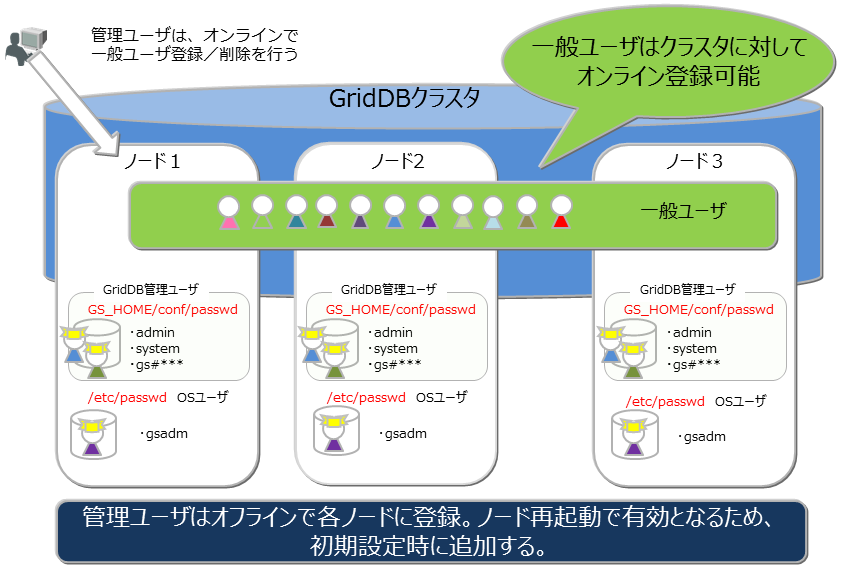
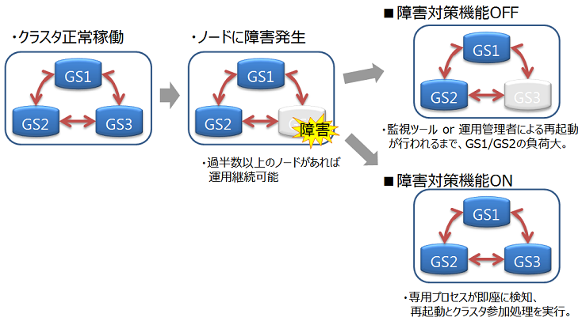
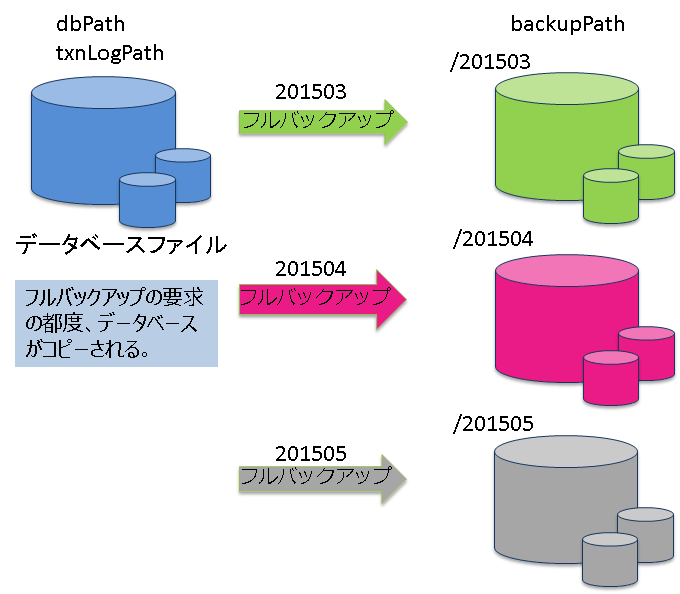
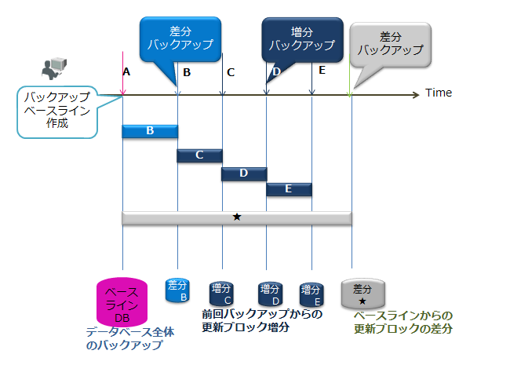
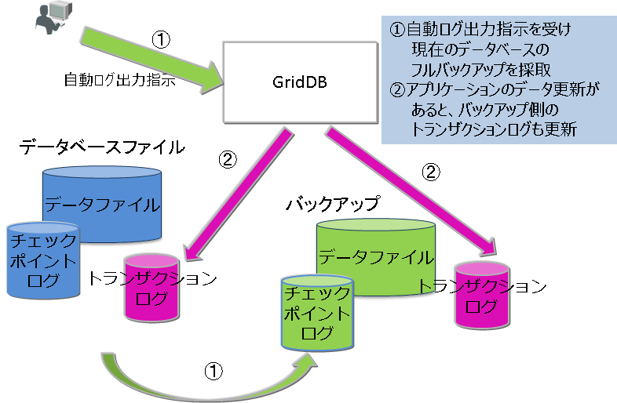
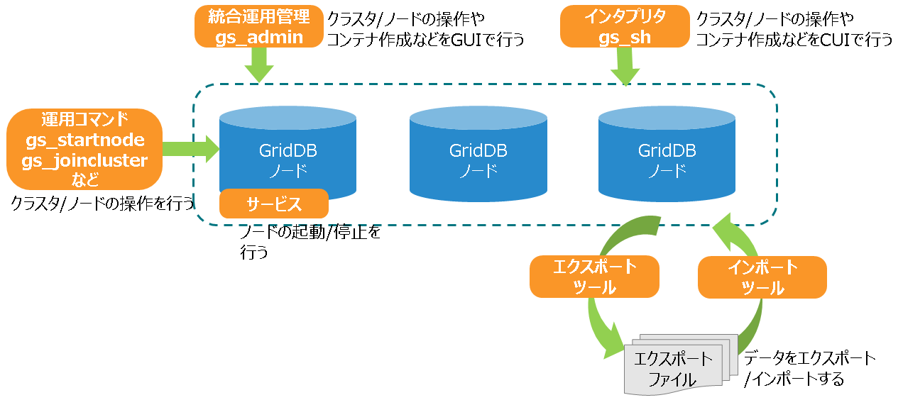

# 運用機能
<a id="label_admin"></a>

## サービス制御

OSの起動と同時にGridDBをサービスとして動作させるサービス制御機能があります。

GridDBのサービスは、パッケージのインストール直後からサービスが有効となっています。サービスが有効となっているため、OS起動と同時にGridDBのサーバが起動され、OS停止時はサーバが停止されます。

OSの監視やデータベースソフトウェアの動作を含めたミドルウェアやアプリケーションの運用を統合化したインターフェースを用いる場合、サービス制御の機能を用いるのか、もしくは運用コマンドを利用するのか、サービスの起動停止の他ミドルウェアとの依存性も検討する必要があります。

GridDBのサービスは、OS起動時に自動的に実行され、GridDBノード(以下、ノード)を起動し、 GridDBクラスタ(以下、クラスタ)へ参加します。OSのシャットダウン時には、クラスタから離脱し、ノードを停止します。

サービスにより、次のことができます。
-   ノードの起動、停止、再起動
-   ノードのプロセス状態確認

　

ノード3台のクラスタに対するサービス操作の手順は以下の通りです。

- サービスを利用してクラスタを開始する場合

  ノード3台が停止している状態から、サービスを利用してクラスタを開始します。

  | ユーザの操作                    | ノードAの状態 | ノードBの状態 | ノードCの状態 |
  |--------------------------------|--------------|--------------|--------------|
  | －                             | ノード停止    | ノード停止    | ノード停止    |
  | ①ノードA/B/Cのサービス開始を実行 | ノード起動<br>クラスタに参加 | ノード起動<br>クラスタに参加 | ノード起動<br>クラスタに参加 |

  - サービス開始は、OS起動時には自動的に実行されます。
  - サービス開始によってクラスタを開始するためには、サービスの起動設定ファイルにクラスタの構成ノード数やクラスタ名を定義している必要があります。
  - 定義した構成ノード数のノードがクラスタに参加した時点で自動的にクラスタが開始されます。

　

- サービスを利用してノードを1台停止する場合

  クラスタ稼動している状態から、サービスを利用してノードを1台停止します。

  | ユーザの操作  | ノードAの状態 | ノードBの状態 | ノードCの状態 |
  |--------------|--------------|--------------|--------------|
  | －           | クラスタに参加 | クラスタに参加 | クラスタに参加 |
  | ①ノードBのサービス停止を実行 | クラスタに参加 | クラスタから離脱<br>ノード停止 | クラスタに参加 |

　

- サービスを利用してクラスタを停止する場合

  クラスタ稼動している状態から、サービスを利用してクラスタを停止します。

  | ユーザの操作                   | ノードAの状態   | ノードBの状態    | ノードCの状態    |
  |-------------------------------|----------------|-----------------|-----------------|
  | －                             | クラスタに参加  | クラスタに参加   | クラスタに参加   |
  | ①クラスタ停止を実行(※注意)      | クラスタから離脱 | クラスタから離脱 | クラスタから離脱 |
  | ②ノードA/B/Cのサービス停止を実行 | ノード停止      | ノード停止       | ノード停止      |


【注意】
- **クラスタ全体を停止する時は、必ずgs_stopclusterコマンドを実行してから、サービスのstopで各ノードを離脱・停止してください。**
  gs_stopclusterコマンドでクラスタを停止しなかった場合、ノードの離脱のたびにデータ再配置が行われる可能性があります。
  データ再配置が頻繁に発生すると、ネットワークやディスクI/Oに負荷がかかる場合があります。
  クラスタを停止してからノードを離脱した場合はデータ再配置は行われません。不要なデータ再配置を防ぐために、必ずクラスタを停止してください。
  クラスタの停止は、運用コマンドgs_stopclusterや、統合運用管理gs_admin、gs_shなどを用いて実行してください。

　

なお、サービス制御を使用しない場合、以下のようにすべてのランレベルでサービスを無効にします。

```
# /sbin/chkconfig gridstore off
```

## ユーザ管理機能

GridDBのユーザには、インストール時に作成されるOSユーザとGridDBの運用／開発を行うGridDBのユーザ（以降GridDBユーザと呼ぶ）の2種類があります。

### OSユーザ

OSユーザは、GridDBの運用機能を実行できる権限を持つユーザであり、GridDBインストール時にgsadmというユーザが作成されます。以降このOSユーザをgsadmと呼びます。

GridDBのリソースはすべて、gsadmの所有物となります。また、GridDBの運用操作のコマンド実行はすべてgsadmで実行します。

運用操作では、GridDBサーバに接続し運用操作を実行できる権限を持ったユーザか否かの認証を行います。この認証は、GridDBユーザで行います。

### GridDBユーザ　

-   管理ユーザと一般ユーザ

    GridDBのユーザには、管理ユーザと一般ユーザの2種類があり、利用できる機能に違いがあります。GridDBインストール直後には、デフォルトの管理ユーザとして、system、adminの2ユーザが登録されています。

    管理ユーザは、GridDBの運用操作を行うために用意されたユーザであり、一般ユーザはアプリケーションシステムで利用するユーザです。

    セキュリティの面から、管理ユーザと一般ユーザは利用用途に応じて使い分ける必要があります。

-   ユーザの作成

    管理ユーザは、gsadmが登録／削除することができ、その情報は、GridDBのリソースとして定義ファイルディレクトリのpasswordファイルに保存されます。管理ユーザは、OSのローカルファイルに保存／管理されるため、クラスタを構成する全ノードで同一の設定となるように、配置しておく必要があります。また、管理ユーザは、GridDBサーバ起動前に設定しておく必要があります。起動後に登録しても有効にはなりません。

    一般ユーザは、GridDBのクラスタ運用開始後に管理ユーザが作成します。クラスタサービス開始前に一般ユーザの登録はできません。一般ユーザはGridDBのクラスタ構成後に作成し、GridDBデータベース内の管理情報として保持するため、クラスタに対して運用コマンドを用いて登録するのみです。

    管理ユーザについては、クラスタ間での自動的な情報伝達は行われないため、定義ファイルのマスタ管理ノードを決めマスタ管理ノードからクラスタを構成する全ノードに配布管理するなどの運用管理を行い、全ノードで同じ設定とする必要があります。



-   ユーザ作成時の規則

    ユーザ名には命名規則があります。
    -   管理ユーザ：『gs\#』で始まるユーザを指定します。『gs\#』以降は英数字およびアンダースコアのみで構成します。大文字と小文字は同一として扱うため、gs\#managerとgs\#MANAGERは同時には登録できません。

    -   一般ユーザ：英数字およびアンダースコアで指定します。ただし、先頭文字に数字は指定できません。また、大文字と小文字は同一として扱うため、userとUSERは同時には登録できません。管理ユーザのデフォルトユーザである、system,adminは作成できません。

    -   パスワード：指定できる文字に制限はありません。

    なお、ユーザ名およびパスワードに指定できる文字列は、それぞれ64文字です。

### 利用できる機能

管理ユーザができる運用操作と一般ユーザが利用できる操作を以下に示します。運用操作のうちGridDBユーザを用いずに、gsadmで実行可能なコマンドは◎印で明記します。

| 操作                   | 操作詳細                            | 利用する運用ツール                         | gsadm | 管理ユーザ | 一般ユーザ            |
|------------------------|-------------------------------------|--------------------------------------------|-------|------------|-----------------------|
| ノード操作             | ノードの起動                        | gs_startnode/gs_sh     |       | ○          | ×                     |
|                        | ノードの停止                        | gs_stopnode/gs_sh      |       | ○          | ×                     |
| クラスタ操作           | クラスタの構築                      | gs_joincluster/gs_sh   |       | ○          | ×                     |
|                        | クラスタへのノード増設              | gs_appendcluster/gs_sh【EE限定】 |       | ○          | ×                     |
|                        | クラスタからのノード離脱            | gs_leavecluster/gs_sh  |       | ○          | ×                     |
|                        | クラスタの停止                      | gs_stopcluster/gs_sh   |       | ○          | ×                     |
| ユーザ管理             | 管理ユーザ登録                      | gs_adduser                       | ◎     | ×          | ×                     |
|                        | 管理ユーザの削除                    | gs_deluser                       | ◎     | ×          | ×                     |
|                        | 管理ユーザのパスワード変更          | gs_passwd                        | ◎     | ×          | ×                     |
|                        | 一般ユーザの作成                    | gs_sh【EE限定】                            |       | ○          | ×                     |
|                        | 一般ユーザの削除                    | gs_sh【EE限定】                            |       | ○          | ×                     |
|                        | 一般ユーザのパスワード変更          | gs_sh【EE限定】                            |       | ○          | ○：本人のみ           |
| データベース管理       | データベースの作成・削除            | gs_sh【EE限定】                            |       | ○          | ×                     |
|                        | データベースへのユーザ割り当て/解除 | gs_sh【EE限定】                            |       | ○          | ×                     |
| データ操作             | コンテナやテーブルの作成・削除      | gs_sh                            |       | ○          | ○：本人のDB内で更新操作が可能な場合のみ     |
|                        | コンテナやテーブルへのデータ登録    | gs_sh                            |       | ○          | ○：本人のDB内で更新操作が可能な場合のみ     |
|                        | コンテナやテーブルの検索            | gs_sh                            |       | ○          | ○：本人のDB内のみ     |
|                        | コンテナやテーブルへの索引操作      | gs_sh                            |       | ○          | ○：本人のDB内で更新操作が可能な場合のみ     |
| バックアップ管理       | バックアップ作成                    | gs_backup【EE限定】                        |       | ○          | ×                     |
| バックアップ管理       | バックアップリストア                | gs_restore【EE限定】                       | ◎     | ×          | ×                     |
|                        | バックアップリスト                  | gs_backuplist【EE限定】                    |       | ○          | ×                     |
| システムステータス管理 | システム情報の取得                  | gs_stat                          |       | ○          | ×                     |
|                        | パラメータ変更                      | gs_paramconf【EE限定】                     |       | ○          | ×                     |
| データインポート/      | データのインポート                  | gs_import                        |       | ○          | ○：アクセスできる範囲 |
| エクスポート           | データのエクスポート                | gs_export                        |       | ○          | ○：アクセスできる範囲 |


### データベースとユーザ

GridDBのクラスタデータベース(以降クラスタデータベースと呼びます)を利用ユーザ単位にアクセスを分離することができます。分離する単位を **データベース** と呼びます。 データベースは、クラスタデータベースの初期状態では以下のデータベースがあります。

-   public
    -   管理ユーザ、一般ユーザのすべてがアクセスできるデータベースです。
    -   接続先データベースを指定せずに接続した場合はこのデータベースが利用されます。

データベースはクラスタデータベースに複数作成することができます。データベースの作成、削除、ユーザへの割り当ては管理ユーザが行います。

データベース作成時の規則は以下に示すとおりです。

-   クラスタデータベースに作成できるユーザ数、データベース数の上限は各々128個までです。
-   データベース名に指定可能な文字列は、英数字およびアンダースコア\_、ハイフン-、ドット.、スラッシュ/、イコール=です。ただし、先頭文字に数字は指定できません。
-   データベース名に指定できる文字列は、64文字です。
-   データベース名命名時の大文字・小文字は保持されますが、大文字小文字同一視した場合に同一名となるデータベースは作成できません。例えば、databaseとDATABASEは同時には登録できません。
-   デフォルトデータベースである「public」および「information_schema」は指定できません。

データベースへ一般ユーザを割り当てる際、権限を指定します。権限は以下の種類があります。
-   ALL
    -   コンテナ作成やロウ登録、検索、索引作成などコンテナに関するすべての操作が可能
-   READ
    -   検索の操作のみ可能

データベースにアクセスできるのは割り当てた一般ユーザと管理ユーザのみです。管理ユーザはすべてのデータベースにアクセスすることができます。 データベースへ一般ユーザを割り当てる際、以下規則があります。
-   1データベースに複数の一般ユーザを割り当てることができる
-   データベースに一般ユーザを割り当てる際、指定できる権限は1種類のみ
-   1データベースに複数の一般ユーザを割り当てる際、ユーザごとに異なる権限を指定することができる
-   1ユーザには複数のデータベースを割り当てることができる


### 認証方式

GridDBの認証方式には、以下があります。
-   内部認証
-   LDAP認証

各方式について、説明します。

#### 内部認証

GridDBの管理/一般ユーザのユーザ名、パスワード、および権限をGridDBで管理します。認証方式を指定しない場合、内部認証がデフォルトです。

管理ユーザは、運用コマンドのgs_adduser/gs_deluser/gs_passwdで管理します。

一般ユーザは、SQLのCREATE USER/DROP USER/SET PASSWORD文で管理します。また、一般ユーザのアクセス権は、SQLのGRANT/REVOKE文で管理します。

**ユーザキャッシュ設定**

一般ユーザ情報のキャッシュの設定は、以下のノード定義ファイル(gs_node.json)を編集します。

【注意】
-   変更内容を反映するには、再起動が必要です。


| パラメータ                      | デフォルト | 設定値                 |
|---------------------------------|------------|------------------------|
| /security/userCacheSize |  1000       | キャッシュする一般ユーザ/LDAPユーザエントリ数を指定。 |
| /security/userCacheUpdateInterval |  60      | キャッシュの更新間隔（秒）を指定。|

#### LDAP認証<a href="https://www.global.toshiba/jp/products-solutions/ai-iot/griddb/product/griddb-ee.html?utm_source=griddb.net&utm_medium=referral&utm_campaign=commercial_badge"><badge text="商用版のみ" type="warning"/></a>

GridDBの一般ユーザをLDAPで管理します。また、LDAP内のユーザ名/グループ名と同じ名前のロールを作成し権限を操作することで、LDAPユーザの権限を管理します。また、認証処理の高速化のため、LDAPで管理するユーザ情報のキャッシュ機能を提供します。

【注意】
-   GridDBノードが稼働するサーバに、openldap2.4をインストールしてください。詳細は、openldapのマニュアルをご参照ください。
-   管理ユーザはLDAPで管理できません。常に内部認証を利用します。


**共通設定**

LDAP認証を利用する場合は、以下、クラスタ定義ファイル(gs_cluster.json)を編集します。

| パラメータ                      | デフォルト | 設定値                 |
|---------------------------------|------------|------------------------|
| /security/authentication | INTERNAL       | 認証方式として、INTERNAL(内部認証) / LDAP(LDAP認証)のいずれかを指定。 |
| /security/ldapRoleManagement | USER      | GridDBのロールとマッピングする対象として、USER(LDAPユーザ名でマッピング) / GROUP(LDAPグループ名でマッピング)のいずれかを指定。          |
| /security/ldapUrl           |       | LDAPサーバを次の形式で指定。ldap[s]://host[:port] |


【注意】
-   /security/ldapUrlに指定できるLDAPサーバは１台のみです。
-   サポートするLDAPサーバは以下です。
    -   OpenLDAP 2.4以降
    -   Active Directory スキーマバージョン87(Windows Server 2016以降)
-   変更内容を反映するには、再起動が必要です。


**ロール管理**

ロールは、SQLのCREATE ROLE / DROP ROLE文で管理します。/security/ldapRoleManagementが「USER」の場合はLDAPのユーザ名で、「GROUP」の場合はLDAPのグループ名でロールを作成します。作成したロールに対するアクセス権限は、SQLのGRANT/REVOKE文で管理します。

**LDAP認証モード設定**

次に、LDAPユーザの認証方法として、単純モード（直接ユーザアカウントでバインド）またはサーチモード（LDAP管理ユーザでバインド後に、ユーザを検索/認証）を選択します。以下、クラスタ定義ファイル(gs_cluster.json)を編集します。

【注意】
-   単純モードとサーチモードの同時指定はできません。
-   変更内容を反映するには、再起動が必要です。

■単純モード


| パラメータ                      | デフォルト | 設定値                 |
|---------------------------------|------------|------------------------|
| /security/ldapUserDNPrefix |         | ユーザのDN（識別子）を生成するために、ユーザ名の前に連結する文字列を指定。 |
| /security/ldapUserDNSuffix |        | ユーザのDN(識別子)を生成するために、ユーザ名の後に連結する文字列を指定。|


■サーチモード


| パラメータ                      | デフォルト | 設定値                 |
|---------------------------------|------------|------------------------|
| /security/ldapBindDn |         | LDAP管理ユーザのDNを指定。 |
| /security/ldapBindPassword |        | LDAP管理ユーザのパスワードを指定。|
| /security/ldapBaseDn |        | 検索を開始するルートDNを指定。|
| /security/ldapSearchAttribute |  uid     | 検索対象となる属性を指定。|
| /security/ldapMemberOfAttribute | memberof | ユーザが所属するグループDNが設定された属性を指定。(ldapRoleManagement=GROUPの場合に有効)|

**ユーザキャッシュ設定**

LDAPユーザ情報のキャッシュの設定は、以下のノード定義ファイル(gs_node.json)を編集します。

【注意】
-   変更内容を反映するには、再起動が必要です。


| パラメータ                      | デフォルト | 設定値                 |
|---------------------------------|------------|------------------------|
| /security/userCacheSize |  1000       | キャッシュする一般ユーザ/LDAPユーザエントリ数を指定。 |
| /security/userCacheUpdateInterval |  60      | キャッシュの更新間隔（秒）を指定。|

**設定例**

以下に設定例を記載します。条件は以下です

-   Active Directory(host=192.168.1.100 port=636)
-   ユーザDN (cn=TEST, ou=d1 ou=dev dc=example, dc=com)
-   ユーザは、sampleDB内を検索のみ可能
-   GridDBロールは、ユーザ名でマッピング
-   単純モードで認証

■ロールの設定例(SQL文)
```
 CREATE ROLE TEST
 GRANT SELECT ON sampleDB to TEST
```

■サーバの設定例（gs_cluster.jsonの一部抜粋）
```
            :
"security":{
    "authentication":"LDAP",
    "ldapRoleManagement":"USER",
    "ldapUrl":"ldaps://192.168.1.100:636",
    "ldapUserDnPrefix":"CN=",
    "ldapUserDnSuffix":",ou=d1,ou=dev,dc=example,dc=com",
    "ldapSearchAttribute":"",
    "ldapMemberOfAttribute": ""
},
            :
```


## セキュリティ機能<a href="https://www.global.toshiba/jp/products-solutions/ai-iot/griddb/product/griddb-ee.html?utm_source=griddb.net&utm_medium=referral&utm_campaign=commercial_badge"><badge text="商用版のみ" type="warning"/></a>

### 通信の暗号化

GridDBでは、GridDBクラスタとクライアント間のSSL接続をサポートします。

【注意】
-   GridDBノード/クライアントが稼働するサーバに、openssl 1.1.1をインストールしてください。
-   以下のコマンドで、openSSLのバージョンが1.1.1であることを確認してください。
```
$ python -c "import ssl; print(ssl.OPENSSL_VERSION)"
```

**設定**

SSL接続を行うためには、以下、クラスタ定義ファイル(gs_cluster.json)、およびノード定義ファイル(gs_node.json)を編集します。
そして、サーバ証明書および秘密鍵のファイルを適切なディレクトリに配置します。

【注意】
-   変更内容を反映するには、再起動が必要です。
-   GridDBクラスタを構成するノード間のSSL接続は未サポートです。GridDBクラスタは外部から直接アクセスできない安全なネットワーク上への配置を推奨します。
-  サーバ証明書検証の実施は指定できますが、ホスト名検証の実施は未サポートです。中間者攻撃を防止するために、独自CAによる証明書の利用を推奨します。
-  証明書失効リスト(CRL)による証明書失効確認は未サポートです。

■クラスタ定義ファイル(gs_cluster.json)

| パラメータ                      | デフォルト | 設定値                 |
|---------------------------------|------------|------------------------|
| /system/serverSslMode | DISABLED        | SSL接続設定として、DISABLED(SSL無効)、PREFERRED(SSL有効、ただし非SSL接続も許容)、REQUIRED(SSL有効、非SSL接続は不可)のいずれかを指定。 |
| /system/sslProtocolMaxVersion | TLSv1.2 | TLSプロトコルバージョンとして、TLSv1.2, TLSv1.3のいずれかを指定。 |

■ノード定義ファイル(gs_node.json)

| パラメータ                      | デフォルト | 設定値                 |
|---------------------------------|------------|------------------------|
| /system/securityPath | security        | サーバ証明書、秘密鍵の配置ディレクトリをフルパスもしくは、相対パスで指定。 |
| /system/serviceSslPort | 10045 | 運用コマンド用待ち受けSSLポート |

■サーバ証明書および秘密鍵

SSLを有効にする場合は、`/system/securityPath`に設定したディレクトリに、サーバ証明書および秘密鍵を
それぞれ次のファイル名で配置します。

- gs_node.crt: 証明書ファイル
- gs_node.key: 秘密鍵ファイル


**クライアント設定**

クライアント側で、SSL接続、サーバ証明書検証の実施を指定できます。詳細は各ツール、およびAPIリファレンスをご参照ください。

## 障害処理機能<a href="https://www.global.toshiba/jp/products-solutions/ai-iot/griddb/product/griddb-ee.html?utm_source=griddb.net&utm_medium=referral&utm_campaign=commercial_badge"><badge text="商用版のみ" type="warning"/></a>

GridDBでは、クラスタを構成する各ノードでデータのレプリカを保持するため、単一点故障に対してのリカバリは不要です。 GridDBでは障害発生時には以下のような動作を行います。


1.  障害発生時、障害ノードはクラスタから自動的に離脱する。
2.  離脱した障害ノードに代わり、バックアップノードへのフェイルオーバーが行われる。
3.  障害によりノード台数が減少するため、自律的にパーティションの再配置を行う（レプリカも配置する）。

障害の回復したノードはオンラインでクラスタ運用に組み込むことができます。障害によりUNSTABLEな状態となったクラスタには、gs_joinclusterコマンドを用いてノードを組み込めます。ノード組込みにより、自律的にパーティションの再配置が行われノードのデータ、負荷バランスが調整されます。

このように、単一点故障の場合にはリカバリのための事前の準備は不要ですが、シングル構成で運用する場合や、クラスタ構成においても複数の障害が重なった場合にはリカバリの操作が必要です。

クラウド環境で稼働させる場合、物理的なディスクの障害やプロセッサ障害で意図せずともクラスタを構成する複数ノードの障害、複数ノードでのデータベース障害といった多重障害となるケースがあります。

### 障害の種類と処置

発生する障害と対処方法の概要を以下の表に示します。

ノード障害とは、プロセッサ障害やGridDBのサーバプロセスのエラーによりノードが停止した状態、データベース障害とは、ディスクに配置したデータベースへのアクセスでエラーが発生した状態を指します。

| GridDBの構成 | 障害の種類           | 動作と処置                                                           |
|--------------|----------------------|----------------------------------------------------------------------|
| シングル構成 | ノード障害           | アプリケーションからアクセスはできなくなりますが、ノードの障害要因を取り除き再起動するだけで、処理が完了したトランザクションのデータはリカバリされます。ノード障害が長期化した際は、別ノードでのリカバリを検討します。                                                         |
| シングル構成 | データベース障害     | アプリケーションでエラーを検出するため、バックアップしたデータからデータベースファイルを復旧します。データはバックアップ時点に復旧されます。   |
| クラスタ構成 | 単一ノード障害       | アプリケーションにはエラーが隠ぺいされ、レプリカのあるノードで処理が継続できます。障害が発生したノードでのリカバリ操作は不要です。       |
| クラスタ構成 | 複数ノード障害       | レプリカのオーナ／バックアップの双方のパーティションが障害対象ノードに存在する場合、対象パーティションにアクセスができませんが、クラスタは正常に稼働します。ノードの障害要因を取り除き再起動するだけで、処理が完了したトランザクションのデータはリカバリされます。ノードの障害が長期化する場合は別ノードでのリカバリを検討します。                    |
| クラスタ構成 | 単一データベース障害 | 単一ノードでのデータベース障害は、クラスタを構成する他のノードでデータアクセスが継続するため、異なるディスクにデータベース配置先を変更し、ノードを再起動するだけでリカバリされます。                   |
| クラスタ構成 | 複数データベース障害 | レプリカで復旧できないパーティションは最新のバックアップデータからバックアップ採取時点にリカバリさせる必要があります。                 |


### クライアントフェイルオーバー

クラスタ構成で運用している際にノード障害が発生した場合、障害ノードに配置されているパーティション（コンテナ）にはアクセスできません。この時、クライアントAPI内で、自動的にバックアップノードに接続し直して処理を継続するクライアントフェイルオーバー機能が動作します。クライアントAPI内で自動的に障害対策を行うため、アプリケーション開発者はノードのエラー処理を意識する必要がありません。

しかし、複数のノードの同時障害やネットワーク障害などにより、アプリケーション操作対象にアクセスできずエラーになることもあります。

エラー発生後のリカバリではアクセス対象のデータに応じて以下の点を考慮する必要があります。

-   時系列コンテナやロウキーが定義されているコレクションの場合、失敗した操作またはトランザクションを再実行すればリカバリできます。

-   ロウキーが定義されていないコレクションの場合データベースの内容チェックをした上で、再実行する必要があります。

【メモ】
- アプリケーションでのエラー処理を単純化するためにコレクションを使う場合は、ロウキーの定義を推奨します。 単一のカラム値での一意化ができない場合で、複数のカラム値で一意化できる場合は、複数カラムの値を連結した値を持つカラムをロウキーにし、データを一意に識別できるようにすることを推奨します。

### 自動再起動機能

GridDBノードが異常終了した場合、またはノードプロセスが強制終了された場合、自動的にノードの再起動、およびクラスタ参加を実行します。 運用管理者が意識せずに、クラスタの状態を正常稼働に戻すことができます。



【注意】

以下の場合は自動起動処理を実施しません。
-   ユーザが明示的に設定を無効にしたとき
-   回復不可能な障害が発生したとき (ノードステータス: ABNORMAL)
-   自動起動を5回以上試行したとき
-   障害発生前のノードがクラスタに参加していなかったとき

**設定**

障害対策機能の設定は以下になります。

| パラメータ                      | デフォルト | 設定値                 |
|---------------------------------|------------|------------------------|
| SVC_ENABLE_AUTO_RESTART | true       | true(有効)/false(無効) |
| GS_USER               | admin      | 適宜                   |
| GS_PASSWORD           | admin      | 適宜                   |

パラメータを変更するには起動設定ファイル( `/etc/sysconfig/gridstore/gridstore.conf` )を編集します。

- SVC_ENABLE_AUTO_RESTART
  - GridDBノードの起動時（再起動時）に設定が有効になります。
  - 別の監視システムで、GridDBの障害復旧の制御を行いたい場合は、本障害対応機能を無効にしてください。

- GS_USER/GS_PASSWORD
  - GridDBの管理者ユーザ、およびパスワードを設定します。
  - ユーザ/パスワードは以下のケースで利用します。
    - サービスによる起動、停止、再起動する場合
    - gs_startnodeで、-uオプションが指定されていない場合

【注意】
-   指定したGS_USER/GS_PASSWORDに誤りがある、もしくはユーザ/パスワードが指定されていない場合には、 GridDBノードの起動に失敗します。


## エクスポート/インポート機能

GridDBのエクスポート/インポートでは、データベースの局所的な破壊に対して復旧を行う障害回復処理や、システム構成が変更された際のデータベースの移行(マイグレーション)処理などを実現するために、データベースやコンテナ単位での保存/復元機能を提供します。

GridDBクラスタでは、コンテナデータをクラスタ内のノードに自動的に配置します。利用者は、どのノードにデータが配置されているかを意識する必要はありません(データの位置透過）。
エクスポート／インポートでも、データの取り出し・登録で配置位置を意識する必要はありません。エクスポート／インポートの構成は以下のとおりです。


【エクスポート(export)】

① GridDBクラスタのコンテナおよびロウデータを、以下のファイルに保存します。コンテナ名を指定して特定コンテナのみエクスポートすることもできます。
-   **コンテナデータファイル**
    -   GridDBのコンテナ情報とロウデータを保存します。
    -   コンテナ単位に保存する形式と複数コンテナをまとめて保存する形式の２種類があります。
-   **エクスポート実行情報ファイル**
    -   エクスポート実行時の情報を保存します。エクスポートしたデータを、そのままGridDBクラスタに復元するために必要です。

　※詳細は『[GridDB 運用ツールリファレンス](../5.md_reference_operation_tool/md_reference_operation_tool.md)』をご参照ください。

【インポート(import)】

② エクスポートデータを保存したコンテナデータファイルとエクスポート実行情報ファイルを読み込んで、コンテナおよびロウデータをGridDBに復元します。特定のコンテナデータを指定して、インポートすることもできます。

③ ユーザが作成したコンテナデータファイルを読み込んで、コンテナとロウデータを登録します。

【メモ】
-   エクスポートしたコンテナデータファイルとユーザが作成するコンテナデータファイルは同じフォーマットです。
-   エクスポート中のコンテナに対してデータの登録や更新を行うと、エクスポート結果に反映される場合があります。


## バックアップ/リストア機能<a href="https://www.global.toshiba/jp/products-solutions/ai-iot/griddb/product/griddb-ee.html?utm_source=griddb.net&utm_medium=referral&utm_campaign=commercial_badge"><badge text="商用版のみ" type="warning"/></a>

データベース障害やアプリケーションの誤動作によるデータ破壊に備えるために、定期的なバックアップの採取が必要です。バックアップ運用は、サービスレベルの要求やシステムのリソースに応じて対処方法を選択する必要があります。

バックアップ方式と、それぞれの方式について以下の項目を説明します。

- バックアップ運用
  - バックアップの種類とバックアップの利用方法について説明します。
- 障害からのリカバリ
 - 障害の検出と障害からのリカバリ方法を説明します。

### バックアップ方式

データベース障害やアプリケーションの誤動作によるデータ破壊に備えるために、定期的なバックアップの採取が必要です。 バックアップ運用は、障害発生時のリカバリの要件（いつの時点にリカバリするか）、バックアップにかかる時間、バックアップのために用意できるディスクの容量に応じて、バックアップの種別やバックアップの間隔を決定します。リカバリ保証のサービスレベルからの要求やシステムのリソースに応じて対処方法を選択する必要があります。 GridDBのバックアップ方式には、以下のものがあります。

| バックアップ方式                                                      | 復旧時点                 | 特徴                                                                                                                                                                                                                                             |     |
|-----------------------------------------------------------------------|--------------------------|--------------------------------------------------------------------------------------------------------------------------------------------------------------------------------------------------------------------------------------------------|-----|
| オフラインバックアップ                                                | クラスタ停止時点         | バックアップのコピー完了までクラスタ停止が必要です。 ノード間で復旧時点が異なることはありません。                                                                                                                                                |     |
| オンラインバックアップ（フル+差分・増分）                             | バックアップ採取完了時点 | GridDBバックアップコマンドを利用します。バックアップの取得完了のタイミングにより、ノード間で復旧時点が異なることがあります。                                                                                                                     |     |
| オンラインバックアップ（自動ログ）                                    | 障害直前の時点           | GridDBバックアップコマンドを利用します。トランザクションログから最新状態にリカバリするため、起動時間が長くなることがあります。                                                                                                                   |     |
| ファイルシステムレベルのオンラインバックアップ（スナップショット等）  | スナップショット取得時点 | OSやストレージのスナップショットと連携してバックアップを取得します。各ノードに対して同時にスナップショットを実行しても、更新トランザクションのログ書き込みモードがDELAYED_SYNCの場合、ノード間で１秒程度ずれが発生する場合があります。 |     |
| ファイルシステムレベルのオンラインバックアップ（OSコピー等+自動ログ） | 障害直前の時点           | バックアップソリューション等と連携してバックアップを取得します。トランザクションログから最新状態にリカバリするため、起動時間が長くなることがあります。                                                                                           |     |

GridDBのオンラインバックアップの機能については、[オンラインバックアップ](#online_backup_and_recovery_operations)を参照ください。

【注意】
-   オンラインバックアップを実行する前に、複数コンテナにまたがった更新処理は停止してください。GridDBクラスタとして論理的に不整合な状態のバックアップ作成を防止できます。
-   オンラインバックアップ中にノード障害が発生した場合、オンラインバックアップを中断し、1台目から再実行してください。ノード障害後のパーティションの再配置（リバランス）により、必要なデータがバックアップされないことを防止できます。

GridDBのオンラインバックアップ機能を使用せず、ファイルシステムレベルのオンラインバックアップを行う場合は、[ファイルシステムレベルのバックアップ](#file_system_level_backup_and_recovery_operations)を参照ください。

オフラインバックアップを行うには、まずgs_stopclusterコマンドでクラスタを停止してから、クラスタを構成する全ノードを停止してください。 次に、各ノードのデータベースファイルの配置ディレクトリ（gs_node.jsonの/dataStore/dbPath、/dataStore/transactionLogPathで示すディレクトリ）下のデータをバックアップしてください。


**定義ファイルのバックアップ**

バックアップでは、データベースファイルの定期的なバックアップに加え、定義ファイルのバックアップも必要です。

$GS_HOME/confディレクトリ（デフォルトでは、/var/lib/gridstore/conf）にあるノード定義ファイル（gs_node.json)、クラスタ定義ファイル（gs_cluster.json)、ユーザ定義ファイル（password）のバックアップをOSのコマンドを用いて採取しておいてください。

定義ファイルのバックアップは、設定変更やユーザ登録・変更した場合には、必ず実施してください。


<a id="online_backup_and_recovery_operations"></a>
### オンラインバックアップとリカバリ操作

#### バックアップ運用

GridDBの障害に備えたバックアップ運用について説明します。

##### バックアップの種類

GridDBでは、ノード単位のオンラインバックアップが可能です。これをGridDBクラスタを構成する全ノードに対して順次行うことで、サービスを継続しながら、クラスタ全体としてオンラインバックアップが行えます。 GridDBの提供するオンラインバックアップの種類には以下のものがあります。

| バックアップ種別       | バックアップの動作                | 復旧時点                       |     |
|------------------------|--------------------------------|--------------------------------|-----|
| フルバックアップ       | 現在利用中のクラスタデータベースをノード定義ファイルで指定したバックアップディレクトリにノード単位にオンラインでバックアップする。 | フルバックアップ採取時点 |
| 差分・増分バックアップ | 現在利用中のクラスタデータベースをノード定義ファイルで指定したバックアップディレクトリにノード単位にオンラインでバックアップし、以降のバックアップでは、バックアップ後の更新ブロックの差分増分のみをバックアップする。 | 差分増分バックアップ採取時点 |
| 自動ログバックアップ   | 現在利用中のクラスタデータベースをノード定義ファイルで指定したバックアップディレクトリにノード単位にオンラインでバックアップするとともに、トランザクションログファイルの書き込みと同じタイミングでトランザクションログも自動で採取します。トランザクションログファイルの書き込みタイミングは、ノード定義ファイルの/dataStore/logWriteModeの値に従います。 | 最新トランザクションの更新時点 |

利用するバックアップの種類に応じて復旧できる時点が異なります。

GridDBの提供する各バックアップの動作と、利用を推奨するシステムについて以下に示します

-   フルバックアップ

    参照系のシステムでは、データ更新が行われる夜間バッチなどの後にフルバックアップを採取します。フルバックアップはすべてのデータベースファイルのデータをコピーするため、時間がかかります。また、バックアップ採取先のデータ容量としてデータベースファイルと同じ容量が必要です。

    また、バックアップを何世代保持するのかに応じて、実データベースサイズの掛け算でバックアップディスク容量が必要です。



-   差分・増分バックアップ

    フルバックアップで全データベースのバックアップを採取後、更新されたデータの差分のみをバックアップできます。 バックアップを短時間に行いたいシステムで、夜間のバッチ運用でバックアップを自動的に、月1回のフルバックアップ(ベースライン作成）、1週間に1回の差分（since）バックアップ、毎日増分バックアップ（incremental)などのように計画的な運用を行うシステムに向いています。

    増分バックアップは、更新データのみを用いたバックアップのため、フルバックアップや差分バックアップと比較して高速にバックアップが行えます。しかし障害発生時のリカバリではフルバックアップのデータに対して更新ブロックをロールフォワードする必要があるため、リカバリに時間がかかります。定期的なBaselineやSince指定での差分バックアップが必要です。



-   自動ログバックアップ

    自動ログバックアップ指定でのフルバックアップ(ベースライン作成）採取以降、更新ログがバックアップディレクトリに収集されます。自動的にトランザクションログが採取されるため、バックアップ操作は不要です。運用を省力化する場合やバックアップでシステムに負荷を与えたくない場合に指定します。ただし、定期的にBaselineを更新しない場合、障害発生時のリカバリで利用するトランザクションログファイルが増え、リカバリに時間がかかることになります。差分・増分バックアップでは、同じブロックのデータが更新された場合に1つのデータとしてバックアップされますが、自動ログバックアップでは更新の都度のログが採取されるため、障害回復時のリカバリには、差分・増分よりも時間がかかります。



【注意】
-   差分・増分バックアップ、自動ログバックアップでも障害発生時のリカバリ時間を短縮するにはベースラインとなるフルバックアップを定期的に採取する必要があります。

バックアップの種別は、コマンドのオプションで指定します。

##### バックアップ関連パラメータの確認

バックアップ先は、ノード定義ファイルの　/dataStore/backupPathで指定します。ディスクの物理障害を考慮して、バックアップ先とデータベースファイル（/dataStore/dbPath、/dataStore/transactionLogPath）は必ず異なる物理ディスクに配置するように設定してください。

トランザクションのログ永続化には２つのモードがあります。デフォルト値はNORMALです。
-   NORMAL：チェックポイントにより、不要になったトランザクションログファイルは削除されます。
-   KEEP_ALL_LOG：全てのトランザクションログファイルを残します。

KEEP_ALL_LOGは、他社のバックアップソフトウェアとの連携等でログファイルの削除を指示する運用を行うなど特別な用途の場合のみ指定しますが、通常は利用しません。

ノード定義ファイルの指定例を以下に示します。

```
$ cat /var/lib/gridstore/conf/gs_node.json         # 設定の確認例
{
    "dataStore":{
        "dbPath":"/var/lib/gridstore/data",
        "transactionLogPath":"/var/lib/gridstore/txnlog",
        "backupPath":"/mnt/gridstore/backup",      # バックアップディレクトリ
        "storeMemoryLimit":"1024",
        "concurrency":2,
        "logWriteMode":1,
        "persistencyMode":"NORMAL"                 #永続化モード
　　　　　　：
　　　　　　：
}
```

##### バックアップの実行

フルバックアップ、差分・増分バックアップ、自動ログバックアップの各々の利用方法を説明します。

どのバックアップでも、バックアップ名（BACKUPNAME)を指定してバックアップを実行します。バックアップで作成されるデータは、ノード定義ファイルのbackupPathで指定したディレクトリ下にバックアップ名（BACKUPNAME）と同じ名前のディレクトリが作成され、配置されます。

BACKUPNAMEは、12文字以内の英数字で指定できます。

##### フルバックアップ

障害発生時、フルバックアップの採取完了時点までリカバリできます。 フルバックアップをクラスタを構成するすべてのノードに対して実施します。バックアップデータはコマンドのBACKUPNAMEで示すディレクトリに配置されます。採取したバックアップデータをわかりやすく管理するためにBACKUPNAMEに日付を指定する運用をお勧めします。

以下のコマンドをクラスタ内の全ノードに対して実行します。

```
$ gs_backup -u admin/admin 20141025
```

この例では、
1.  バックアップ名（BACKUPNAME)を「20141025」とすると、バックアップディレクトリ下に「20141025」というディレクトリが作成されます。
2.  「20141025」ディレクトリに、バックアップ情報ファイル(gs_backup_info.json,gs_backup_info_digest.json)とLSN情報ファイル(gs_lsn_info.json)が作成されます。また、「data」ディレクトリにデータファイルとチェックポイントログファイル、「txnlog」ディレクトリにトランザクションログファイルが作成されます。

```
/var/lib/gridstore/backup/
        20141025/                           # バックアップディレクトリ                
                gs_backup_info.json         # バックアップ情報ファイル
                gs_backup_info_digest.json  # バックアップ情報ファイル
                gs_lsn_info.json            # LSN情報ファイル
                data/
                    0/                      # パーティション番号0
                        0_part_0.dat        # データファイルバックアップ
                        0_117.cplog         # チェックポイントログバックアップ
                        0_118.cplog         
                        ...
                    1/                      
                    2/                                           
                    ...
                txnlog/
                    0/                      # パーティション番号0
                        0_120.xlog          # トランザクションログバックアップ
                        0_121.xlog         
                    1/
                    2/                     
                    ...
```

バックアップコマンドは、バックアップの指示をサーバに通知するだけで、処理の完了は待ち合わせません。

バックアップ処理の完了は、gs_statコマンドのステータスで確認してください。

```

$ gs_backup -u admin/admin 20141025
$ gs_stat -u admin/admin --type backup
BackupStatus: Processing
```

-   バックアップ状態(BackupStatus)は、以下のいずれかになります。
    -   Processing : 実行中
    -   \- : 完了もしくは未稼働

バックアップが正しく採取できたか否かは、gs_backuplistコマンドのステータスで確認できます。

```
$ gs_backuplist -u admin/admin

BackupName   Status   StartTime                EndTime
------------------------------------------------------------------------
 20141025NO2     P   2014-10-25T06:37:10+0900 -
 20141025        NG  2014-10-25T02:13:34+0900 -
 20140925        OK  2014-09-25T05:30:02+0900 2014-09-25T05:59:03+0900
 20140825        OK  2014-08-25T04:35:02+0900 2014-08-25T04:55:03+0900
```

バックアップリストのStatusの記号を以下に示します。
-   P ：バックアップ実行中
-   NG : バックアップ実行中にエラーが発生し、バックアップデータが異常
-   OK : 正常にバックアップが採取されている

##### 差分・増分ブロックバックアップ

障害発生時、ベースライン（基準点）となるフルバックアップとベースライン以降の差分・増分バックアップを用いて、最後の差分・増分バックアップ採取時点まで復旧できます。 差分・増分バックアップのベースラインとしてフルバックアップを取得し、以降差分・増分バックアップを指定します。

データの更新容量とリカバリにかかる時間のサービス目標に応じてバックアップの採取間隔は検討する必要がありますが、以下を目安として運用してください。

-   ベースラインのフルバックアップ（baseline)　：　一か月毎に実行
-   ベースライン以降の更新ブロックの差分バックアップ（since)　：　一週間毎に実行
-   ベースラインや差分バックアップ以降の更新ブロックの増分バックアップ（incremental)　：　毎日実行

フルバックアップのベースライン作成は、以下のように指定します。この例ではBACKUPNAMEは「201504」です。

```
$ gs_backup  -u admin/admin --mode baseline 201504
$ gs_stat -u admin/admin --type backup
BackupStatus: Processing(Baseline)
```

バックアップのベースラインとして、データディレクトリにあるデータベースファイルが、バックアップディレクトリ下にコピーされます。

ベースライン作成後の定期的な差分・増分ブロックのバックアップ（ベースラインのフルバックアップ以降に更新されたデータブロックのバックアップ）は、バックアップコマンド（gs_backup）のモードとしてincrementalやsinceを指定します。BACKUPNAMEには、ベースライン作成時のBACKUPNAMEと同じ値を指定します。この例ではBACKUPNAMEは『201504』です。

```
*****　増分バックアップの場合
$ gs_backup  -u admin/admin --mode incremental 201504
$ gs_stat  -u admin/admin --type backup
BackupStatus: Processing(Incremental)

*****　差分バックアップの場合
$ gs_backup  -u admin/admin --mode since 201504
$ gs_stat  -u admin/admin --type backup
BackupStatus: Processing(Since)
```

バックアップが正しく採取できたか否かはgs_backuplistコマンドで確認できます。差分・増分バックアップは、複数のバックアップで1つのリカバリ単位となるため、BACKUPNAMEの一覧では1つとして扱われます。したがってステータスの詳細を見るには、バックアップ名を指定して詳細を確認します。

差分・増分バックアップであるというこことはBACKUPNAMEの先頭に"\*"：アスタリスクがついていることで確認できます。差分・増分のバックアップのステータスは常に"--"です。

差分・増分バックアップのステータスは、gs_backuplistコマンドの引数にBACKUPNAMEを指定することで確認できます。

```
*****　BACKUPNAMEの一覧を表示します
$ gs_backuplist -u admin/admin

BackupName   Status   StartTime                EndTime
------------------------------------------------------------------------
*201504          --  2015-04-01T05:20:00+0900 2015-04-24T06:10:55+0900
*201503          --  2015-03-01T05:20:00+0900 2015-04-24T06:05:32+0900
  :
 20141025NO2     OK   2014-10-25T06:37:10+0900 2014-10-25T06:37:10+0900

*****　個別のBACKUPNAMEを指定し、詳細情報を表示します
$ gs_backuplist -u admin/admin 201504

BackupName : 201504

BackupData            Status   StartTime                EndTime
--------------------------------------------------------------------------------
201504_lv0                OK  2015-04-01T05:20:00+0900 2015-04-01T06:10:55+0900
201504_lv1_000_001        OK  2015-04-02T05:20:00+0900 2015-04-01T05:20:52+0900
201504_lv1_000_002        OK  2015-04-03T05:20:00+0900 2015-04-01T05:20:25+0900
201504_lv1_000_003        OK  2015-04-04T05:20:00+0900 2015-04-01T05:20:33+0900
201504_lv1_000_004        OK  2015-04-05T05:20:00+0900 2015-04-01T05:21:15+0900
201504_lv1_000_005        OK  2015-04-06T05:20:00+0900 2015-04-01T05:21:05+0900
201504_lv1_001_000        OK  2015-04-07T05:20:00+0900 2015-04-01T05:22:11+0900
201504_lv1_001_001        OK  2015-04-07T05:20:00+0900 2015-04-01T05:20:55+0900
```

差分・増分のバックアップデータは、バックアップディレクトリに以下の規則でディレクトリが作成され、データが配置されます。

-   BACKUPNAME_lv0 : 差分・増分バックアップのベースラインのバックアップデータが配置されます。lv0固定です。
-   BACKUPNAME_lv1_NNN_MMM : 差分・増分バックアップの差分（Since）と増分（Incremental)のバックアップデータが配置されます。
    -   NNNは、差分バックアップ時に数字がカウントアップされます。
    -   MMMは、差分バックアップ時に000にクリアされ、増分バックアップ時に数字がカウントアップされます。

バックアップリストのStatusの記号を以下に示します。
-   P ：バックアップ実行中
-   NG : バックアップ実行中にエラーが発生し、バックアップデータが異常
-   OK : 正常にバックアップが採取されている

差分・増分バックアップでは、BackupDataディレクトリ/dataディレクトリ/<パーティション番号>ディレクトリの下に、<パーティション番号>_n_incremental.cplogという名前で更新ブロックのログが出力されます。(※nは数値)

差分・増分バックアップはフルバックアップと比較してバックアップ時間を削減できます。しかし障害発生時のリカバリにはフルバックアップのデータに更新ブロックをロールフォワードするため、リカバリには時間がかかります。 定期的なベースライン取得やSince指定によるベースラインからの差分バックアップを実施してください。

【注意】
-   クラスタ構成変更やシステムの負荷に応じてパーティションは自動配置されます（リバランス）。パーティションの配置が変更となった後に差分ログバックアップを指定すると、『パーティション状態変更によりログバックアップできない』というエラーが通知されます。この場合、必ずクラスタを構成する全ノードのバックアップ(baseline)を採取してください。パーティションの再配置（リバランス）は以下のようなクラスタ構成変更でも発生します。
    -   ノード追加によるクラスタ構成台数の増加
    -   障害発生等で発生するノードの切り離しによるクラスタ構成台数の縮小

##### 自動ログバックアップ

GridDBが自動的にトランザクションログをバックアップディレクトリに出力します。従って、常に最新の状態にリカバリすることができます。 自動的なバックアップ操作のため、『システムの利用時間の低い時間にあらかじめスケジューリングしてバックアップ処理をしたい』といったシステムの運用形態に応じた計画的なバックアップはできません。また、自動ログバックアップにより、通常運用中にも多少のシステム負荷が発生します。従って、システムのリソースに余裕がある場合にのみ本指定を用いることをお勧めします。

自動ログバックアップを利用するには次のように指定します。この例ではBACKUPNAMEは「201411252100」です。

```
$ gs_backup -u admin/admin --mode auto 201411252100
$ gs_stat -u admin/admin --type backup
```

コマンドを実行するとBACKUPNAMEで示すディレクトリにバックアップを取得します。
-   自動ログバックアップでは、バックアップ中のエラーに対する動作設定が、オプションmodeで指定できます。
    -   auto :バックアップエラー時、ノードはABNORMAL状態となり停止する。
    -   auto_nostop ：バックアップエラーでバックアップは不完全な状態となるが、ノードは運用を継続する。

この例では、
1.  バックアップディレクトリ下に「201411252100」というディレクトリが作成されます。
2.  「201411252100」ディレクトリに、バックアップ情報ファイル(gs_backup_info.json,gs_backup_info_digest.json)とLSN情報ファイル(gs_lsn_info.json)が作成されます。また、「data」ディレクトリにデータファイルとチェックポイントログファイル、「txnlog」ディレクトリにトランザクションログファイルが作成されます。
3.  「201411252100/txnlog」ディレクトリの下にトランザクションの実行完了とともにトランザクションログファイルが作成されます。

自動ログバックアップで運用した場合、障害発生時のリカバリは、2)のフルバックアップデータに対して、3)のトランザクションログファイルをロールフォワードします。従ってリカバリに利用するログファイルが多数になるとリカバリ時間が増大しますので、定期的に、--mode autoを指定してフルバックアップを採取してください。

##### バックアップ動作の確認

現在実行しているバックアップのモードや実行状態の詳細はgs_statコマンドで取得できる情報でも確認できます。

```
$ gs_stat -u admin/admin

    "checkpoint": {
        "backupOperation": 3,
        "duplicateLog": 0,
        "endTime": 0,
        "mode": "INCREMENTAL_BACKUP_LEVEL_0",
        "normalCheckpointOperation": 139,
        "pendingPartition": 1,
        "requestedCheckpointOperation": 0,
        "startTime": 1429756253260
    },
        ：
        ：
```

gs_statで出力されるバックアップ関連の各パラメータの意味は以下のとおりです。
-   backupOperation ：システム起動後のバックアップ実行回数です。
-   duplicateLog : 自動ログバックアップが行われ、ログの2重出力が行われているか否かを示します。
    -   0:自動ログバックアップoff
    -   1:自動ログバックアップon
-   endtime :バックアップやチェックポイント実行中は、"0"です。処理が完了すると時刻が設定されます。
-   mode :バックアップやチェックポイントの処理名が表示されます。実行中もしくは最後に実行されたバックアップの処理名が表示されます。
    -   BACKUP : フルバックアップや自動ログバックアップでのフルバックアップの実行
    -   INCREMENTAL_BACKUP_LEVEL_0: 差分・増分バックアップのベースライン作成
    -   INCREMENTAL_BACKUP_LEVEL_1_CUMULATIVE : ベースラインからの差分バックアップ
    -   INCREMENTAL_BACKUP_LEVEL_1_DIFFERENTIAL : 前回のバックアップからの増分バックアップ

##### コンテナ情報の採取

データベース障害発生時には、どのコンテナがリカバリ対象なのかを把握してコンテナの使用者に連絡するなどの手立てが必要です。リカバリ対象のコンテナを検出するには、定期的に以下の情報を採取している必要があります。
-   パーティションに配置されているコンテナ一覧
    -   コンテナはアプリケーションシステムの仕様に応じて、動的に作成されパーティションに配置されるため、gs_shコマンドで定期的にコンテナ一覧とパーティション配置の一覧を出力しておく必要があります。

コンテナ一覧を出力するgs_shのコマンドスクリプトを作成しておくことで運用の省力化が図れます。

以下の例では、gs_shのサブコマンドをlistContainer.gshというファイル名で作成します。

```
setnode node1 198.2.2.1  10040
setnode node2 198.2.2.2  10040
setnode node3 198.2.2.3  10040
setcluster cl1 clusterSeller 239.0.0.20 31999 $node1 $node2 $node3
setuser admin admin gstore
connect $cl1
showcontainer
connect $cl1 db0
showcontainer
 :   dbの数だけ繰り返す
quit
```

クラスタを構成するノードを示すnode1,node2,node3といったノード変数や、cl1というクラスタ変数、ユーザ設定やデータベース情報は適宜環境に合わせて変更してください。
gs_shの詳細は『[GridDB 運用ツールリファレンス](../5.md_reference_operation_tool/md_reference_operation_tool.md)』を参照ください。

gs_shのスクリプトファイルを以下のように実行することで、コンテナとパーティションの一覧が採取できます。

```
$ gs_sh listContainer.gsh>`date +%Y%m%d`Container.txt
```

20141001Container.txtには以下の形式で情報が保存されます。

```
Database : public
Name                  Type         PartitionId
------------------------------------------------
container_7           TIME_SERIES            0
container_9           TIME_SERIES            7
container_2           TIME_SERIES           15
container_8           TIME_SERIES           17
container_6           TIME_SERIES           22
container_3           TIME_SERIES           25
container_0           TIME_SERIES           35
container_5           TIME_SERIES           44
container_1           TIME_SERIES           53
：
 Total Count: 20

Database : db0
Name                  Type         PartitionId
---------------------------------------------
CO_ALL1              COLLECTION           32
COL1                 COLLECTION          125
 Total Count: 2
```


#### リカバリ操作

障害発生時のリカバリ操作の概要は以下のとおりです。
1.  障害の認識とリカバリ範囲の確認
2.  リカバリ操作とノード起動
3.  ノードのクラスタへの組込み
4.  復旧結果の確認と操作

##### 障害の認識とリカバリ範囲の確認

GridDB内で障害が発生すると、エラーが発生したノードのイベントログファイルに障害の原因が出力されるとともに、ノードの動作が継続不能と判断した際は、ノードがABNORMAL状態となり、クラスタサービスから切り離されます。

クラスタ構成では、通常複数レプリカが存在する運用を実施しているため、ノードがABNORMAL状態となってもクラスタサービスが停止することはありません。パーティションがレプリカも含めてすべて障害となった場合、データのリカバリが必要です。

データのリカバリが必要か否かは、マスタノードのステータスをgs_statで確認し、/cluster/partitionStatusの値が"OWNER_LOSS"の場合はリカバリが必要です。

```
$ gs_stat -u admin/admin -p 10041
{
    "checkpoint": {
        ：
    },
    "cluster": {
        "activeCount": 2,
        "clusterName": "clusterSeller",
        "clusterStatus": "MASTER",
        "designatedCount": 3,
        "loadBalancer": "ACTIVE",
        "master": {
            "address": "192.168.0.1",
            "port": 10011
        },
        "nodeList": [
            {
                "address": "192.168.0.2",
                "port": 10011
            },
            {
                "address": "192.168.0.3",
                "port": 10010
            }
        ],
        "nodeStatus": "ACTIVE",
        "partitionStatus": "OWNER_LOSS",     ★
        "startupTime": "2014-10-07T15:22:59+0900",
        "syncCount": 4
          :
```

リカバリしなければならないデータは、gs_partitionコマンドで確認します。--lossオプションを指定してコマンドを実行することで問題のあるパーティションが確認できます。

以下の例では192.168.0.3のノードの問題によりパーティション68がエラーになっています。


```
$ gs_partition -u admin/admin -p 10041 --loss

[
 {
        "all": [
            {
                "address": "192.168.0.1",
                "lsn": 0,
                "port": 10011,
                "status": "ACTIVE"
            },
            ：
            ：
            ,
            {
                "address": "192.168.0.3",
                "lsn": 2004,
                "port": 10012,
                "status": "INACTIVE"   <---　このノードのステータスがACTIVEでない
            }
        ],
        "backup": [],
        "catchup": [],
        "maxLsn": 2004,
        "owner": null,           //クラスタ内でパーティションのオーナが不在の状態
        "pId": "68",             //リカバリが必要なパーティションID     
        "status": "OFF"
   },
   {
     :

   }
  ]
```

##### リカバリ操作とノード起動

###### バックアップデータからのリカバリ

ディスク障害などで、利用しているシステムの問題でデータベースに問題が発生した場合、バックアップデータからリカバリします。リカバリ時は以下のことに注意する必要があります。

【注意】
-   クラスタ定義ファイルの、パーティション数と処理並列度のパラメータ値には注意してください。 バックアップしたノードの設定値とリストアするノードの設定値は同一にしてください。同一でないと正しくノードが起動できません。
-   データファイル分割を行う設定となっている場合はノード定義ファイルの分割数のパラメータ値に注意してください。バックアップしたノードの分割数とリストアするノードの分割数は同一にしてください。同一でないとリストアに失敗します。
-   特定の時点にクラスタデータベースをリカバリしたい場合、バックアップ、リストアの作業をクラスタ全体で行う必要があります。
-   クラスタ運用で一部のノードをリストアした場合には、他のノードで保持するレプリカの方が有効となり（LSN情報が新しい場合に発生）、リストアしたバックアップデータベースの状態に戻すことができない場合があります。
-   特に、バックアップを作成した時点からクラスタの構成が変化している場合には、リストアの効果がありません。そのノードをクラスタに参加させると自律的にデータを再配置するので、リストアしても高い確率でデータが無効になります。
-   バックアップ情報ファイルの情報が欠けている場合、または内容を改変した場合は、GridDBノードはサービスを開始できません。

GridDBノードにバックアップデータをリストアします。

バックアップしたデータからリストアする場合、以下の手順で操作を行います。

1.  ノードが起動していないことを確認します。
    -   クラスタ定義ファイルが、参加させるクラスタの他のノードと同一であることを確認します。

2.  リカバリに利用するバックアップ名を確認します。この操作はノード上で実行します。
    -   バックアップのステータスを確認し、正しくバックアップされているものを選択します。

3.  ノードのデータベースファイルディレクトリ(デフォルトでは、/var/lib/gridstore/data, /var/lib/gridstore/txnlog)に過去のデータファイル、チェックポイントログファイル、トランザクションログファイルが残っていないことを確認します。
    -   不要であれば削除、必要であれば別のディレクトリに移動してください。

4.  ノードを起動するマシン上で、リストアコマンドを実行します。
5.  ノードを起動します。

バックアップしたデータの確認には、以下のコマンドを用います。

-   gs_backuplist -u ユーザ名/パスワード

以下は、バックアップ名の一覧を表示する具体例です。 バックアップ名の一覧は、ノードの起動状態に関わらず表示できます。ノードが起動状態で、バックアップ処理中の場合はStatusは"P"（Processingの略）と表示されます。

バックアップのリスト表示では、最新のものから順に表示されます。以下の例の場合、201912のBACKUPNAMEが最新です。

```
$ gs_backuplist -u admin/admin
 BackupName   Status  StartTime                 EndTime
-------------------------------------------------------------------------
*201912           --  2019-12-01T05:20:00+09:00 2019-12-01T06:10:55+09:00
*201911           --  2019-11-01T05:20:00+09:00 2019-11-01T06:10:55+09:00
  :
 20191025NO2      OK  2019-10-25T06:37:10+09:00 2019-10-25T06:38:20+09:00
 20191025         NG  2019-10-25T02:13:34+09:00 -
 20191018         OK  2019-10-18T02:10:00+09:00 2019-10-18T02:12:15+09:00

$ gs_backuplist -u admin/admin 201912

BackupName : 201912

BackupData            Status StartTime                 EndTime
--------------------------------------------------------------------------------
201912_lv0                OK 2019-12-01T05:20:00+09:00 2019-12-01T06:10:55+09:00
201912_lv1_000_001        OK 2019-12-02T05:20:00+09:00 2019-12-02T05:20:52+09:00
201912_lv1_000_002        OK 2019-12-03T05:20:00+09:00 2019-12-03T05:20:25+09:00
201912_lv1_000_003        OK 2019-12-04T05:20:00+09:00 2019-12-04T05:20:33+09:00
201912_lv1_000_004        OK 2019-12-05T05:20:00+09:00 2019-12-05T05:21:25+09:00
201912_lv1_000_005        OK 2019-12-06T05:20:00+09:00 2019-12-06T05:21:05+09:00
201912_lv1_001_000        OK 2019-12-07T05:20:00+09:00 2019-12-07T05:22:11+09:00
201912_lv1_001_001        OK 2019-12-08T05:20:00+09:00 2019-12-08T05:20:55+09:00

```

【注意】
-   StatusがNGと表示される場合、そのバックアップファイルはファイルが破損している可能性があるため、リストアすることはできません。

この201912のバックアップデータのうちでリカバリに利用されるデータを確認します。gs_restoreの--testオプションではリカバリに利用する、差分・増分バックアップのデータが確認できます。--testオプションでは、リカバリに利用する情報の表示のみでデータのリストアは行いません。事前確認する際に利用してください。

上記例で出力された201912のBACKUPNAMEのリカバリでは、ベースラインの201912_lv0ディレクトリのデータ、および差分(Since)の201912_lv1_001_000ディレクトリ、増分(Incremental)の201912_lv1_001_001ディレクトリのデータがリカバリに利用されることを示しています。

```

-bash-4.2$ gs_restore --test 201912

BackupName : 201912
BackupFolder : /var/lib/gridstore/backup

RestoreData           Status StartTime                 EndTime
--------------------------------------------------------------------------------
201912_lv0                OK 2019-09-06T11:39:28+09:00 2019-09-06T11:39:28+09:00
201912_lv1_001_000        OK 2019-09-06T20:01:00+09:00 2019-09-06T20:01:00+09:00
201912_lv1_001_001        OK 2019-09-06T20:04:42+09:00 2019-09-06T20:04:43+09:00

```

なお、特定のパーティションの障害の場合、そのパーティションの最新データがどこに保持されているのかを確認する必要があります。

クラスタを構成するすべてのノード上で、gs_backuplistコマンドを用い、--partitionIdオプションに確認したいパーティションIDを指定して実行します。最も数値の大きいLSNを含むノードのバックアップを利用してリカバリします。

```
****　クラスタを構成する各ノードで実行します。

$ gs_backuplist -u admin/admin --partitionId=68
 BackupName    ID   LSN
----------------------------------------------------------
 20191018      68   1534
*201911        68   2349
*201912        68   11512
```

"\*"は、差分・増分バックアップのBACKUPNAMEの場合に付与されます。

以下は、バックアップデータをリストアする実行例です。リストアはノードを停止した状態で実行します。

```
$ mv ${GS_HOME}/data/* ${GS_HOME}/temp/data         # データファイル、チェックポイントログファイルの移動
$ mv ${GS_HOME}/txnlog/* ${GS_HOME}/temp/txnlog     # トランザクションログファイルの移動
$ gs_restore 201912                                 # リストア
```

gs_restoreコマンドの実行により、以下のような処理が実行されます。

-   バックアップディレクトリ(ノード定義ファイルの　/dataStore/backupPath)の下にある、201912_lv0および201912_lv1_001_001ディレクトリから、バックアップファイル群をデータベースディレクトリ(ノード定義ファイルの　/dataStore/dbPath, /dataStore/transactionLogPath)にコピーする。

リストア後はノードを起動します。起動後の処理は、*ノード起動後の操作*を参照してください。

```
$ gs_startnode -u admin/admin -w
```

###### ノード障害からのリカバリ

ノード障害でノードの状態がABNORMAL状態になったり、ノードが異常終了した際は、イベントログファイルでエラー原因を特定する必要があります。

データベースファイルに障害がない場合、ノードの障害原因を除去し、ノードを起動するだけでデータベースファイルのデータはリカバリできます。

ノードの状態がABNORMAL状態になったときは、一旦ノードを強制終了させ、エラー原因を調査後再起動します。

強制的にノードを停止します。

```
$ gs_stopnode -f -u admin/admin -w
```

エラー原因を特定し、データベースの障害ではないと判断した場合、ノードを起動します。ノードを起動することで、トランザクションログのロールフォワードが行われ、最新の状態にデータがリカバリされます。

```
$ gs_startnode -u admin/admin -w
```

起動後の処理は、*ノード起動後の操作*を参照してください。


<a id="operations_after_node_startup"></a>
##### ノード起動後の操作

ノード起動後には以下の操作を行います。

1.  ノードをクラスタに組み込む
2.  データ一貫性の確認とフェイルオーバー操作

###### ノードをクラスタに組み込む

ノードを起動後、回復したノードをクラスタに組み込むには、gs_joinclusterコマンドを **待合せオプション(-w)を指定して** 実行します。

```
$ gs_joincluster -u admin/admin -c clusterSeller -n 5 -w
```


###### データ一貫性の確認とフェイルオーバー操作

ノードをクラスタに組み込んだ後、パーティションのリカバリ状態を確認します。オンラインで動作しているクラスタに対して、データベースファイルのリカバリをバックアップから実施した場合、オンラインで保持しているパーティションのLSNに一致しない場合があります。 以下のコマンドでパーティションの詳細情報を調べ、*コンテナ情報の採取*で採取した情報と照らし合わせることで、ロスト対象に含まれるコンテナがわかります。

gs_partitionコマンドを用いてパーティションの欠損情報を取得します。パーティションの欠損が発生している場合は、欠損が発生しているパーティションのみが表示されます。表示されなければ、データの一貫性に問題はありません。

```
$ gs_partition  -u admin/admin --loss
 [
      {
        "all": [
            {
                "address": "192.168.0.1",
                "lsn": 0,
                "port": 10040,
                "status": "ACTIVE"
            },
            {
                "address": "192.168.0.2",
                "lsn": 1207,
                "port": 10040,
                "status": "ACTIVE"
            },
            {
                "address": "192.168.0.3",
                "lsn": 0,
                "port": 10040,
                "status": "ACTIVE"
            },
        ],
        "backup": [],
        "catchup": [],
        "maxLsn": 1408,
        "owner": null,
        "pId": "1",
        "status": "OFF"
    },
：
]
```

LSNがマスタノードが保持するMAXLSNと異なる場合パーティション欠損と判断されます。 クラスタを構成するノードのstatusはACTIVEですが、パーティションのstatusはOFF状態です。 このままシステムに組み込むにはgs_failoverclusterコマンドを実行します。

```
$ gs_failovercluster -u admin/admin --repair
```

フェイルオーバーの完了は、マスタノードに対するgs_statコマンドの実行で/cluster/partitionStatusがNORMALになっていること、 gs_partitionコマンドでパーティションの欠損が発生していないことで確認します。

##### リカバリ完了後の操作

リカバリ完了後は、クラスタを構成する全ノードでフルバックアップを採取してください。


<a id="file_system_level_backup_and_recovery_operations"></a>
### ファイルシステムレベルのバックアップとリカバリ操作

GridDBのオンラインバックアップ機能を使わない代替案として、ファイルシステムレベルのオンラインバックアップの方法があります。この方法では、LVMやストレージのスナップショット機能を利用したり、ファイルを直接コピーすることで、データディレクトリのバックアップを取得します。

また、GridDBの自動ログバックアップ機能と組み合わせることで、この方法で取得したバックアップをベースラインとして、最新データまでリカバリすることも可能です。

#### スナップショットによるオンラインバックアップ

LVMスナップショットやストレージのスナップショット機能を用いてオンラインバックアップを実行できます。 バックアップに要する時間を大幅に短縮できるほか、クラスタの各ノードの復旧時点を可能な限り揃えることができます。

以下の手順で操作を行います。

1.  定期チェックポイント処理を一時停止します。
2.  (任意)自動ログバックアップを併用する場合は、自動ログバックアップを開始します。
    -   フルバックアップの取得処理は省略します。

3.  手動チェックポイント処理を実行し、完了を待ち合わせます。
4.  データベースファイルディレクトリを含むスナップショットを取得します。
    -   クラスタの全ノードの復旧時点を可能な限り揃えたい場合、この手順を同時刻に開始してください。

5.  スナップショットからデータベースファイルディレクトリをコピーします。
6.  (任意)不要となったスナップショットを削除します。
7.  定期チェックポイント処理を再開します。

取得したバックアップのおおよその復旧時点は、スナップショット取得時点となります。

【注意】
-   スナップショットによるバックアップのみでは、復旧されるデータはクラッシュリカバリとなります。 高い整合性が求められるシステムである場合は、自動ログバックアップを併用してください。
-   ログ書き込みモードがDELAYED_SYNC 1秒(デフォルト)の場合、復旧時点は最大1秒間の誤差が生じます。
-   スナップショットを使用する場合、Copy on write固有の性能低下を招く可能性があります。十分に事前検証を行ってください。

【メモ】
-   自動ログバックアップを併用する場合、ファイルコピーによるバックアップ先のディレクトリ名とバックアップ名を揃えておくと、対応が分かり易くなります。

#### ファイルコピーによるオンラインバックアップ

OSコマンドやバックアップソリューションを用いて、ファイルコピーによるオンラインバックアップを実行できます。

以下の手順で操作を行います。

1.  定期チェックポイント処理を一時停止します。
2.  (任意)自動ログバックアップを併用する場合は、自動ログバックアップを開始します。
    -   フルバックアップの取得処理は省略します。

3.  手動チェックポイント処理を実行し、完了を待ち合わせます。
4.  トランザクションログファイルをコピーします。その後、データファイルとチェックポイントログファイルをコピーします。
    -   クラスタの全ノードの復旧時点を可能な限り揃えたい場合、この手順を同時刻に開始してください。

5.  定期チェックポイント処理を再開します。

以下では、手順の具体例を説明します。

チェックポイント制御コマンドを実行し、定期チェックポイント処理を一時停止します。

```
$ gs_checkpoint -u admin/admin --off
```

ログバックアップを併用する場合は、バックアップコマンドを実行し、自動ログバックアップを開始します。--skipBaselineオプションを指定し、フルバックアップの取得処理は省略します。

```
$ gs_backup -u admin/admin --mode auto --skipBaseline 201808010300
```

手動チェックポイント処理を待合せオプション(-w)を指定して実行します。

```
$ gs_checkpoint -u admin/admin --manual -w
```

トランザクションログファイルをコピーした後に、データファイルとチェックポイントログファイルをコピーします。

```
$ mkdir -p /mnt/backup/201808010300
$ cp -p ${GS_HOME}/txnlog/* /mnt/backup/201808010300/txnlog
$ cp -p ${GS_HOME}/data/* /mnt/backup/201808010300/data
```

ファイルコピー完了後、定期チェックポイント処理を再開します。

```
$ gs_checkpoint -u admin/admin --on
```

取得したバックアップのおおよその復旧時点は、トランザクションログファイルのうち、最新のファイルの最終更新時刻となります。

ログバックアップを併用した場合のおおよその復旧時点は、バックアップディレクトリの最終更新日時となります。

【注意】
-   ファイルコピーによるバックアップのみでは、復旧されるデータはクラッシュリカバリとなります。 高い整合性が求められるシステムである場合は、自動ログバックアップを併用してください。

【メモ】
-   自動ログバックアップを併用する場合、バックアップ名とファイルコピーによるバックアップ先のディレクトリ名を揃えておくと、対応が分かり易くなります。

#### リカバリ操作とノードの起動

スナップショットやファイルコピーによってバックアップしたデータからリストアする場合、以下の手順で操作を行います。

1.  ノードが起動していないことを確認します。
    -   クラスタ定義ファイルが、参加させるクラスタの他のノードと同一であることを確認します。

2.  ノードのデータベースファイルディレクトリ(デフォルトでは、/var/lib/gridstore/data, /var/lib/gridstore/txnlog)に過去のデータファイル、チェックポイントログファイル、トランザクションログファイルが残っていないことを確認します。
    -   不要であれば削除、必要であれば別のディレクトリに移動してください。

3.  リストアするバックアップデータをデータベースファイルディレクトリにコピーします。
    -   ログバックアップを併用して最新のデータへリカバリする場合は、続けてリストアコマンドでログ更新オプションを指定し、対応するログバックアップデータをリストアします。

4.  ノードを起動します。

以下では、3以降の手順の具体例を説明します。

リストアするバックアップデータをデータベースファイルディレクトリにコピーします。

```
$ cp -p /mnt/backup/201808010300/data/* ${GS_HOME}/data
$ cp -p /mnt/backup/201808010300/txnlog* ${GS_HOME}/txnlog
```

ログバックアップを併用して最新のデータへリカバリする場合は、続けてリストアコマンドで対象となるログバックアップデータをリストアします。


ログバックアップによるおおよその復旧時点は、バックアップディレクトリの最終更新日時となります。

```
$ ls -l /mnt/backup | grep 201808010300
drwx------ 2 gsadm gridstore 4096  8月  4 14:06 2018 201808010300
```

問題が無いことを確認後、gs_restoreコマンドに--updateLogsオプションを指定して実行します。

```
$ gs_restore --updateLogs 201808010300
```

リストア後はノードを起動します。起動後の処理は、[ノード起動後の操作](#operations_after_node_startup)を参照してください。


### バックアップファイル

#### ファイル構成

ノード定義ファイルの　/dataStore/backupPathが指すディレクトリ下に、バックアップコマンドのBACKUPNAMEで指定した名前でディレクトリが作成され、以下のファイルが配置されます。なお、差分・増分バックアップの場合は、バックアップディレクトリ下にBACKUPNAME_lv0 (ベースライン） BACKUPNAME_lv1_NNN_MMM(差分・増分バックアップ）ディレクトリが作成され、同様に以下のファイルが配置されます。

1.  バックアップ情報ファイル(gs_backup_info.json,gs_backup_info_digest.json)
    -   バックアップ時の情報として、バックアップの採取開始時間、完了時間やバックアップファイルのサイズなどの情報がgs_backup_info.jsonに保持され、gs_backup_info_digest.jsonにダイジェスト情報が保持されています。本ファイルを元にgs_backuplistで情報が出力されます。

2.  シーケンス番号(gs_lsn_info.json)
    -   パーティション更新のシーケンス番号を示すLSN(Log Sequence Number)が出力されます。バックアップ採取時点でパーティションが保持しているLSNが出力されます。

3.  データファイル(<パーティション番号>_part_n.dat) ※nは数値
    -   dataディレクトリ/<パーティション番号>ディレクトリの下に出力されます。
    -   データファイル分割を行う設定となっている場合、分割数(/dataStore/dbFileSplitCount)の数だけファイルが作成されます。

4.  チェックポイントログファイル(<パーティション番号>_n.cplog) ※nは数値
    -   dataディレクトリ/<パーティション番号>ディレクトリの下に出力されます。

5.  トランザクションログファイル(<パーティション番号>_n.xlog) ※nは数値
    -   txnlogディレクトリ/<パーティション番号>ディレクトリの下に出力されます。
    -   フルバックアップ時もしくは、自動ログバックアップの動作に応じて新しいしいトランザクションログファイルが追加されます。

6.  差分・増分ブロックログファイル(<パーティション番号>_n_incremental.cplog) ※nは数値
    -   差分・増分バックアップで、更新ブロックのチェックポイントログファイルを保持します。
    -   dataディレクトリ/<パーティション番号>ディレクトリの下に出力されます。


#### 不要となったバックアップファイルの削除

不要となったバックアップデータの削除は、BACKUPNAME単位に不要となったディレクトリを削除するのみです。バックアップデータの管理情報はすべて各々のBACKUPNAMEのディレクトリ下にあるため、他のレジストリ情報などを削除するといった操作は不要です。 なお、差分・増分バックアップの際は、BACKUPNAME_lv0, BACKUPNAME_lv1_NNN_MMMのディレクトリ群をすべて削除してください。


## ローリングアップグレード機能<a href="https://www.global.toshiba/jp/products-solutions/ai-iot/griddb/product/griddb-ee.html?utm_source=griddb.net&utm_medium=referral&utm_campaign=commercial_badge"><badge text="商用版のみ" type="warning"/></a>

ローリングアップグレード機能では、クラスタ構成を稼動したままノードのアップグレードを行うことができます。 ノード1台ずつ順番に、クラスタからノードを離脱してGridDB製品をアップグレードし、再びクラスタ構成へノードを参加させることで、最終的にクラスタを構成するすべてのノードを新しいバージョンのGridDB製品に置き換えることができます。

以下の手順で、ローリングアップグレード機能を用いたアップグレードを行います。

1. ローリングアップグレードの運用計画を立てる
    - ローリングアップグレードの作業時間を見積もります。ノード1台分の作業は下記の項目となります。 これらにかかる時間を見積り、クラスタの全ノードでの作業時間を計算します。 ノード起動(リカバリ)以外の項目は、約5分程度が目安の時間です。
      -   クラスタ離脱
      -   ノード停止
      -   GridDBインストール
      -   ノード起動(リカバリ)
      -   クラスタ参加
    - クラスタ離脱前にデータ更新が多い場合(チェックポイントされていない更新が多い場合)、また、ローリングアップグレード中にデータ更新が多い場合は、リカバリに時間がかかる場合があります。


2. クラスタのデータ配置目標の自動設定を無効にする
    - ローリングアップグレードでは、繰り返しクラスタ構成を変更するため、データ配置目標の自動設定を無効にした状態で全ノードのアップグレードを実施します。これにより、無駄なデータ再配置が行われず、処理やネットワーク通信の負荷を軽減できます。
    - gs_goalconfコマンドで--clusterオプションを付けて実行すると、クラスタを構成する全ノードに対してデータ配置目標の自動設定の無効化が行われます。
    - 例)
      ```
      $ gs_goalconf -u admin/admin --off --cluster
      ```

3. クラスタ構成を確認する
    - ローリングアップグレードの手順では、すべてのフォロワノードをアップグレードした後で、最後にマスタノードをアップグレードします。 そのため、事前にクラスタ構成を確認し、ノードをアップグレードする順序を決めます。
    - gs_configコマンドでマスタノードを確認します。確認したマスタノード以外はフォロワノードです。
    - 例)
      ```
      $ gs_config -u admin/admin
      ```

4. すべてのフォロワノードを1台ずつアップグレードする
    - 下記の作業を各フォロワノードに対して行います。ノードにログインして実施してください。 この作業の開始以降、5の作業が完了するまでSQL処理は継続できない場合があります。詳しくは【注意】を参照ください。
      - a. 現在のデータ配置目標をマスタノードから取得する (gs_goalconf)
        - 例)
          ```
          $ gs_goalconf -u admin/admin -s MASTER_IP --manual > last_goal.json
          ```
      - b. 対象のノードを離脱対象とするための配置目標を全ノードに設定する (gs_goalconf)
        - ノードを安全に離脱させるため、離脱させるノードがレプリカのオーナを持たないデータ配置にする必要があります。この操作は、(パーティション数 * ノード数 / 10)秒程度かかります。
        - このとき、一部パーティションのオーナとバックアップが切り替わるため、クライアントフェイルオーバが発生することがあります。またクライアントフェイルオーバ非対応の処理はエラーとなります。
        - 例)
          ```
          $ gs_goalconf -u admin/admin --manual --leaveNode NODE_IP --cluster
          ```
      - c. マスタノードのパーティション状態がNORMALになるまで待つ (gs_stat)
        - 例)
          ```
          $ gs_stat -u admin/admin -s MASTER_IP | grep partitionStatus
          ```
      - d. 全ノードの自律的データ配置機能を無効にする (gs_loadbalance)
        - 例)
          ```
          $ gs_loadbalance -u admin/admin --off --cluster
          ```
      - e. ノードをクラスタから離脱する (gs_leavecluster)
        - 例)
          ```
          $ gs_leavecluster -u admin/admin --force -w
          ```
      - f. ノードを通常停止する (gs_stopnode)
        - 例)
          ```
          $ gs_stopnode -u admin/admin -w
          ```
      - g. GridDBをアップグレードする
      - h. ノードを起動する (gs_startnode)
        - 例)
          ```
          $ gs_startnode -u admin/admin -w
          ```
      - i. 自律的データ配置機能を無効にする (gs_loadbalance)
        - ノード1台に対して行う操作なので、--clusterオプションは不要です。
        - 例)
          ```
          $ gs_loadbalance -u admin/admin --off
          ```
      - j. データ配置目標の自動設定を無効にする (gs_goalconf)
        - ノード1台に対して行う操作なので、--clusterオプションは不要です。
        - 例)
          ```
          $ gs_goalconf -u admin/admin --off
          ```
      - k. ノードをクラスタに参加させる (gs_joincluster)
        - 例) クラスタ名:mycluster、クラスタ構成ノード数:5の場合
          ```
          $ gs_joincluster -u admin/admin -c mycluster -n 5 -w
          ```
      - l. マスタノードのパーティション状態がREPLICA_LOSSになるまで待つ (gs_stat)
        - 例)
          ```
          $ gs_stat -u admin/admin -s MASTER_IP | grep partitionStatus
          ```
      - m. データ配置目標を離脱前の状態に戻す (gs_goalconf)
        - この操作は、(パーティション数 * ノード数 / 10)秒程度かかります。
        - 例)
          ```
          $ gs_goalconf -u admin/admin --manual --set last_goal.json --cluster
          ```
      - n. 全ノードの自律的データ配置機能に有効にする (gs_loadbalance)
        - このとき、一部パーティションのオーナとバックアップが切り替わるため、クライアントフェイルオーバが発生することがあります。またクライアントフェイルオーバ非対応の処理はエラーとなります。
        - 例)
          ```
          $ gs_loadbalance -u admin/admin --on --cluster
          ```
      - o. マスタノードのパーティション状態がNORMALになるまで待つ (gs_stat)
        - 例)
          ```
          $ gs_stat -u admin/admin -s MASTER_IP | grep partitionStatus
          ```
5. マスタノードをアップグレードする
   - 手順3で確認したマスタノードを最後にアップグレードします。手順は4と同様です。

6. クラスタ内のすべてのノードが新しいバージョンになっていることを確認する (gs_stat)

7. クラスタのデータ配置目標の自動設定を有効にする
   - 例)
     ```
     $ gs_goalconf -u admin/admin --on --cluster
     ```

なお、ノードのアップグレードを実施する際のa-oの手順を自動実行するサンプルスクリプトを提供しています。サーバパッケージをインストールすると、次のディレクトリに配置されます。

```
$ ls /usr/griddb/sample/ja/rolling_upgrade
Readme.txt  rolling_upgrade_sample.sh

$ ls /usr/griddb/sample/en/rolling_upgrade
Readme.txt  rolling_upgrade_sample.sh
```

【メモ】
-   ローリングアップグレード機能は、V4.0以降のバージョンにおいて使用することができます。
-   現在のクラスタ構成のGridDBバージョンと、ローリングアップグレードによって入れ替える新しいGridDBバージョンのメジャーバージョンが異なる場合は、ローリングアップグレード機能を使用することはできません。

    例) 現在のバージョンがV4.0で、入れ替えたいバージョンがV5.0の場合、メジャーバージョンが異なるのでローリングアップグレードは使用できません。

-   ローリングアップグレードによって入れ替えるGridDBバージョンは、現在のクラスタを構成するGridDBノードのバージョンよりも新しいバージョンでなければなりません。
-   全ノードのローリングアップグレードが完了するまで、新しいバージョンの追加機能は使用できません。

【注意】
-   運用中のクラスタをローリングアップグレードする前に、テスト環境でローリングアップグレードを試行し、手順に問題が無いことを十分に確認してください。
-   パッケージのアップデートインストールに十分なディスク容量を確保してから手順を実施してください。
-   ローリングアップグレード中のSQL処理の継続は保証されません。
    -   SQLの検索はクライアントフェイルオーバにより継続できる可能性がありますが、ノード間負荷が高いとエラーが返る場合があります。
-   マスタノードのアップグレードの際、一時的に(約1分程度)クラスタが停止します。
    -   クライアントでフェイルオーバされる処理(NoSQLインターフェース)は、フェイルオーバタイムアウト時間までにクラスタが再開すれば、クライアント側でエラーにはなりません。
-   ローリングアップグレード中に大量にデータ更新が行われると、ローリングアップグレード完了後のデータ同期処理に時間がかかります。 また、ノードのアップグレード中は残りのノードで要求を処理することになるため、一時的にリソース不足に陥る可能性があります。 そのため、ローリングアップグレードは、クライアントアクセスがなるべく少ない時間帯に実施することを推奨します。
-   レプリケーションの同期設定が非同期である場合、ローリングアップグレード中に登録・更新操作を継続していると、ノードを一時的に離脱させた際に一部のパーティションにアクセスできない状態になる可能性があります。このとき、クライアントフェイルオーバに失敗する可能性があるため、必要に応じてリトライ処理を行ってください。
-   クラスタに複数バージョンのノードが混在する状態のまま運用を継続しないでください。

<a id="label_event_log"></a>
## イベントログ機能

イベントログは、GridDBノード内部で発生した例外などのイベント情報に関するメッセージやシステム稼働情報を記録するログです。

イベントログは、環境変数GS_LOGで示すディレクトリにgridstore-%Y%m%d-n.logというファイル名で作成されます(例: gridstore-20150328-5.log)。ファイルは以下のタイミングで切り替わります。

-   日付が変わって一番最初にログが書かれるとき
-   ノードを再起動したとき
-   1ファイルのサイズが1MBを超えたとき

イベントログファイルの上限数の初期値は30です。30ファイルを超えると古いファイルから削除されます。ファイル数の上限値はノード定義ファイルで変更できます。

イベントログの出力形式は以下の内容です。

-   (日付時刻) (ホスト名) (スレッド番号) (ログレベル) (カテゴリ) \[(エラー・トレース番号):(エラー・トレース番号名)\](メッセージ) &lt;(base64詳細情報: サポートサービスにて問題点分析用の詳細情報)&gt;

    エラー・トレース番号名で発生した事象の概要が判ります。
    また、エラー・トレース番号を用いて『[GridDB エラーコード](manuals/6.md_error_code/md_error_code.md)』で問題点への対策を検索できます。以下にイベントログの出力例を示します。

```

2014-11-12T10:35:29.746+0900 TSOL1234 8456 ERROR TRANSACTION_SERVICE [10008:TXN_CLUSTER_NOT_SERVICING] (nd={clientId=2, address=127.0.0.1:52719}, pId=0, eventType=CONNECT, stmtId=1) <Z3JpZF9zdG9yZS9zZXJ2ZXIvdHJhbnNhY3Rpb25fc2VydmljZS5jcHAgQ29ubmVjdEhhbmRsZXI6OmhhbmRsZUVycm9yIGxpbmU9MTg2MSA6IGJ5IERlbnlFeGNlcHRpb24gZ3JpZF9zdG9yZS9zZXJ2ZXIvdHJhbnNhY3Rpb25fc2VydmljZS5jcHAgU3RhdGVtZW50SGFuZGxlcjo6Y2hlY2tFeGVjdXRhYmxlIGxpbmU9NjExIGNvZGU9MTAwMDg=>

```

イベントログの出力レベルはgs_logconfコマンドを用いてオンラインで変更できます。障害情報の詳細を分析する際には、オンラインで変更します。ただし、オンラインでの変更は一時的なメモリ上での変更のため、ノードの再起動でも設定を有効とするような恒久的設定にするには、クラスタを構成する各ノードのノード定義ファイルのtrace項目を設定する必要があります。

設定状況はgs_logconfコマンドで確認できます。出力される内容はバージョンによって異なります。

```
 $ gs_logconf -u admin/admin
{
    "levels": {
        "CHECKPOINT_FILE": "ERROR",
        "CHECKPOINT_SERVICE": "INFO",
        "CHUNK_MANAGER": "ERROR",
        "CHUNK_MANAGER_IODETAIL": "ERROR",
        "CLUSTER_OPERATION": "INFO",
        "CLUSTER_SERVICE": "ERROR",
        "COLLECTION": "ERROR",
        "DATA_STORE": "ERROR",
        "DEFAULT": "ERROR",
        "EVENT_ENGINE": "WARNING",
        "IO_MONITOR": "WARNING",
        "LOG_MANAGER": "WARNING",
        "MAIN": "WARNING",
        "MESSAGE_LOG_TEST": "ERROR",
        "OBJECT_MANAGER": "ERROR",
        "RECOVERY_MANAGER": "INFO",
        "REPLICATION_TIMEOUT": "WARNING",
        "SESSION_TIMEOUT": "WARNING",
        "SYNC_SERVICE": "ERROR",
        "SYSTEM": "UNKNOWN",
        "SYSTEM_SERVICE": "INFO",
        "TIME_SERIES": "ERROR",
        "TRANSACTION_MANAGER": "ERROR",
        "TRANSACTION_SERVICE": "ERROR",
        "TRANSACTION_TIMEOUT": "WARNING"
    }
}
```


## 稼働状況の確認機能

### 性能・統計情報

GridDBの性能・統計情報は、運用コマンドのgs_statを利用して確認できます。gs_statはクラスタで共通の情報とノード独自の性能情報・統計情報を表示します。

gs_statコマンドでの出力のうち、performance構造が、性能・統計情報に関連する項目です。

出力例を以下に示します。出力される内容はバージョンによって異なります。

```
-bash-4.1$ gs_stat -u admin/admin -s 192.168.0.1:10040
{
    ：
    "performance": {
        "batchFree": 0,
        "dataFileSize": 65536,
        "dataFileUsageRate": 0,
        "checkpointWriteSize": 0,
        "checkpointWriteTime": 0,
        "currentTime": 1428024628904,
        "numConnection": 0,
        "numTxn": 0,
        "peakProcessMemory": 42270720,
        "processMemory": 42270720,
        "recoveryReadSize": 65536,
        "recoveryReadTime": 0,
        "sqlStoreSwapRead": 0,
        "sqlStoreSwapReadSize": 0,
        "sqlStoreSwapReadTime": 0,
        "sqlStoreSwapWrite": 0,
        "sqlStoreSwapWriteSize": 0,
        "sqlStoreSwapWriteTime": 0,
        "storeDetail": {
            "batchFreeMapData": {
                "storeMemory": 0,
                "storeUse": 0,
                "swapRead": 0,
                "swapWrite": 0
            },
            "batchFreeRowData": {
                "storeMemory": 0,
                "storeUse": 0,
                "swapRead": 0,
                "swapWrite": 0
            },
            "mapData": {
                "storeMemory": 0,
                "storeUse": 0,
                "swapRead": 0,
                "swapWrite": 0
            },
            "metaData": {
                "storeMemory": 0,
                "storeUse": 0,
                "swapRead": 0,
                "swapWrite": 0
            },
            "rowData": {
                "storeMemory": 0,
                "storeUse": 0,
                "swapRead": 0,
                "swapWrite": 0
            }
        },
        "storeMemory": 0,
        "storeMemoryLimit": 1073741824,
        "storeTotalUse": 0,
        "swapRead": 0,
        "swapReadSize": 0,
        "swapReadTime": 0,
        "swapWrite": 0,
        "swapWriteSize": 0,
        "swapWriteTime": 0,
        "syncReadSize": 0,
        "syncReadTime": 0,
        "totalLockConflictCount": 0,
        "totalReadOperation": 0,
        "totalRowRead": 0,
        "totalRowWrite": 0,
        "totalWriteOperation": 0
    },
    ：
}
```

性能・統計情報に関連する情報を説明します。storeDetail構造は、内部のデバッグ情報のため説明は省きます。
-   種別は以下を示します
    -   CC:クラスタ全体の現在の値
    -   c:指定ノードの現在の値
    -   CS：クラスタ全体のサービス開始後の累積値
    -   s:ノード全体のサービス開始後の累積値
    -   CP:クラスタ全体のサービス開始後のピーク値
    -   p:ノード全体のサービス開始後のピーク値
-   監視すべき事象、数値を確認し、運用を継続するにあたり検討すべき項目を示します。

| 出力パラメータ              | 種別  | 説明                                                | 監視すべき事象 |
|----------------------------|------|-----------------------------------------------------|-----|
| dataFileSize               | c    | データファイルサイズ(バイト) |     |
| dataFileUsageRate          | c    | データファイル利用率   |     |
| checkpointWrite            | s    | チェックポイント処理のデータファイルへの書き込み回数 |     |
| checkpointWriteSize        | s    | チェックポイント処理のデータファイルへの書き込みサイズ(バイト) |     |
| checkpointWriteTime        | s    | チェックポイント処理のデータファイルへの書き込み時間(ミリ秒) |     |
| checkpointWriteCompressTime| s    | チェックポイント処理のデータファイルへの書き込みデータ圧縮時間(ミリ秒) |     |
| dataFileAllocateSize       | c    | データファイルに割り当てられたブロックの総サイズ(バイト)    |     |
| currentTime                | c    | 現在時刻  |     |
| numConnection              | c    | 現在のコネクション数。トランザクション処理で使用している接続数であり、クラスタ処理で使用している接続数は含まれない。クライアントの数+保有するパーティション＊レプリカ数の値となる。 | ログの監視でコネクション不足が発生している場合はノード構成のconnectionLimitの値を見直します。|
| numSession                 | c    | 現在のセッション数  |     |
| numTxn                     | c    | 現在のトランザクション数 |     |
| peakProcessMemory          | p    | プロセス最大使用メモリ量(バイト) storememoryの値を含め、GridDBサーバの利用したメモリのピーク値  | peakProcessMemory、processMemoryがノードの実装メモリより大きくOSのスワップが発生している場合、メモリの追加や一時的にstorememoryLimitの値を下げるなどの検討が必要 |
| processMemory              | c    | プロセス使用メモリ量(バイト)  |     |
| recoveryReadSize           | s    | リカバリ処理でデータファイルを読み込んだサイズ(バイト) |     |
| recoveryReadTime           | s    | リカバリ処理でデータファイルを読み込んだ時間(ミリ秒)  |     |
| sqlStoreSwapRead           | s    | SQLストアスワップ処理のファイルからの読み込み回数     |     |
| sqlStoreSwapReadSize       | s    | SQLストアスワップ処理のファイルからの読み込みサイズ(バイト) |     |
| sqlStoreSwapReadTime       | s    | SQLストアスワップ処理のファイルからの読み込み時間(ミリ秒)   |     |
| sqlStoreSwapWrite          | s    | SQLストアスワップ処理のファイルへの書き込み回数      |     |
| sqlStoreSwapWriteSize      | s    | SQLストアスワップ処理のファイルへの書き込みサイズ(バイト)  |     |
| sqlStoreSwapWriteTime      | s    | SQLストアスワップ処理のファイルへの書き込み時間(ミリ秒)     |     |
| storeMemory                | c    | インメモリデータベースでの使用メモリ量(バイト)  |     |
| storeMemoryLimit           | c    | インメモリデータベースでの使用メモリ量制限(バイト)  |     |
| storeTotalUse              | c    | データベースファイル内のデータ容量を含めたノードが保有する全データ容量(バイト)  |     |
| swapRead                   | s    | スワップ処理のファイルからの読み込み回数  |     |
| swapReadSize               | s    | スワップ処理のファイルからの読み込みサイズ(バイト)  |     |
| swapReadTime               | s    | スワップ処理のファイルからの読み込み時間(ミリ秒)  |     |
| swapWrite                  | s    | スワップ処理のファイルへの書き込み回数  |     |
| swapWriteSize              | s    | スワップ処理のファイルへの書き込みサイズ(バイト)  |     |
| swapWriteTime              | s    | スワップ処理のファイルへの書き込み時間(ミリ秒)  |     |
| swapWriteCompressTime      | s    | スワップ処理のファイルへの書き込みデータ圧縮時間(ミリ秒)  |     |
| syncReadSize               | s    | 同期処理データファイルからの読み込みサイズ(バイト)   |     |
| syncReadTime               | s    | 同期処理データファイルからの読み込み時間(ミリ秒)   |     |
| totalLockConflictCount     | s    | ロウロック競合発生回数                                                     |     |
| totalReadOperation         | s    | 検索処理回数                                                              |     |
| totalRowRead               | s    | ロウ読み出し回数                                                           |     |
| totalRowWrite              | s    | ロウ書き込み回数                                                         |     |
| totalWriteOperation        | s    | 登録更新処理回数                                                          |     |


### コンテナ(テーブル)の配置情報確認<a href="https://www.global.toshiba/jp/products-solutions/ai-iot/griddb/product/griddb-ee.html?utm_source=griddb.net&utm_medium=referral&utm_campaign=commercial_badge"><badge text="商用版のみ" type="warning"/></a>

GridDBクラスタ上のコンテナ(テーブル)は、各ノードに自動的に分散して配置されます。 運用機能やSQLを用いることで、コンテナ(テーブル)がどのノードに配置されているかを確認することができます。

この機能は次の場合に役立ちます。
-   ノードごとのデータベースサイズに偏りがあるときに、ノードに配置されているコンテナを調べたい。
-   特定のコンテナを含むノードのバックアップを取得したい。

【メモ】
-   コンテナやパーティションなどデータ管理に関する説明は、[データモデル](#data_model)をご参照ください。
-   ノードの停止や障害などによって自律的データ配置が行われると、コンテナの配置が動的に変化する場合があります。コンテナ配置は恒久的なものではありません。

次の方法で、コンテナ(テーブル)が属するパーティションのオーナが配置されているノードを確認できます。

#### ノード上のコンテナ(テーブル)一覧確認

1つのノード上に配置されているコンテナ(テーブル)一覧を確認するには、統合運用管理GUI(gs_admin)のコンテナ一覧画面を使用します。

1.  gs_adminにログインします。

2.  左画面のツリービューで「ClusterTree」タブを選択してノードを選択した後、右画面で「Container」タブをクリックします。

3.  ノードに配置されているコンテナ一覧が表示されます。

【メモ】
-   パーティショニングされたコンテナ(テーブル)は、管理テーブルのみ表示されます。データパーティションは表示されません。

#### コンテナ(テーブル)配置ノードの確認

特定のコンテナ(テーブル)が配置されているノードを確認するには、gs_shとパーティション情報取得コマンド(gs_partition)を使用します。

1.  gs_shのshowcontainerサブコマンドでコンテナが格納されているパーティションのIDを確認します。 パーティションIDが"Partition ID"に表示されます。

2.  gs_shのconfigclusterサブコマンドでマスタノードを確認します。 "Role"に"M"と表示されるノードがマスタノードです。

3.  マスタノードに対して、1で確認したパーティションIDを引数に指定してgs_partitionを実行します。 表示されたJSONの/owner/addressのノードが、コンテナが配置されているノードです。

【実行例】
-   特定のパーティションの配置ノードを確認します。

```
$ gs_partition -u admin/admin -n 5
[
    {
        "backup": [],
        "catchup": [],
        "maxLsn": 300008,
        "owner": {
            "address": "192.168.11.10",    -> IPアドレス:192.168.11.10のノードに格納されている
            "lsn": 300008,
            "port": 10010
        },
        "pId": "5",
        "status": "ON"
    }
]
```

【注意】
-   マスタノード以外にgs_partitionを実行した場合は、パーティション情報が正しくない場合があります。

【メモ】
-   パーティショニングされたコンテナ(テーブル)を指定した場合、管理テーブルの配置情報が表示されます。 データパーティションの配置情報は表示されません。

#### データパーティション配置ノードの確認

パーティショニングされたコンテナ(テーブル)は、複数の内部コンテナ(データパーティション)にデータを分割して格納します。 これらのデータパーティションがどのノードに配置されているかを確認することで、パーティショニングされたコンテナ(テーブル)のデータ配置を知ることができます。

配置確認の流れとしては、該当コンテナ(テーブル)のデータパーティションが格納されているパーティションのIDを調べて、そのIDを基にして配置されているノードを調べます。以下に手順を説明します。

1.  該当コンテナ(テーブル)のデータパーティションが格納されているパーティションのIDを確認する

-   データパーティションが格納されているパーティションのIDは、メタテーブル"\#table_partitions"を使って確認します。メタテーブル"\#table_partitions"には、全データパーティションのコンテナ名やパーティションIDなどの情報が格納されています。
-   統合運用管理GUI(gs_admin)のSQL画面またはgs_shのsqlサブコマンドを使用し、メタテーブル"\#table_partitions"に検索を実行します。調べたいコンテナの名前を、where句で「TABLE_NAME」カラムの条件として指定します。
-   指定したコンテナの複数のデータパーティション情報が表示されますので、「CLUSTER_PARTITION_INDEX」カラムでパーティションIDを確認します。

2.  パーティションIDから、配置されているノードを確認する

-   パーティションIDから、配置されているノードを確認するためには、マスタノードに対してgs_partitionコマンドを実行する必要があります。
-   gs_shのconfigclusterサブコマンドでマスタノードを確認します。"Role"に"M"と表示されるノードがマスタノードです。
-   マスタノードに対して、1で確認したパーティションIDを引数-nに指定してgs_partitionを実行します。 表示されたJSONの/owner/addressのノードが、コンテナが配置されているノードです。
-   -nには、ひとつのパーティションIDしか指定できません。-nを指定しない場合、全パーティションの情報が表示されます。

【例】
-   1 パーティショニングテーブル'hashTable1'のデータパーティションが格納されているパーティションIDを確認します。

```
select DATABASE_NAME, TABLE_NAME, CLUSTER_PARTITION_INDEX from "#table_partitions" where TABLE_NAME='hashTable1';

DATABASE_NAME,TABLE_NAME,CLUSTER_PARTITION_INDEX
public,hashTable1,1
public,hashTable1,93
public,hashTable1,51
public,hashTable1,18
public,hashTable1,32  →'hashTable1'のデータパーティションは5個で、格納されているパーティションのIDは1, 93, 51, 18, 32。
```

-   2 パーティションID 1の配置ノードを確認します。(パーティションID 93, 51, 18, 32の情報も同様に確認します）

```
$ gs_partition -u admin/admin -n 1
[
    {
        "backup": [],
        "catchup": [],
        "maxLsn": 200328,
        "owner": {
            "address": "192.168.11.15",    -> IPアドレス:192.168.11.15のノードに格納されている
            "lsn": 200328,
            "port": 10010
        },
        "pId": "1",
        "status": "ON"
    }
]
```

【注意】
-   メタテーブル"\#table_partitions"のスキーマは、今後のバージョンで変更される可能性があります。

【メモ】
-   メタテーブルの詳細は『[GridDB SQLリファレンス](../14.md_reference_sql/md_reference_sql.md)』を参照ください。


## 運用ツール

GridDBでは、クラスタ操作やノード操作、コンテナ作成などのデータ操作、エクスポート/インポートなどを行うための以下のツールを提供しています。



| 名称                                     | 内容 |
|------------------------------------------|--------------------------------------------------------------------|
| サービス                                  | Linuxのサービス管理で、GridDBノードの起動/停止などを行います。          |
| 統合運用管理GUI(gs_admin)                  | GridDBクラスタの運用機能を統合したWebベースの統合運用管理GUIツールです。|
| クラスタ運用管理コマンド・インタプリタ(gs_sh) | GridDBクラスタの運用管理機能、およびデータ操作を行うCUIツールです。|
| 運用コマンド                               | GridDBクラスタの運用機能を行うコマンド群です。機能ごとに様々なコマンドがあります。 |
| エクスポートツール/インポートツール          | データをエクスポート/インポートします。 |


<a id="operating_commands"></a>

### 運用コマンド

GridDBの運用動作を指示するコマンドには以下があります。GridDBの運用コマンドはすべてgs_で始まります。

| 種類                 | コマンド            | 機能                |
|----------------------|--------------------|---------------------|
| ノード操作            | gs_startnode       | ノードの起動         |
|                      | gs_stopnode        | ノードの停止         |
| クラスタ操作          | gs_joincluster     | 指定ノードをクラスタ構成へ参加させる。クラスタを構成する際に使用 |
|                      | gs_leavecluster    | クラスタから特定ノードを切り離す。メンテナンス等で特定ノードを切り離す際に利用する。切り離したノードに配置されているパーティションは再配置(リバランス）される |
|                      | gs_stopcluster     | クラスタを構成する全ノードをクラスタから切り離す。全ノードを停止する際に利用する。ノード切り離しに伴うパーティションのリバランスは発生しない |
|                      | gs_config【EE限定】          | クラスタを構成するノードの情報を取得      |
|                      | gs_stat            | ノードやクラスタの稼働情報や性能情報を情報取得         |
|                      | gs_appendcluster【EE限定】   | STABLE状態のクラスタに対してノードを増設する      |
|                      | gs_failovercluster【EE限定】 | クラスタのフェイルオーバーを手動で通知する。データロストを許容してサービスを開始する際にも利用     |
|                      | gs_partition【EE限定】       | パーティションのクラスタ内での配置（マスタ／バックアップ）情報や更新情報を取得        |
|                      | gs_loadbalance【EE限定】     | クラスタの自律的データ配置機能の有効無効の設定、設定情報の取得        |
| 管理ユーザ操作        | gs_adduser         | 管理ユーザの登録         |
|                      | gs_deluser         | 管理ユーザの削除        |
|                      | gs_passwd          | 管理ユーザのパスワードの変更         |
| ログ情報              | gs_logs【EE限定】            | ノードのメモリに保持する最新のログ情報の表示     |
|                      | gs_logconf【EE限定】         | イベントログ出力レベルの表示と変更           |
| バックアップ／リストア | gs_backup【EE限定】          | バックアップの取得指示        |
|                      | gs_backuplist【EE限定】      | バックアップデータの確認          |
|                      | gs_restore【EE限定】         | バックアップデータのリストア           |
| インポート／エクスポート | gs_import        | ディスクに保持しているコンテナやデータベースのexportデータを指定してインポート       |
|                      | gs_export          | コンテナやデータベースを指定して、ディスク上にデータをCSV形式またはzip形式でエクスポート     |
| 保守                 | gs_paramconf【EE限定】       | 稼働パラメータの表示と稼働パラメータのオンライン変更    |
|                 | gs_authcache【EE限定】       | 一般ユーザの認証やLDAP認証の高速化のためのユーザ情報キャッシュの一覧表示と削除   |


<a id="integrated_operation_control"></a>
### 統合運用管理機能<a href="https://www.global.toshiba/jp/products-solutions/ai-iot/griddb/product/griddb-ee.html?utm_source=griddb.net&utm_medium=referral&utm_campaign=commercial_badge"><badge text="商用版のみ" type="warning"/></a>

統合運用管理機能(gs_admin)はGridDBのクラスタ運用機能を統合したWebアプリケーションです。gs_adminは直観的なインターフェースで、クラスタの稼働情報を1画面で把握できます（ダッシュボード画面）。また、クラスタを構成する個々のノードへの起動停止操作や性能情報の確認などができます。


gs_adminは、上記運用操作とともに、開発を支援する以下の機能もサポートしており、システムの開発段階でも有効に利用できます。
-   データベースの作成・削除、ユーザの割り当て
-   コンテナの作成・削除・検索
-   索引の作成・削除
-   コンテナ内データのTQLでの検索
-   SQLの実行


<a id="label_gs_sh"></a>
### クラスタ運用管理コマンド・インタプリタ（gs_sh）

GridDBのクラスタ操作やデータ操作のためのコマンドラインインターフェースです。運用コマンドが個別のノードに対して操作するのに対して、クラスタを構成するノードに一括した処理を行うインターフェースを提供しています。また、ユーザ管理操作に加え、データベース、コンテナやテーブルの作成、TQLやSQLによる検索などのデータ操作も提供します。

gs_shは、対話形式でサブコマンドを指定して処理を実行する方法と、一連の操作をサブコマンドで記載したスクリプトファイルをバッチで実行する方法の２つの起動方法があります。バッチスクリプトを利用することで、システム構築の省力化や開発時の動作検証の自動化などができます。

```
//対話形式
$ gs_sh
//サブコマンド「version」の実行
gs> version

//バッチ形式 コマンドの引数にサブコマンドを記載したファイルを指定する
$gs_sh test.gsh
```

gs_shでは、ノード起動やクラスタ開始などのクラスタ操作や、コンテナ作成などのデータ操作が実行できます。

- クラスタ操作
  - ノードの起動・停止、クラスタの開始・停止、ノードやクラスタなどのステータス表示など

- データ操作
  - コンテナ作成、索引作成、TQL・SQLの実行など


gs_shの操作の詳細については、『[GridDB 運用ツールリファレンス](../5.md_reference_operation_tool/md_reference_operation_tool.md)』をご参照ください。

