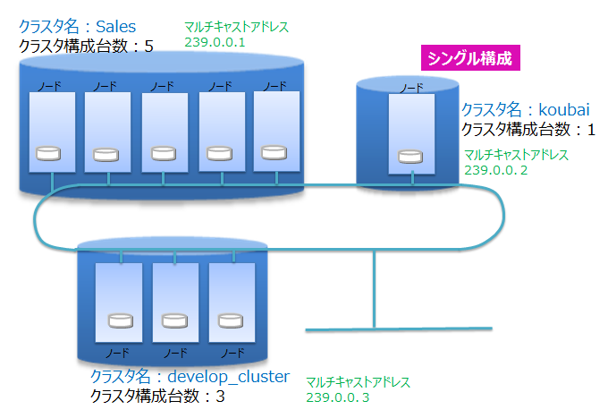
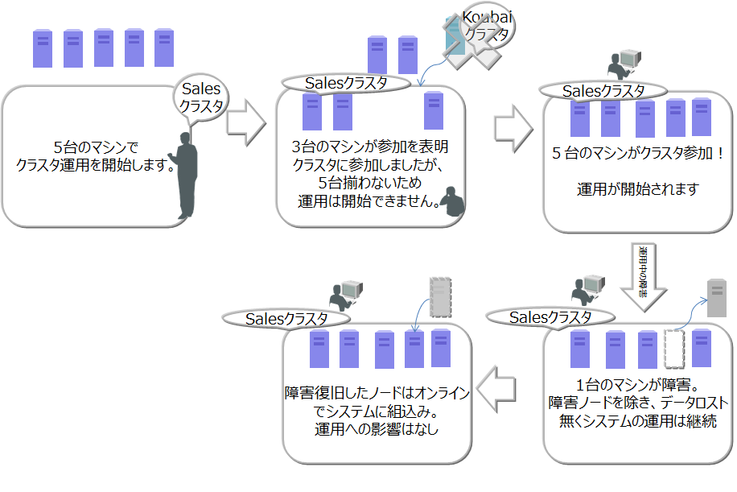
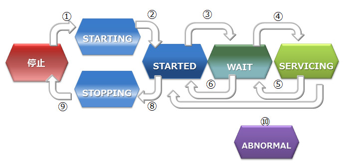
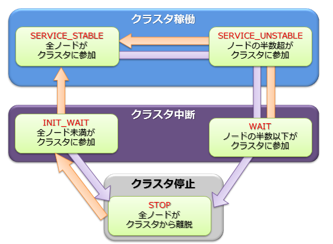

# GridDBの仕組み

GridDBのクラスタ動作の仕組みについて説明します。


クラスタの構成
--------------

GridDBは複数ノードで構成されるクラスタで動作します。アプリケーションシステムからデータベースにアクセスするにはノードが起動されており、かつクラスタが構成(クラスタサービスが実行)されている必要があります。

クラスタは、ユーザが指定した構成ノード数のノードがクラスタへ参加することで構成され、クラスタサービスが開始されます。構成ノード数のノードがクラスタに参加するまでクラスタサービスは開始されず、アプリケーションからはアクセスできません。

ノード1台で動作させる場合にも、クラスタを構成する必要があります。この場合構成ノード数を1台でクラスタを構成することになります。ノード1台で動作させる構成をシングル構成と呼びます。



ネットワーク上にあるGridDBの多数のノードを用いて、正しく（意図したノードを用いて）クラスタが構成できるよう、クラスタ名を使って複数のクラスタを区別します。これにより、同じネットワーク上に複数のGridDBクラスタが構成できます。
クラスタは、クラスタ名、構成ノード数、接続方式の設定が等しいノードで構成されます。クラスタ名は、クラスタを構成するノード毎に保有するクラスタ定義ファイルに設定するとともに、クラスタ構成する際のパラメータでも指定します。

マルチキャストを用いてクラスタを構成する方式をマルチキャスト方式と呼びます。クラスタ構成方式については、[クラスタ構成方式](#cluster_configuration_methods)を参照してください。

以下にクラスタ構成の操作の流れを示します。



ノードの起動、クラスタの構成には、[運用コマンド](#operating_commands)のgs_startnode/gs_joinclusterコマンドや[gs_sh](#label_gs_sh)を用います。また、OS起動と同時にノードを起動し、クラスタを構成するサービス制御機能もあります。


クラスタを構成するには、クラスタに参加させるノードの数（構成ノード数）とクラスタ名をすべての参加ノードで一致させる必要があります。

クラスタサービスは、クラスタでの運用開始後に構成するノードに障害がありクラスタからノードが切り離された場合でも、過半数のノードが参加している限りサービスは継続します。

過半数以上のノードさえ動作していればクラスタ運用は継続できるので、クラスタ運用中にメンテナンス等のために、オンラインでノード切り離したり、メンテナンス完了後にノードを組込む操作ができます。さらには、システムを増強するためにノードを追加することもオンラインでできます。


### ノードのステータス

ノードには、ノードの状態を表す複数の種類のステータスがあります。ユーザのコマンド実行やノードの内部処理によってステータスが遷移します。[クラスタのステータス](#status_of_cluster)は、クラスタに属する複数のノードのノードステータスによって決まります。

ノードステータスの種類と遷移、確認方法を説明します。

- ノードステータスの種類

  | ノードステータス  | 説明                                 |
  |-----------|----------------------------------------------|
  | STOP      | ノードでGridDBサーバが起動されていない状態です。 |
  | STARTING  | ノードでGridDBサーバが起動処理中の状態です。前回の運転状態に応じて、データベースのリカバリ処理などの起動時の処理が行われます。クライアントからアクセスできるのは、gs_statコマンドやgs_shコマンドでのシステムの状態確認のみです。アプリケーションからのアクセスはできません。 |
  | STARTED   | ノードでGridDBサーバが起動されている状態です。ただし、クラスタには参加していないため、引き続きアプリケーションからのアクセスはできません。クラスタを構成するには、gs_joinclusterやgs_shのクラスタ操作コマンドでクラスタへの参加を指示します。 |
  | WAIT      | クラスタ構成待ちの状態です。ノードはクラスタへの参加を通知しているが、構成ノード数のノードが足りておらず、ノード数が構成ノード数になるまで待ち状態となります。また、クラスタを構成するノードが過半数以下になり、クラスタのサービスが停止した際のノード状態もWAIT状態になります。 |
  | SERVICING | クラスタが構成されており、アプリケーションからのアクセスが可能な状態です。ただし、ノード停止時の障害後の再起動などでパーティションのクラスタ間での同期処理が発生した場合、アクセスが遅延することがあります。 |
  | STOPPING  | ノードを停止指示後、停止するまでの中間ステータスです。 |
  | ABNORMAL  | SERVICING状態もしくは、状態遷移の途中でノードがエラーを検出した際のステータスです。ABNORMAL状態となったノードは、自動的にクラスタから切り離されます。システムの動作情報を採取してから、ABNORMAL状態のノードを強制停止・再起動する必要があります。再起動することで、リカバリ処理が自動的に行われます。|

- ノードステータスの遷移



  | ステータス遷移  | 状態遷移事象 | 説明                                                                   |
  |----------------|-------------|-----------------------------------------------------------------------|
  | 　　 ①         | コマンド実行 | ノード起動(gs_startnodeコマンド、gs_sh、サービス起動などのコマンド実行)     |
  | 　　 ②         | システム     | リカバリ処理やデータベースファイルのロードが完了すると、状態は自動遷移       |
  | 　　 ③         | コマンド実行 | クラスタ参加(gs_joincluster/gs_appendclusterコマンド、gs_sh、サービス起動などのコマンド実行)   |
  | 　　 ④         | システム     | 構成ノード数のノードがクラスタに参加すると状態は自動遷移                  |
  | 　　 ⑤         | システム     | クラスタを構成する他のノードが障害等によりサービスから切り離され、構成ノード数が設定値の過半数を下回った時に、状態が自動遷移 |
  | 　　 ⑥         | コマンド実行 | ノードをクラスタから切り離す(gs_leaveclusterコマンドやgs_shなどのコマンド実行) |
  | 　　 ⑦         | コマンド実行 | ノードをクラスタから切り離す(gs_leavecluster/gs_stopclusterコマンドやgs_shなどのコマンド実行)   |
  | 　　 ⑧         | コマンド実行 | ノード停止(gs_stopnodeコマンド、gs_sh、サービス停止などのコマンド実行)      |
  | 　　 ⑨         | システム     | 終了処理が完了次第、サーバプロセスを停止                                   |
  | 　　 ⑩         | システム     | システム障害により切り離された状態。この状態では一度ノードを強制的に停止する必要がある。  |


- ノードステータスの確認方法

  ノードステータスは、ノードの稼働状況とノードの役割の2つの状態の組み合わせによって決まります。

  ノードのステータスは[gs_sh](#label_gs_sh)や[gs_admin](#integrated_operation_control)で確認できます。

  ノードの稼働状況とノードの役割は、gs_statコマンドを実行した結果のjson形式のデータから確認できます。（ノードの稼働状況：/cluster/nodeStatusの値、ノードの役割：/cluster/clusterStatusの値)

  ノードステータスと、ノードの稼働状況とノードの役割の2つの状態の組み合わせを以下に示します。

  | ノードステータス | ノードの稼働状況<br>(/cluster/nodeStatus)  | ノードの役割<br>(/cluster/clusterStatus) |
  |------------|------------------------------|------------------------|
  | STOP       | －(gs_statの接続エラー)       | －(gs_statの接続エラー)    |
  | STARTING   | INACTIVE                     | SUB_CLUSTER            |
  | STARTED    | INACTIVE                     | SUB_CLUSTER            |
  | WAIT       | ACTIVE                       | SUB_CLUSTER           |
  | SERVICING  | ACTIVE                       | MASTERまたはFOLLOWER   |
  | STOPPING   | NORMAL_SHUTDOWN              | SUB_CLUSTER           |
  | ABNORMAL   | ABNORMAL                     | SUB_CLUSTER           |

  - ノードの稼働状況

    ノードの稼働状況を表します。gs_statコマンドの/cluster/nodeStatusの値で確認できます。

    | ノードの稼働状況  |  説明                   |
    |------------------|------------------------|
    | ACTIVE           | アクティブ状態          |
    | ACTIVATING       | アクティブ状態に遷移中   |
    | INACTIVE         | 非アクティブ状態        |
    | DEACTIVATING     | 非アクティブ状態に遷移中 |
    | NORMAL_SHUTDOWN  | シャットダウン処理中     |
    | ABNORMAL         | 異常状態                |

  - ノードの役割

    ノードの役割を表します。gs_statコマンドの/cluster/clusterStatusの値で確認できます。

    ノードには「マスタ」と「フォロワ」という二つの役割があります。
    クラスタが開始する時には、クラスタを構成するノードのひとつが必ず「マスタ」になります。マスタはクラスタ全体の管理を行います。
    マスタ以外のノードはすべて「フォロワ」になります。フォロワは、マスタからの指示に基づいて同期などのクラスタ処理を行います。

    | ノードの役割                 |  説明     |
    |-----------------------------|-----------|
    | MASTER                      | マスタ     |
    | FOLLOWER                    | フォロワ   |
    | SUB_CLUSTER/SUB_MASTER      | 役割未定   |

<a id="status_of_cluster"></a>

### クラスタのステータス

クラスタの稼働ステータスは各ノードの状態で決まり、そのステータスには稼働／中断／停止の3つの種類があります。

クラスタのサービスは、システムの初回構築時においては、ユーザが指定したクラスタ構成するノード数（構成ノード数）のノードがすべてクラスタに参加した時点で開始されます。

初回のクラスタ構築時、クラスタを構成するノードがすべてクラスタに組み入れられておらず、クラスタ構成待ちの状態が【INIT_WAIT】状態です。構成ノード数のノードがクラスタに参加完了した時点で状態は自動遷移し稼働状態となります。

稼働状態には【STABLE】と【UNSTABLE】の2つの状態があります。

-   【STABLE】状態
    -   構成ノード数で指定したノードの数でクラスタが構成されており、サービスが提供できている安定した状態。
-   【UNSTABLE】状態
    -   構成ノード数に満たない状態で、かつ、構成ノード数の過半数が稼働している状態
    -   構成ノード数の過半数が稼働している限り、クラスタのサービスは継続します。

メンテナンスなどでノードをクラスタより切り離しても、構成ノード数の過半数が動作している限りクラスタは【UNSTABLE】状態で運用できます。

クラスタを構成するノードが、構成ノード数の半数以下となった場合、スプリットブレイン発生を防ぐためにクラスタは自動的にサービスを中断します。クラスタのステータスは【WAIT】状態となります。

-   スプリットブレインとは、

    複数のノードを相互接続して1台のサーバのように動作させる密結合クラスタシステムにおいて、ハードウェアやネットワークの障害によりシステムが分断されたことを契機に、同じ処理を行う複数のクラスタシステムが同時にサービスを提供してしまう動作をいいます。この状態で運用を継続した場合、複数のクラスタでレプリカとして保有するデータをマスタデータとして動作してしまい、データの一貫性が取れない状態となってしまいます。

【WAIT】状態からクラスタサービスを再開するには、エラーの回復したノードや新規のノードをノード追加操作でクラスタへ追加していきます。 再び構成ノード数のノードがクラスタに参加完了した時点で状態は【STABLE】状態となり、サービスが再開されます。

ノードの障害等でクラスタを構成するノード数が半数以下となり、クラスタのサービスが中断した場合でも、ノード追加操作でエラーの回復したノードや新規のノードをクラスタへ追加していき過半数のノードがクラスタに参加した時点で自動的にクラスタのサービスは再開されます。



STABLE状態はgs_statの示すjsonのパラメータである、/cluster/activeCountと/cluster/designatedCountの値が等しい状態です。（出力される内容はバージョンによって異なります。）

```
$ gs_stat -u admin/admin
{
    "checkpoint": {
　　　　　：
　　　　　：
    },
    "cluster": {
        "activeCount":4,　　　　　　　　　　　 ★ クラスタ内で稼働中のノード
        "clusterName": "test-cluster",
        "clusterStatus": "MASTER",
        "designatedCount": 4,                  ★ 構成ノード数
        "loadBalancer": "ACTIVE",
        "master": {
            "address": "192.168.0.1",
            "port": 10040
        },
        "nodeList": [　　　　　　　　　　　　　★　クラスタを構成するマシンリスト
            {
                "address": "192.168.0.1",
                "port": 10040
            },
            {
                "address": "192.168.0.2",
                "port": 10040
            },
            {
                "address": "192.168.0.3",
                "port": 10040
            },
            {
                "address": "192.168.0.4",
                "port": 10040
            },

        ],
        ：
        ：
```

クラスタのステータスは、[gs_sh](#label_gs_sh)や[gs_admin](#integrated_operation_control)で確認できます。以下にgs_shでのクラスタステータスの確認例を示します。

```
$ gs_sh
gs> setuser admin admin gsadm                  //接続ユーザの設定
gs> setnode node1 192.168.0.1 10040            //クラスタを構成するノードの定義
gs> setnode node2 192.168.0.2 10040
gs> setnode node3 192.168.0.3 10040
gs> setnode node4 192.168.0.4 10040
gs> setcluster cluster1 test150 239.0.0.5 31999 $node1 $node2 $node3 $node4 　//クラスタの定義
gs> startnode $cluster1                        //クラスタを構成する全ノードの起動
gs> startcluster $cluster1                     //クラスタ構成を指示
クラスタの開始を待っています。
クラスタが開始しました。
gs> configcluster  $cluster1                      ★クラスタのステータスを確認
Name                  : cluster1
ClusterName           : test-cluster
Designated Node Count : 4
Active Node Count     : 4
ClusterStatus         : SERVICE_STABLE　　　　　　★安定状態

Nodes:
  Name    Role Host:Port              Status
-------------------------------------------------
  node1     M  192.168.0.1:10040    SERVICING
  node2     F  192.168.0.2:10040    SERVICING
  node3     F  192.168.0.3:10040    SERVICING
  node4     F  192.168.0.4:10040    SERVICING

gs> leavecluster $node2
ノードがクラスタから離脱するのを待っています。
ノードがクラスタから離脱しました。
gs> configcluster  $cluster1
Name                  : cluster1
ClusterName           : test150
Designated Node Count : 4
Active Node Count     : 3
ClusterStatus         : SERVICE_UNSTABLE　　　　　★不安定な状態

Nodes:
  Name    Role Host:Port              Status
-------------------------------------------------
  node1     M  192.168.0.1:10040    SERVICING　　　　//マスタノード
  node2     -  192.168.0.2:10040    STARTED　　　　　
  node3     F  192.168.0.3:10040    SERVICING　　　　//フォロワノード
  node4     F  192.168.0.4:10040    SERVICING　　　　//フォロワノード
```

### パーティションのステータス

パーティションステータスは、クラスタ上のパーティション全体の状態を表します。
クラスタステータスが稼働状態の時に、パーティションにアクセスできる状態か、パーティションに偏りが無いかなどを表すステータスです。

| パーティションステータス | 説明 |
|--------------|----------------|
| NORMAL       | すべてのパーティションがデータ配置目標と同一の正常な状態 |
| NOT_BALANCE  | レプリカロスやオーナロスは発生していないが、パーティションの配置が偏っている状態 |
| REPLICA_LOSS | レプリカのデータが欠損しているパーティションが存在する状態<br>（該当パーティションの可用性が落ちている・ノード離脱できない） |
| OWNER_LOSS   | オーナのデータが欠損しているパーティションが存在する状態<br>（該当パーティションのデータにはアクセスできない）      |
| INITIAL      | クラスタ構成に参加していない初期状態 |

パーティションステータスは、マスタノードへのgs_statコマンドの実行で確認できます。（/cluster/partitionStatusの値）

```
$ gs_stat -u admin/admin
{
　　：
　　：
"cluster": {
    ：
    "nodeStatus": "ACTIVE",
    "notificationMode": "MULTICAST",
    "partitionStatus": "NORMAL",
    ：
```

[メモ]
- マスタノード以外の/cluster/partitionStatusの値は、正しくない場合があります。必ずマスタノードの値を確認してください。

<a id="cluster_configuration_methods"></a>

## クラスタ構成方式

クラスタは、ネットワーク上に存在するノード同士がお互いを認識することで構成されます。 ノードは、認識した他のノードのアドレスをリストとして持ちます。

GridDBは、アドレスリストを構成する方法が異なる3つのクラスタ構成方式を提供します。環境や利用ケースによってクラスタ構成方式を使い分けることができます。クラスタ構成方式によって、クライアントや運用ツールの接続方式も異なります。

クラスタ構成方式には、マルチキャスト方式と固定リスト方式とプロバイダ方式の3つがあります。推奨はマルチキャスト方式です。

固定リスト方式かプロバイダ方式を用いることで、マルチキャストが利用不可能な環境でのクラスタ構成、クライアント接続が可能になります。

-   マルチキャスト方式
    -   マルチキャストでノードのディスカバリを行い、アドレスリストを自動構成します。
-   固定リスト方式
    -   クラスタ定義ファイルに固定のアドレスリストを指定して起動することで、そのリストを利用します。
-   プロバイダ方式
    -   アドレスプロバイダが提供するアドレスリストを取得して利用します。
    -   アドレスプロバイダはWebサービスとして構成するか、静的コンテンツとして構成することができます。

クラスタ構成方式の比較は以下のとおりです。

| 項目         | マルチキャスト方式(推奨)             | 固定リスト方式                                 | プロバイダ方式          |
|--------------|------------------------------------|-----------------------------------------------|-----------------------|
| 設定         | ・マルチキャストアドレス、ポート      | ・全ノードのIPアドレス:ポートのリスト           | ・プロバイダURL        |
| 利用ケース   | ・マルチキャストが利用できる          | ・マルチキャストが利用できない<br>・正確にシステム規模の見積りが行える | ・マルチキャストが利用できない<br>・システム規模が見積もれない        |
| クラスタ動作 | ・一定時間間隔でノードの自動ディスカバリを行う。 | ・全ノードに同一のアドレスリストを設定する<br>・ノード起動時に1度だけそのリストを読み込む | ・アドレスプロバイダから一定時間間隔でアドレスリストを取得 |
| メリット     | ・ノード追加のためのクラスタ再起動不要      | ・リストの整合性チェックが行われるため、間違いが無い | ・ノード追加のためのクラスタ再起動不要    |
| デメリット   | ・クライアント接続にマルチキャストを要する   | ・ノード追加にクラスタ再起動が必要<br>・アプリ側の接続設定の更新も必要 | ・アドレスプロバイダの可用性確保が必要     |


### クラスタ構成方式の設定

マルチキャスト方式が利用できない環境では、固定リスト方式またはプロバイダ方式でクラスタを構成します。 以下では、固定リスト方式とプロバイダ方式それぞれのネットワーク設定について説明します。

#### 固定リスト方式

固定のアドレスリストを与えてノードを起動することで、そのリストを利用してクラスタを構成します。

固定リスト方式でクラスタを構成する場合は、クラスタ定義ファイルのパラメータを設定します。

**クラスタ定義ファイル**

| パラメータ                  | データ型 | 意味                                                                     |
|-----------------------------|----------|--------------------------------------------------------------------------|
| /cluster/notificationMember | string   | クラスタ構成方式を固定リスト方式にする際に、アドレスリストを指定します。 |

クラスタ定義ファイルの設定例は以下のとおりです。

```
{
                             :
                             :
    "cluster":{
        "clusterName":"yourClusterName",
        "replicationNum":2,
        "heartbeatInterval":"5s",
        "loadbalanceCheckInterval":"180s",
        "notificationMember": [
            {
                "cluster": {"address":"172.17.0.44", "port":10010},
                "sync": {"address":"172.17.0.44", "port":10020},
                "system": {"address":"172.17.0.44", "port":10040},
                "transaction": {"address":"172.17.0.44", "port":10001},
                "sql": {"address":"172.17.0.44", "port":20001}
            },
            {
                "cluster": {"address":"172.17.0.45", "port":10010},
                "sync": {"address":"172.17.0.45", "port":10020},
                "system": {"address":"172.17.0.45", "port":10040},
                "transaction": {"address":"172.17.0.45", "port":10001},
                "sql": {"address":"172.17.0.45", "port":20001}
            },
            {
                "cluster": {"address":"172.17.0.46", "port":10010},
                "sync": {"address":"172.17.0.46", "port":10020},
                "system": {"address":"172.17.0.46", "port":10040},
                "transaction": {"address":"172.17.0.46", "port":10001},
                "sql": {"address":"172.17.0.46", "port":20001}
            }
        ]
    },
                             :
                             :
}
```

#### プロバイダ方式【EE限定】

アドレスプロバイダが提供するアドレスリストを取得してクラスタ構成を行います。

プロバイダ方式でクラスタを構成する場合は、クラスタ定義ファイルのパラメータを設定します。

**クラスタ定義ファイル**

| パラメータ                                   | データ型 | 意味            |
|----------------------------------------------|----------|---------------|
| /cluster/notificationProvider/url            | string   | クラスタ構成方式をプロバイダ方式にする際に、アドレスプロバイダのURLを指定します。                     |
| /cluster/notificationProvider/updateInterval | string   | アドレスプロバイダからリストを取得する間隔を指定します。1s以上、2<sup>31</sup>s未満の値を指定します。 |

クラスタ定義ファイルの設定例は以下のとおりです。

```
{
                             :
                             :
    "cluster":{
        "clusterName":"yourClusterName",
        "replicationNum":2,
        "heartbeatInterval":"5s",
        "loadbalanceCheckInterval":"180s",
        "notificationProvider":{
            "url":"http://example.com/notification/provider",
            "updateInterval":"30s"
        }
    },
                             :
                             :
}
```

アドレスプロバイダはWebサービスとして構成するか、静的コンテンツとして構成することができます。 アドレスプロバイダは以下の仕様を満たす必要があります。

-   GETメソッドに対応。
-   URLにアクセスすると、そのURLが書かれたクラスタ定義ファイルを持つクラスタのノードのアドレスリストをレスポンスとして返す。
    -   レスポンスボディ：固定リスト方式において指定するノードリストの内容と同等のJSON
    -   レスポンスヘッダ：Content-Type:application/jsonを含む

アドレスプロバイダからのレスポンスの例は以下のとおりです。

```
$ curl http://example.com/notification/provider
[
    {
        "cluster": {"address":"172.17.0.44", "port":10010},
        "sync": {"address":"172.17.0.44", "port":10020},
        "system": {"address":"172.17.0.44", "port":10040},
        "transaction": {"address":"172.17.0.44", "port":10001},
        "sql": {"address":"172.17.0.44", "port":20001}
    },
    {
        "cluster": {"address":"172.17.0.45", "port":10010},
        "sync": {"address":"172.17.0.45", "port":10020},
        "system": {"address":"172.17.0.45", "port":10040},
        "transaction": {"address":"172.17.0.45", "port":10001},
        "sql": {"address":"172.17.0.45", "port":20001}
    },
    {
        "cluster": {"address":"172.17.0.46", "port":10010},
        "sync": {"address":"172.17.0.46", "port":10020},
        "system": {"address":"172.17.0.46", "port":10040},
        "transaction": {"address":"172.17.0.46", "port":10001},
        "sql": {"address":"172.17.0.46", "port":20001}
    }
]
```

【メモ】
-   各アドレスおよびポートはノード定義ファイルのserviceAddressおよびservicePortをモジュール(cluster,syncなど)ごとに指定します。
-   クラスタ定義ファイルの/cluster/notificationAddress、/cluster/notificationMember、/cluster/notificationProviderは、使用するクラスタ構成方式に合わせていずれか1つを設定してください。

