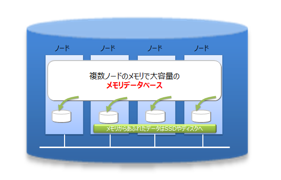
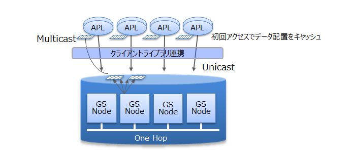
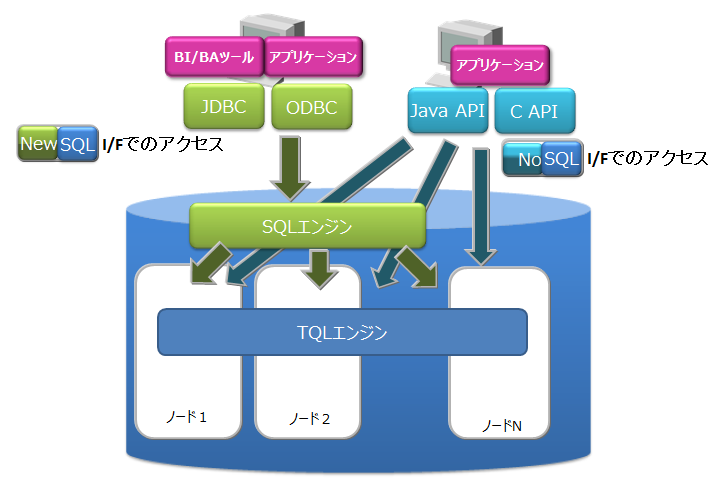
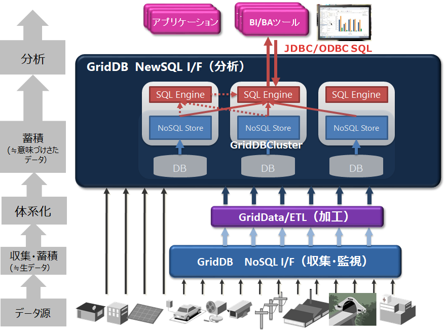

# GridDBとは

GridDBは、キーと複数の値からなるデータ(ロウと呼ばれる)の集合を管理する、分散NoSQL型データベースです。 データをすべてメモリに配置するインメモリデータベースとしての構成に加え、ディスク(SSDも含む)とメモリの利用を併用したハイブリッド構成も取ることができます。ハイブリッド構成を用いることで、小規模、小メモリシステムでも活用可能です。

GridDBはビッグデータソリューションで必要となる３つのV(Volume,Variety,Velocity)に加え、データの信頼性／可用性を備えています。また、自律的なノード監視と負荷バランシング機能により、クラスタ運用の省力化が実現できます。

## GridDBの特徴

### 大容量データ(Volume)<a href="https://www.global.toshiba/jp/products-solutions/ai-iot/griddb/product/griddb-ee.html?utm_source=griddb.net&utm_medium=referral&utm_campaign=commercial_badge"><badge text="商用版のみ" type="warning"/></a>

システムの規模拡大とともに扱うデータの容量は増大し、大容量データを素早く処理するためにはシステムの拡張が必要になります。

システムの拡張のアプローチには、大きく分けてスケールアップ(垂直スケーラビリティ）とスケールアウト(水平スケーラビリティ）の２つのアプローチがあります。

-   スケールアップ（垂直スケーラビリティ）とは

    動作するマシンへのメモリ追加、ディスクのSSD化、プロセッサの追加などの方法でシステムを増強するアプローチです。一般的に、１つ１つの処理時間を短縮してシステムを高速化するという効果があります。その反面、複数台マシンを用いたクラスタ運用ではないため、スケールアップ時には一旦ノードを停止する必要があり、障害発生時には障害回復に時間がかかるなどの欠点があります。

-   スケールアウト（水平スケーラビリティ）とは

    システムを構成するノードの台数を増やして処理能力を向上させるアプローチです。一般的に、複数のノードを連携して動作させることになるため、メンテナンスや障害発生時でもサービスを完全に停止させる必要がない点が利点となります。その反面、ノード台数が増えるために運用管理の手間が増大するなどの欠点があります。並列度の高い処理を行うのに向いたアーキテクチャです。

GridDBでは、動作するノードをスケールアップしてシステム増強する方法に加え、システムに新たなノードを追加し、稼働するクラスタに組み込むスケールアウトでシステムを拡張することもできます。

GridDBは、インメモリ処理データベースとしてもスケールアウトモデルで大容量化が可能です。GridDBでは、複数ノードで構成されるクラスタ内のノードにデータを分散配置します。複数ノードのメモリを１つの大きなメモリ空間として利用することで、大規模なメモリデータベースを提供できます。

また、メモリの利用だけでなく、ディスクを併用したハイブリッド構成のデータ管理も可能であるため、単体のノードで動作させた場合も、メモリサイズを超えたデータを保持して、アクセスができます。メモリサイズに制限されない大容量化も実現できます。

スケールアウトでのシステム拡張は、オンラインで行うことができます。そのため、運用中のシステムを停止することなく、システムの成長とともに増大するデータに対応できます。

スケールアウトでシステムに追加したノードには、システムの負荷に応じて適切にデータが配置されます。GridDBが負荷バランスを最適化するため、運用管理者がデータ配置を気にする必要はありません。このような運用を自動化する仕組みが組み込まれており、運用も容易です。

### さまざまなデータ(Variety)

GridDBのデータは、Key-Valueを発展させたKey-Container型のデータモデルです。コンテナというRDBのテーブルに相当する器にデータを格納します。 （コンテナをRDBのテーブルとして考えるとわかりやすいです。）

GridDBのデータアクセスでは、Key-Valueデータベース構造のため、Keyで絞り込みができるモデルが最も高速に処理できます。管理する実体に対応して、キーとなるコンテナを用意するという設計が必要です。

コンテナには、センサ等の時々刻々発生する時間と値のペアになった大量の時系列のデータを扱うのに適したコンテナ(時系列コンテナ）に加え、位置情報などの空間データを登録し、空間固有の演算（空間の交差）を行うこともできます。配列型のデータやBLOBなどの非定型なデータにも対応しているため、さまざまなデータを扱うことができます。

### 高速処理(Velocity)

GridDBには、さまざまなアーキテクチャ上の工夫が組み込まれ、高速化を実現しています。

#### できるだけメモリ上で処理をする

全てのデータがメモリに配置されてインメモリで動作するシステムの場合、ディスクへのアクセスのオーバヘッドをあまり気にする必要がありません。しかし、メモリ上に保持できないほどの大量のデータを処理するためには、アプリケーションがアクセスするデータを局所化して、ディスクに配置されたデータへのアクセスをできるだけ少なくする必要があります。

GridDBでは、アプリケーションからのデータアクセスを局所化するために、関連のあるデータをできるだけ同じブロックに配置する機能を提供します。データにヒント情報を与えることで、ヒントに従ったデータブロックにデータを集約し、データアクセス時のメモリ内ヒット率を高め、データアクセス時間を高速化します。アプリケーションでのアクセス頻度やアクセスパターンに応じて、メモリ集約のヒントを設定することで、限られたメモリ領域を有効活用して動作させることができます（アフィニティ機能）。

#### オーバヘッドを減らす

データベースに対して並列にアクセスする時のロックやラッチなどによる、データベースの実行処理待ちとなる時間をできるだけ少なくするために、GridDBでは、CPUコア・スレッドごとに占有するメモリとデータベースファイルを割り当て、排他、同期処理の待ちをなくしています。

また、GridDBでは、クライアントライブラリ側で初回アクセス時にデータ配置をキャッシュすることで、クライアントとノード間は直接アクセス可能です。データ配置やクラスタの動作状況を管理するマスタノードを介さず、直接目的とするデータにアクセスできるので、マスタノードへのアクセス集中や、通信コストを大幅に削減できます。

#### 並列に処理をする

GridDBでは、1つの巨大なデータを複数ノードに分散配置（パーティショニング）したノード間、およびノード内での並列処理と、少ないリソースで多くの要求を処理できるイベント駆動エンジンで、高速化を実現しています。

### 信頼性／可用性<a href="https://www.global.toshiba/jp/products-solutions/ai-iot/griddb/product/griddb-ee.html?utm_source=griddb.net&utm_medium=referral&utm_campaign=commercial_badge"><badge text="商用版のみ" type="warning"/></a>

クラスタ内ではデータを複製して、複数のノード上にデータ(レプリカ)を多重配置しています。レプリカの中で、マスタのデータをオーナ、複製したデータをバックアップと呼びます。クラスタを構成するいずれかのノードに障害が発生した場合でも、レプリカを使用することで処理を継続できます。ノード障害発生後のデータ再配置もシステムが自動的に行うため(自律的データ配置）、特別な運用操作は不要です。障害対象のノードに配置されていたデータはレプリカから復旧され、自動的に設定されたレプリカ数となるようにデータは再配置されます。

レプリカは、可用性の要求に応じて2重化、3重化など多重度の設定ができます。

各ノードはディスクを使用してデータ更新情報の永続化を行っています。クラスタシステムに障害が発生しても、ディスクに問題がなければ、それまで登録・更新したデータを失わずに復元することができます。

また、クライアントでもデータ配置管理情報のキャッシュを保有しているため、ノードの障害を検知すると自動的にフェイルオーバーし、レプリカを用いたデータアクセスを継続できます。

## GridDBの製品

GridDBには、以下の製品があります。

-   GridDB Community Edition (CE)
-   GridDB Enterprise Edition (EE)

上記製品は[GridDBの特徴](#griddb_features)で説明した特徴で説明した特徴に加え、
以下の2つの特徴を持ちます。

-   NewSQL インターフェース
    -   SQL92に準拠したSQLとともに、標準仕様に準拠したアプリケーションインターフェースであるODBC(C言語インターフェース)とJDBC(Javaインターフェース)を利用できます。
    -   ODBC/JDBCを利用することで、BI(Business Intelligence)ツールやETL(Extract Transfer Load)ツールからデータベースに直接アクセスすることもできます。
    -  	コンテナをテーブルとみなして操作できます。
-   テーブルパーティショニング機能
    -   巨大なテーブルを高速にアクセスするためのパーティショニング機能です。
    -   データを複数の部分に分割し、複数のノードに分散配置するため、テーブルから条件にマッチするデータを検索する処理やデータを取り出す処理の並列化を行い、データアクセスの高速化が実現できます。

各インターフェースの特徴は以下のとおりです。

-   NoSQLインターフェース(NoSQL I/F)
    -   NoSQL I/FのクライアントAPI(C言語、Java)は、ビッグデータを高速に一括処理する機能に重点を置いています。
    -   データ収集やKey-Valueデータの高速なアクセス、TQLを用いた簡単な集計演算などを行う場合に利用します。
-   NewSQLインターフェース(NewSQL I/F)
    -   NewSQL I/FのODBCやJDBCは、既存アプリケーションとの連携やSQLを用いた開発生産性の向上に重点を置いています。
    -   BIツールなどを用いて収集したデータを分類し分析する場合に利用します。

GridDBでは、NoSQL I/FとNewSQL I/Fの両方を用途によって使い分けることができます。

同一メジャーバージョン内(マイナーバージョンアップ時)では、GridDBのデータベースおよびNoSQL/NewSQLインターフェースの互換性があります。 バージョンの表記は、以下の通りです。

-   GridDBのバージョンは「X.Y\[.Z\]」で表され、それぞれ以下を表します。
    -   メジャーバージョン(X)： 大幅な機能強化の場合に変更します。
    -   マイナーバージョン(Y)： 機能強化・追加などの場合に変更します。
    -   リビジョン(Z)： 不具合修正などの場合に変更します。

NoSQL I/FとNewSQL I/Fを併用する場合は以下の仕様をあらかじめ理解してください。

-   NoSQL I/Fで作成したコンテナは、テーブルとしてNewSQL I/Fで操作できます。 また、NewSQL I/Fで操作したテーブルは、コンテナとしてNoSQL I/Fで操作できます。
-   コンテナおよびテーブルの名称は、一意の名称である必要があります。 作成するテーブルと同じ名前のコンテナが既に存在するとエラーになります。

## 用語一覧

GridDBで利用する用語を一覧で解説します。

| 用語                           | 意味    |
|--------------------------------|------------------------------------------------------------------------|
| ノード                         | GridDBでデータ管理を行う個々のサーバプロセスを指します。                   |
| クラスタ                       | 一体となってデータ管理を行う、1つ、もしくは複数のノードの集合を指します。     |
| マスタノード                   | クラスタ管理処理を行うノードです。                                         |
| フォロワノード                 | クラスタに参加している、マスタノード以外のノードです。                       |
| 構成ノード数                   | GridDBクラスタを構成するノード数を指定します。GridDBが初回に起動する際に、クラスタが成立する閾値として用いられます。（構成ノード数のノードがクラスタに参加することでクラスタサービスが開始されます。）  |
| 有効ノード数                   | GridDBクラスタを構成するノードの内、クラスタに組み込まれた稼働中のノードの数です。 |
| ブロック                       | ブロックとは、ディスクへのデータ永続化処理（以降、チェックポイントと呼びます）のデータ単位であり、GridDBの物理的なデータ管理の最小単位です。ブロックには複数のコンテナのデータが配置されます。ブロックサイズは、GridDBの初期起動前に定義ファイル（クラスタ定義ファイル）で設定します。 |
| パーティション                 | コンテナを配置するデータ管理の単位で、データをディスクに永続化する際のファイルシステム上のデータファイルに相当します。1つのパーティションに１つのデータファイルが対応します。また、クラスタ間でのデータ配置の最小単位であり、ノード間の負荷バランスを調整するため(リバランス）や、障害発生時のデータ多重化（レプリカ）管理のためのデータ移動や複製の単位です。 |
| ロウ                           | コンテナ(テーブル)に登録される1行のデータを指します。コンテナ(テーブル)には複数のロウが登録されます。ロウは、コンテナ(テーブル)のスキーマ定義に対応したカラムの値から構成されます。   |
| コンテナ(テーブル)             | ロウの集合を管理する入れ物です。NoSQL I/Fで操作する場合はコンテナ、NewSQL I/Fで操作する場合はテーブルと呼ぶ場合があります。呼び方が異なるだけで、実体は同じオブジェクトです。コンテナには、コレクションと時系列コンテナの２種類のデータタイプが存在します。        |
| コレクション(テーブル)         | 一般の型のキーを持つロウを管理するコンテナ(テーブル)の１種です。     |
| 時系列コンテナ(時系列テーブル) | 時刻型のキーを持つロウを管理するコンテナ(テーブル)の１種です。時系列のデータを扱う専用の機能を持ちます。 |
| データベースファイル           |クラスタを構成するノードの保有するデータをディスクやSSDに書き込み、永続化したファイル群です。データベースファイルは、データファイル、チェックポイントログファイル、トランザクションログファイルの総称です。    |
| データファイル       | パーティションのデータが書き込まれたファイルです。 ノード定義ファイルのサイクル（/checkpoint/checkpointInterval）でメモリ上の更新情報が反映されます。        |
| チェックポイントログファイル       |  パーティションのブロック管理情報を格納するファイルです。ノード定義ファイルのサイクル（/checkpoint/checkpointInterval）で、ブロック管理情報の書き込みを分割で行います。 |
| トランザクションログファイル   | トランザクションの更新情報がログとして逐次保存されるファイルです。 |
| LSN（Log Sequence Number)    | パーティションごとに割り当てられる、トランザクションでの更新時の更新ログシーケンス番号です。クラスタ構成のマスタノードは、各ノードが保持している全パーティションのLSNのうちの最大数（MAXLSN)を保持しています。 |
| レプリカ                       | 複数のノードにパーティションを多重化配置することを指します。レプリカには更新されるマスタデータであるオーナと参照に利用されるバックアップがあります。       |
| オーナノード                   | パーティション内のコンテナに対して更新操作ができるノードです。複製されたコンテナのうち、マスタとなるコンテナを記録しているノードです。 |
| バックアップノード             | 複製されたコンテナのうち、バックアップのためのデータを記録しているノードです。      |
| 定義ファイル                   | クラスタを構成する際のパラメータファイル（gs_cluster.json：以降クラスタ定義ファイルと呼ぶ）とクラスタ内でのノードの動作やリソースを設定するパラメータファイル（gs_node.json：以降ノード定義ファイルと呼ぶ）の２つがあります。また、GridDBの管理ユーザのユーザ定義ファイルもあります。   |
| イベントログファイル           | GridDBサーバのイベントログが保管されるファイルです。エラーや警告などのメッセージが含まれます。                     |
| OSユーザ（gsadm)               | GridDBの運用機能を実行できる権限を持つユーザです。GridDBインストール時にgsadmというOSのユーザが作成されます。       |
| 管理ユーザ                     | GridDBの運用操作を行うために用意されたGridDBのユーザです。         |
| 一般ユーザ                     | アプリケーションシステムで利用するユーザです。                     |
| ユーザ定義ファイル             | 管理ユーザが登録されるファイルです。初期インストールではsystem,adminの２つの管理ユーザが登録されています。               |
| クラスタデータベース           | GridDBのクラスタシステムでアクセスできるデータベース全体を総称します。                                                                            |
| データベース                   | クラスタデータベースに作成される、論理的なデータ管理の単位です。クラスタデータベース内にデフォルトではpublicというデータベースが作成されています。新規にデータベースを作成し、一般ユーザに利用権限をあたえることで、ユーザ毎のデータ分離が実現できます。                 |
| フルバックアップ               | 現在利用中のクラスタデータベースをノード定義ファイルで指定したバックアップディレクトリにオンラインでバックアップします。      |
| 差分・増分バックアップ         | 現在利用中のクラスタデータベースをノード定義ファイルで指定したバックアップディレクトリにオンラインでバックアップし、以降のバックアップでは、バックアップ後の更新ブロックの差分増分のみをバックアップします。    |
| 自動ログバックアップ           | 現在利用中のクラスタデータベースをオンラインで指定したディレクトリにバックアップするとともに、トランザクションログファイルの書き込みと同じタイミングでトランザクションログも自動で採取します。トランザクションログファイルの書き込みタイミングは、ノード定義ファイルの/dataStore/logWriteModeの値に従います。            |
| フェイルオーバ―                | 稼働中のクラスタに障害が発生した際に、バックアップノードがその機能を自動的に引き継ぎ、処理を続行する仕組みです。       |
| クライアントフェイルオーバー   | 稼働中のクラスタに障害が発生した際、クライアント側のAPIで障害時のリトライ処理としてバックアップノードに自動的に接続し直し、処理を続行する仕組みです。    |
| テーブルパーティショニング     | データ登録数が多い巨大なテーブルのデータを複数のノードに分散配置することで、複数ノードのメモリを有効に利用し、かつ複数ノードのプロセッサの並列実行を可能とし、巨大テーブルのアクセスを高速化するための機能です。             |
| データパーティション           | テーブルパーティショニングによって分割されたデータを格納する入れ物を総称します。テーブルパーティショニングされた1つのテーブルに対して、データパーティションは複数作成されます。データパーティションは、通常のコンテナと同様に各ノードに分散配置されます。データパーティションの数や格納するデータの範囲は、テーブルパーティショニングの種類(ハッシュ、インターバル、インターバル-ハッシュ)によって異なります。 |
| データアフィニティ             | 関連の強いコンテナのデータを同じブロックに配置し、データアクセスの局所化を図ることでメモリヒット率を高めるための機能です。      |
| ノードアフィニティ             | 関連の強いコンテナを同じノードに配置し、データアクセス時のネットワーク負荷を減少させるための機能です。       |
