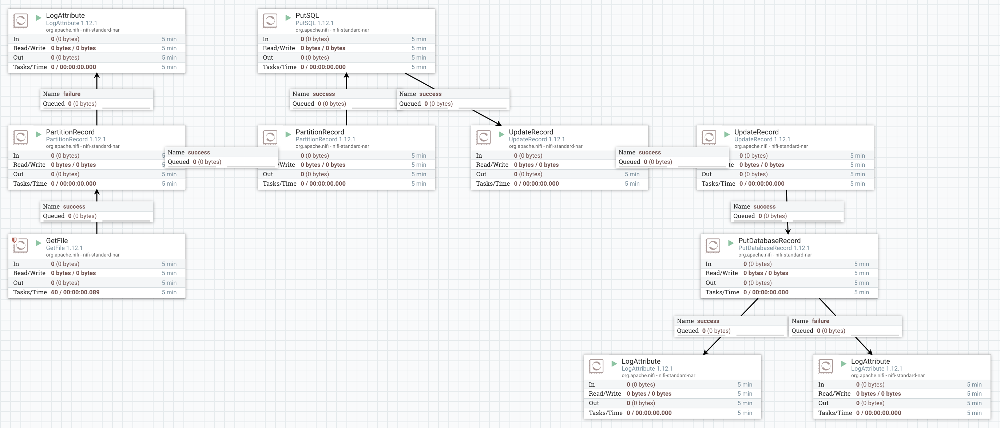
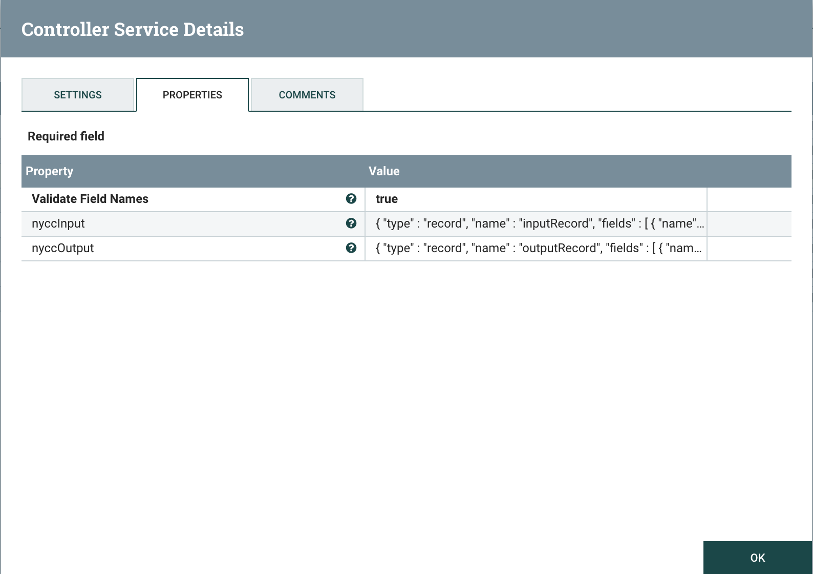
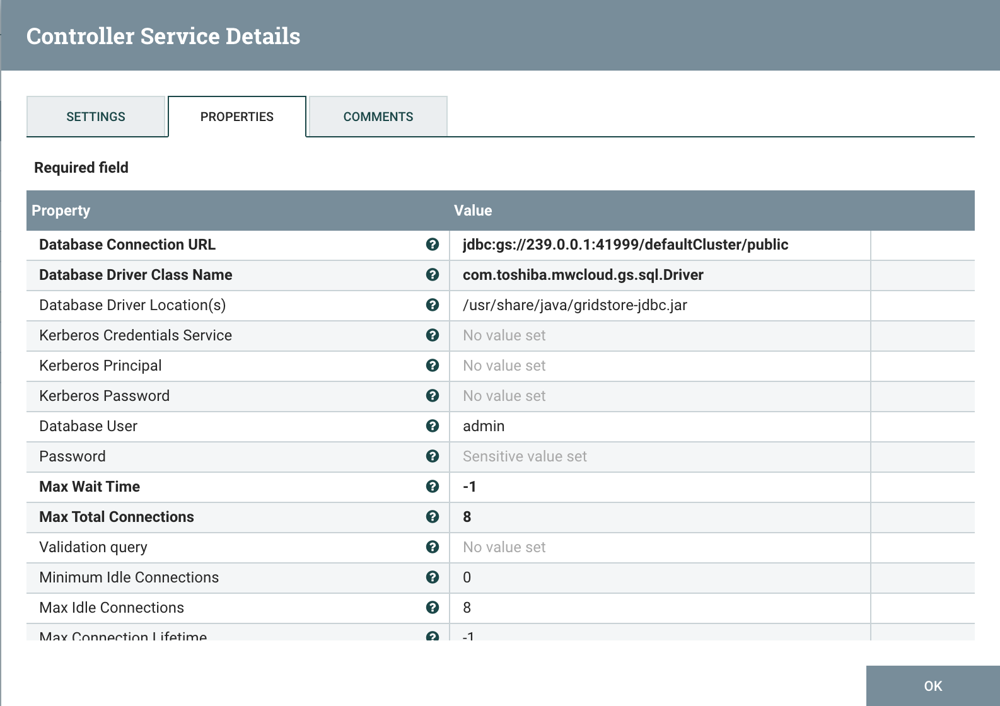
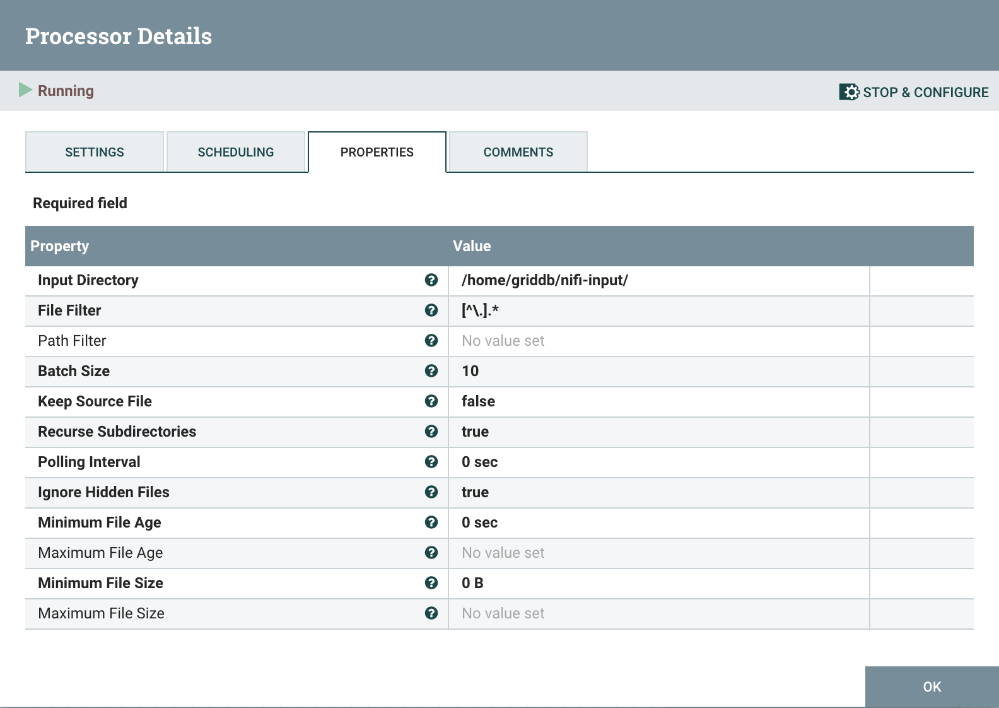
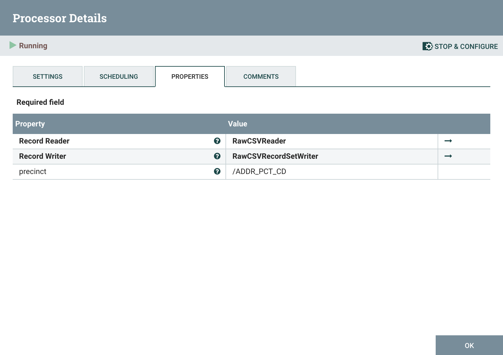
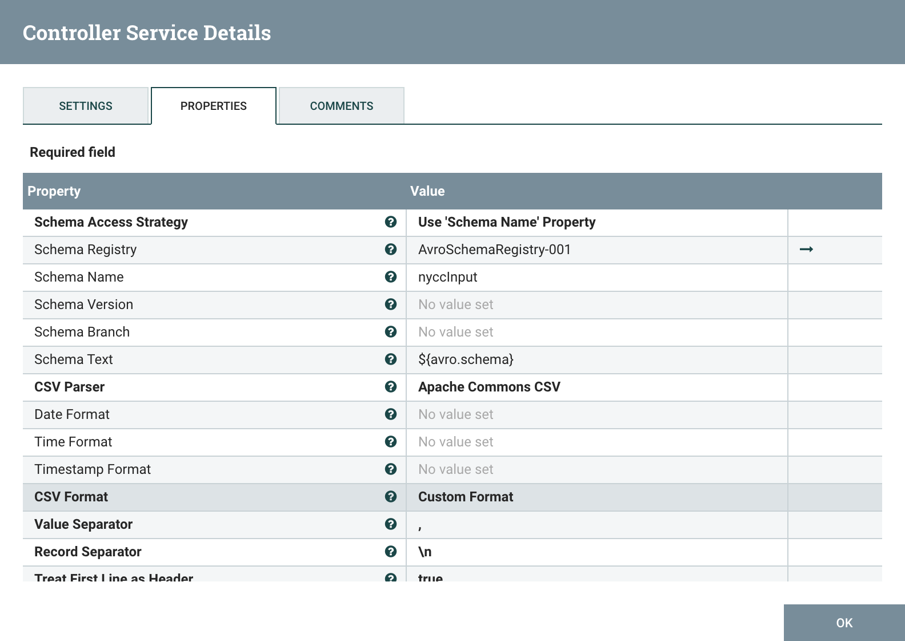
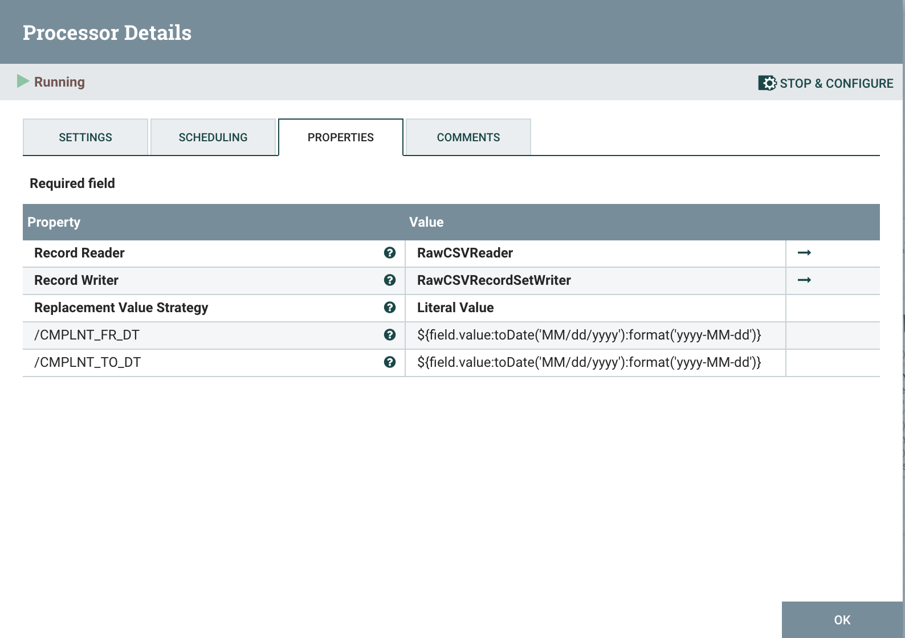
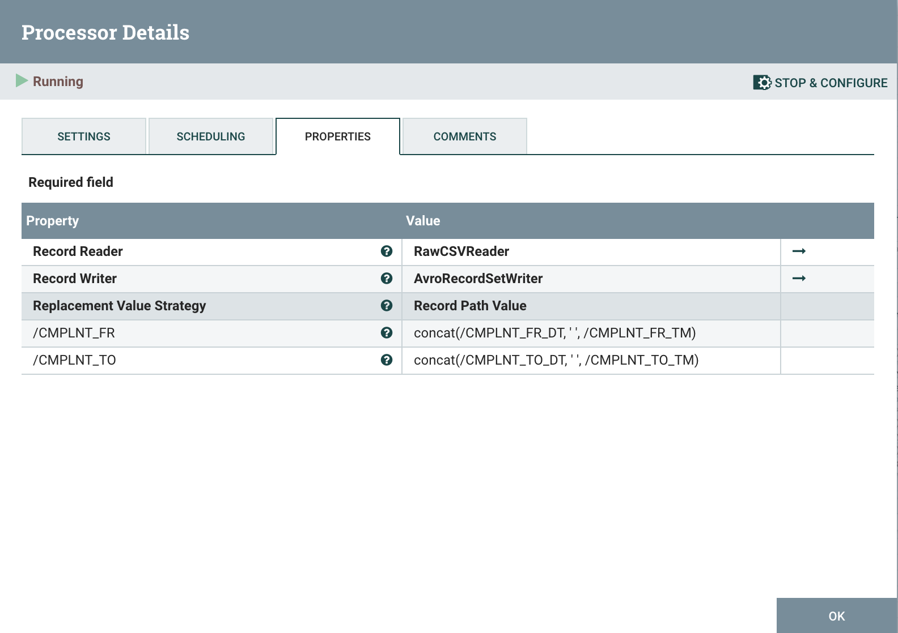
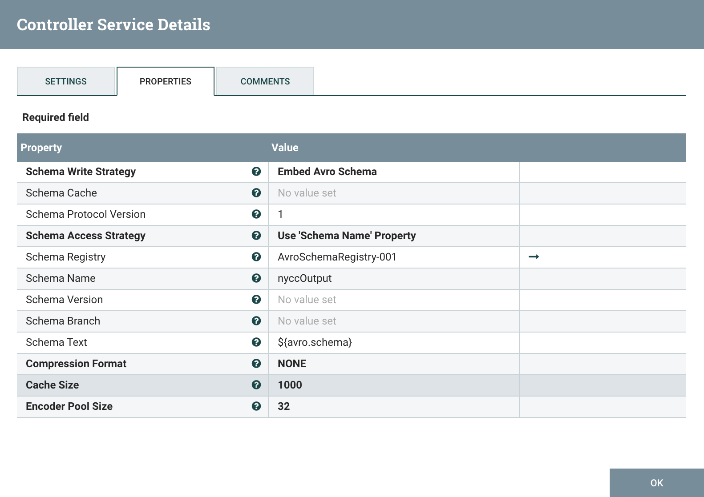

# ETL With Apache Nifi

# Introduction

In this tutorial, we will import comma seperated (CSV) data into GridDB using the popular ETL tool, [Apache Nifi](https://nifi.apache.org/). Nifi is a enterprise-ready data plumbing platform that is highly configurable and extensible.

ETL is an acryonm that stands for Extract, Transform, and Load, which simply means copying a data source from one format to another where the data is contextualized differently between the source and destination. While there are many advanced enterprise ETL tools, many developers have used basic text processing tools like awk, sed, and grep to build rudimentary ETL pipelines.

In this tutorial, we will cover three different transformations that most GridDB users would like to implement:

- Partition data into multiple tables based on a record column value.
- Convert. 
- Combine multiple columns into one.
- Convert a datetime string to timestamp value that can be inserted into GridDB.

## Setup Nifi/GridDB

If you prefer a video: 

<p class="iframe-container">
<iframe src="https://www.youtube.com/embed/5EU3jbNE9ow" frameborder="0" allow="accelerometer; autoplay; encrypted-media; gyroscope; picture-in-picture" allowfullscreen></iframe>
</p>

Nifi's installation is simple; [download](https://www.apache.org/dyn/closer.lua?path=/nifi/1.12.1/nifi-1.12.1-bin.tar.gz) and untar the tarball before starting the server:

```
$ cd nifi-1.12.1/
$ ./bin/nifi.sh start
```

If you want to access the Nifi server from a remote computer, edit conf/nifi.properties, changing nifi.web.http.host to your local IP address.

If you do not already have GridDB set up, follow the [Getting Started](https://docs.griddb.net/gettingstarted/using-rpmyum/#install-with-rpm) manual to first install GridDB. You will also need to use the [gridstore-jdbc.jar](https://github.com/griddbnet/jdbc/releases/download/v4.5.0.1-setValue/gridstore-jdbc.jar) from GridDB.net's Github repository. It has implemented additional JDBC functions requiured by Nifi.

## The Data Set

We're going to use the Historic NYPD Complaint Data made available Open NYC  available [here](https://data.cityofnewyork.us/Public-Safety/NYPD-Complaint-Data-Historic/qgea-i56i). The data has nearly 7 million rows across 35 columns totalling TODO GB. 

## Build the Nifi Flow

The Nifi Flow defines how data is extracted, transformed, and loaded with a series of Processors and Controllers. A Processor is responsible for the task whose inputs and outputs are defined by its configured Controllers. If you're new to Nifi, the navigation can be difficult. Processors can be added by dragging the first icon on the top bar into the workspace and Controllers can be added to your Flow by Clicking the "Gear Icon" in the "Operate Panel" and then selecting the "Controller Services" tab.

The following screenshot depicts the overall flow and how the various processors are connected:



The LogAttributes are generic and show the number of failed or successful records output by a processor.

The AvroRegistry Controller defines schemas and is referenced by the other controllers, in this case the schema of the CSV file we're reading and the schema of the GridDB table/container that we're writing.



Most of the NYCC data is missing one or more data fields which can cause errors, so defaults are set in the input schema as follows:

```
{
  "type" : "record",
  "name" : "inputRecord",
  "fields" : [ 
    { "name" : "CMPLNT_NUM", "type" : "int", "default" : 0},
    { "name" : "CMPLNT_FR_DT", "type" : "string", "default" : "01/01/1970"},
    { "name" : "CMPLNT_FR_TM", "type" : "string", "default" : "00:00:00"},
    { "name" : "CMPLNT_TO_DT", "type" : "string", "default" : "01/01/1970"},
    { "name" : "CMPLNT_TO_TM", "type" : "string", "default" : "00:00:00"},
    { "name" : "ADDR_PCT_CD", "type" : "int", "default" : 0},
    { "name" : "RPT_DT", "type" : "string", "default" : "NA"},
    { "name" : "KY_CD", "type" : "int", "default" : 0},
    { "name" : "OFNS_DESC", "type" : "string", "default" : "NA"},
    { "name" : "PD_CD", "type" : "int", "default" : 0},
    { "name" : "PD_DESC", "type" : "string", "default" : "NA"},
    { "name" : "CRM_ATPT_CPTD_CD", "type" : "string", "default" : "NA"},
    { "name" : "LAW_CAT_CD", "type" : "string", "default" : "NA"},
    { "name" : "BORO_NM", "type" : "string", "default" : "NA"},
    { "name" : "LOC_OF_OCCUR_DESC", "type" : "string", "default" : "NA"},
    { "name" : "PREM_TYP_DESC", "type" : "string", "default" : "NA"},
    { "name" : "JURIS_DESC", "type" : "string", "default" : "NA"},
    { "name" : "JURISDICTION_CODE", "type" : "int", "default" : 0},
    { "name" : "PARKS_NM", "type" : "string", "default" : "NA"},
    { "name" : "HADEVELOPT", "type" : "string", "default" : "NA"},
    { "name" : "HOUSING_PSA", "type" : "string", "default" : "NA"},
    { "name" : "X_COORD_CD", "type" : "int", "default" : 0},
    { "name" : "Y_COORD_CD", "type" : "int", "default" : 0},
    { "name" : "SUSP_AGE_GROUP", "type" : "string", "default" : "NA"},
    { "name" : "SUSP_RACE", "type" : "string", "default" : "NA"},
    { "name" : "SUSP_SEX", "type" : "string", "default" : "NA"},
    { "name" : "TRANSIT_DISTRICT", "type" : "int", "default" : 0},
    { "name" : "Latitude", "type" : "float", "default" : 0.0},
    { "name" : "Longitude", "type" : "float", "default" : 0.0},
    { "name" : "Lat_Lon", "type" : "string", "default" : "NA"},
    { "name" : "PATROL_BORO", "type" : "string", "default" : "NA"},
    { "name" : "STATION_NAME", "type" : "string", "default" : "NA"},
    { "name" : "VIC_AGE_GROUP", "type" : "string", "default" : "NA"},
    { "name" : "VIC_RACE", "type" : "string", "default" : "NA"},
    { "name" : "VIC_SEX", "type" : "string", "default" : "NA"}
  ]
}

```

The defaults aren't required in the output schema as the fields have been populated, but two fields are added for the CMPLNT_TO/FR timestamp:

```
{
  "type" : "record",
  "name" : "outputRecord",
  "fields" : [

    { "name" : "CMPLNT_NUM", "type" : "int"},
    { "name" : "CMPLNT_FR_DT", "type" : "string"},
    { "name" : "CMPLNT_FR_TM", "type" : "string"},
    { "name" : "CMPLNT_TO_DT", "type" : "string"},
    { "name" : "CMPLNT_TO_TM", "type" : "string"},
    { "name" : "ADDR_PCT_CD", "type" : "int"},
    { "name" : "RPT_DT", "type" : "string"},
    { "name" : "KY_CD", "type" : "int"},
    { "name" : "OFNS_DESC", "type" : "string"},
    { "name" : "PD_CD", "type" : "int"},
    { "name" : "PD_DESC", "type" : "string"},
    { "name" : "CRM_ATPT_CPTD_CD", "type" : "string"},
    { "name" : "LAW_CAT_CD", "type" : "string"},
    { "name" : "BORO_NM", "type" : "string"},
    { "name" : "LOC_OF_OCCUR_DESC", "type" : "string"},
    { "name" : "PREM_TYP_DESC", "type" : "string"},
    { "name" : "JURIS_DESC", "type" : "string"},
    { "name" : "JURISDICTION_CODE", "type" : "int"},
    { "name" : "PARKS_NM", "type" : "string"},
    { "name" : "HADEVELOPT", "type" : "string"},
    { "name" : "HOUSING_PSA", "type" : "string"},
    { "name" : "X_COORD_CD", "type" : "int"},
    { "name" : "Y_COORD_CD", "type" : "int"},
    { "name" : "SUSP_AGE_GROUP", "type" : "string"},
    { "name" : "SUSP_RACE", "type" : "string"},
    { "name" : "SUSP_SEX", "type" : "string"},
    { "name" : "TRANSIT_DISTRICT", "type" : "int"},
    { "name" : "Latitude", "type" : "float"},
    { "name" : "Longitude", "type" : "float"},
    { "name" : "Lat_Lon", "type" : "string"},
    { "name" : "PATROL_BORO", "type" : "string"},
    { "name" : "STATION_NAME", "type" : "string"},
    { "name" : "VIC_AGE_GROUP", "type" : "string"},
    { "name" : "VIC_RACE", "type" : "string"},
    { "name" : "VIC_SEX", "type" : "string"},
    { "name" : "CMPLNT_FR", "type" : { "type": "long", "logicalType" : "timestamp-millis"} },
    { "name" : "CMPLNT_TO", "type" : { "type": "long", "logicalType" : "timestamp-millis"} }
 ] 
}
```

The DBCPConnectionPool controller is responsible for all database connections within our flow and it uses the GridDB JDBC interface. It is configured with the JDBC driver, JAR path, connection url, username, and password as follows:



### GetFile



The GetFile processor reads the CSV file from disk. All that needs to be configured is the path where the CSV will be read. It should be noted that the CSV will be deleted after being read, so it is best to create a new staging directory and copy in files as required.

### PartitionRecord



The first PartitionRecord processor splits the records from the flow based on a column value. In the case of the New York Crime Complaint data, we're going to split the data by precinct which is the ADDR_PCT_CD field. It works by setting the ${precinct} attribute to the value of the /ADDR_PCT_CD field. PutDatabaseRecord and PutSQL processors will use the ${precinct} attribute to determine the table name. This split allows us to put data for individual police precincts into seperate tables/containers.

The RawCSVReader controller is used to read the Raw CSV from GetFile while the RawCSVRecordSetWriter re-writes the CSV for the next Processor in the chain.




### PutSQL


We need to create the table for a precinct before PutDatabaseRecord can write; PutSQL is the best processor for that. It reads the ${precinct} attribute and executes the following SQL statement:

```
create table precinct_test (
    CMPLNT_NUM integer PRIMARY KEY,
    CMPLNT_FR_DT varchar,
    CMPLNT_FR_TM varchar,
    CMPLNT_TO_DT varchar,
    CMPLNT_TO_TM varchar,
    ADDR_PCT_CD integer,
    RPT_DT varchar,
    KY_CD integer,
    OFNS_DESC varchar,
    PD_CD integer,
    PD_DESC varchar,
    CRM_ATPT_CPTD_CD varchar,
    LAW_CAT_CD varchar,
    BORO_NM varchar,
    LOC_OF_OCCUR_DESC varchar,
    PREM_TYP_DESC varchar,
    JURIS_DESC varchar,
    JURISDICTION_CODE integer,
    PARKS_NM varchar,
    HADEVELOPT varchar,
    HOUSING_PSA varchar,
    X_COORD_CD integer,
    Y_COORD_CD integer,
    SUSP_AGE_GROUP varchar,
    SUSP_RACE varchar,
    SUSP_SEX varchar,
    TRANSIT_DISTRICT integer,
    Latitude float,
    Longitude float,
    Lat_Lon varchar,
    PATROL_BORO varchar,
    STATION_NAME varchar,
    VIC_AGE_GROUP varchar,
    VIC_RACE varchar,
    VIC_SEX varchar,
    CMPLNT_FR timestamp,
    CMPLNT_TO timestamp 
);
```

### PartitionRecord


The second PartitionRecord processor splits up the input so that each row of the CSV becomes one record. Records are still read and written by RawCSVReader and RawCSVRecordSetWriter respectively. 

### UpdateRecord



The first UpdateRecord processor changes the date format of the CSV from MM/dd/yyyy to yyyy-MM-dd as that is the expected format to convert into a timestamp in the next processor.

The property updates used are:
```
/CMPLNT_FR_DT       ${field.value:toDate('MM/dd/yyyy'):format('yyyy-MM-dd')}
/CMPLNT_TO_DT       ${field.value:toDate('MM/dd/yyyy'):format('yyyy-MM-dd')}
```

### UpdateRecord



The UpdateRecord processor combines Date and Time fields and then converts the record to Avro by using the AvroRecordSetWriter as the output. By converting the record from CSV to Avro we are able to convert a date string such as 2021-02-11 18:14:17 to an epoch 1613067247 that can be written to the timestamp field by the PutDatabaseRecord processor. 

The property updates used are:

```
/CMPLNT_FR_DT       concat(/CMPLNT_FR_DT, ' ', /CMPLNT_FR_TM)
/CMPLNT_TO_DT       concat(/CMPLNT_TO_DT, ' ', /CMPLNT_TO_TM)
```

The AvroRecordSetWriter controller is configured as below:



### PutDatabaseRecord


Finally the last process, PutDatabaseRecord, writes the incoming records to GridDB using the DBCPConnectionPool controller. The records are read with the AvroReader controller which is configured as shown:


## Conclusion

Finally, to start to the ETL process, we copy the downloaded rows.csv to the input directory we configured in the GetFile processor and can monitor the load from the Nifi web interface.

```
cp ~/Downloads/rows.csv /path/to/nifi-input/
```

This tutorial has demonstrated how to load a large dataset stored in CSV to GridDB. With the extensibility of Nifi, it is possible to Extract, Transform, and Load nearly any data set from any destination to any source without writing complex scripts. 
